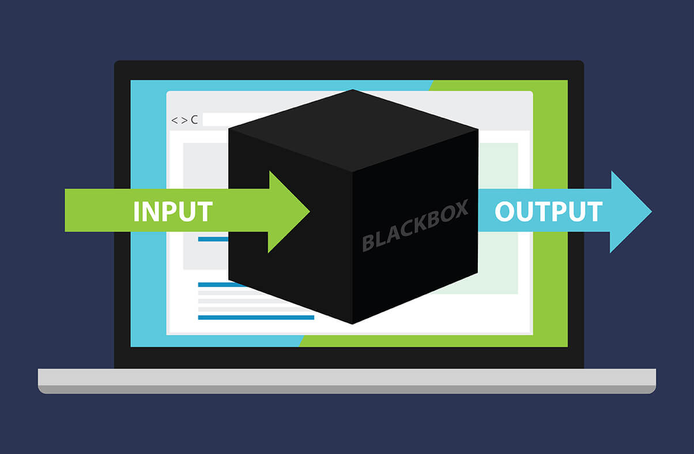
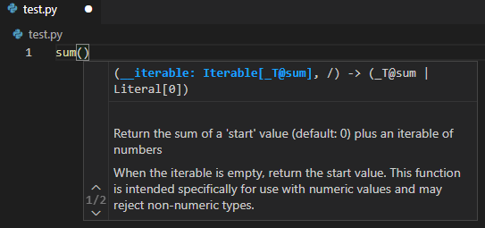

# Function 함수

1. Basic of function
2. Output
3. Input
4. Scope
5. Doc-string
6. Applications(map, filter, zip, ...)



<br/>

## 함수의 기초

### Function

* A block of code which only runs when it is called. [w3schools](https://www.w3schools.com/python/python_functions.asp)

  특정한 기능을 하는 코드의 조각(묶음)

* 특정 명령을 수행하는 코드를 매번 다시 작성X, 필요시에만 호출

#### Custom Function

```python
def function_name(parameter):
    # code block
    return returning value
```

<br/>

### 함수의 구조

* define & call
* input
* doc-string(문서화)
* scope(범위)
* output(결과값)

<br/>

### Define & Call

* Define by keyword `def`

* tab + Function body(실행될 코드 블록)

* Functions can deliver parameter

* At the end, functions `return` returning value

  

<br/>

<br/>

## Output 함수의 결과값

### 값에 따라

* 명시적인 return 값이 없을 때 => None 반환 후 종료
* return 값을 반환하고 함수 종료 => **하나의 객체**를 반환

### return vs print

* return은 함수 안에서만 사용하는 키워드
* print는 출력을 위해 사용하는, **보기 위해 사용하는** 함수

<br/>

### 튜플 반환

* 두 개 이상의 값을 반환하겠다? => 튜플로 묶여서 **하나의 객체**로 반환 됨

<br/>

<br/>

## Input 함수의 입력

### Parameter & Argument

* Parameter : 함수를 실행할 때, 함수 **내부**에서 사용되는 식별자 => 이름을 지어주는 것

* Argument : 함수를 **호출**할 때 넣어주는 **값**

  

<br/>

### Argument

* 함수 호출 시 함수의 parameter를 통해 전달 되는 값
* 소괄호 안에 할당 `func_name(argument)`
  * 필수 arg : 반드시 전달 되어야 함
  * 선택 arg : 값을 전달하지 않아도 됨 => 기본 값이 전달

<br/>

### Positional Arguments

* 기본적으로 함수 호출 시 argument는 위치에 따라 함수 내에 전달 됨

### Keyword Arguments

* (굳이) 특정한 값에 특정한 value를 집어 넣는 방식

  ```python
  def multiply(x, y):
      return x * y
  
  print(add(1, 2)) # => x = 1, y = 2
  print(add(y=2, x=1)) # 키워드
  print(add(x=1, 2)) # SyntaxError <= 키워드를 지정하는 순간 위치 의미 X
  print(add(1, y=2))
  ```

<br/>

### Default Arguments Values (Def)

* 기본값을 지정하여 함수 호출 시 argument 값 설정안해도 괜찮음(선택)

  ```python
  def student(name= 'Jen', gpa): # => SyntaxError: non-default argument follows default argument
      return name, gpa
  
  def student(gpa, name='Jen'):
      return name, gpa
  
  print(student(4.0))
  >>> ('Jen', 4.0)
  ```

<br/>

### Positional Arguments Packing/Unpacking `*`

* multiple positional arguments  ==>> parameter

* Use to define the function which **doesn't know how many arguments** to receive

  ```python
  def add(*args, a):
      return args, a
  
  print(add(1, 2, 3, 4))
  # TypeError: add() missing 1 required keyword-only argument: 'a'
  print(add(1, 2, 3, 4, a=5))
  ```

  * Then, *args needs to be at the end?

    ```python
    def another_add(a, *args):
    	return a, args
    
    print(another_add(1,2,3,4,5))
    >>> (1, (2, 3, 4, 5))
    ```

<br/>

### Keyword Arguments Packing/Unpacking `**`

* 함수가 임의의 개수 Argument를 keyword Argument로 호출될 수 있도록 지정

  ```python
  def add(**kwargs, a): # SyntaxError: invalid syntax
      return kwargs, a
  
  # add(a=1, b=2, c=3) 이라고 해도 **kwargs가 값을 다 가져간다!!!!!!
  ```
  
  ```python
  def numbers(a, **kwargs):
  	return a, kwargs
  
  print(numbers(1, b ='2', c ='3'))
  # 순서대로 a 먼저 자기 자리 찾아간 뒤에 묶으니까 가능!
  ```
  
  ```python
  def characters(**kwargs):
  	return kwargs
  
  print(characters(Batman='Wayne', Ironman='Stark', Spiderman='Parker'))
  >>> {'Batman': 'Wayne', 'Ironman': 'Stark', 'Spiderman': 'Parker'}
  
  #Batman, Ironman, Spiderman은 딕셔너리의 키 X
  #식별자(이름)일 뿐! 그래서 ''표시 필요 없음
  ```

<br/>

<br/>

## Scope 함수의 범위

* 함수는 코드 내부에 local scope를 생성하며, 그 외의 공간인 global scope로 구분한다
* 식별자(Variable, 변수의 이름)들은 LEGB 순서로 찾아나가면 됨

 


```python
a = 0
b = 1
def enclosed():
    a = 10
    c = 4
    def local(c):
        print(a, b, c)
        # => a는 바로 위의 10, b는 더 위의 1, c는 아래 local(400)에서 호출한 값 400 => 10 1 400
    local(400)
    print(a, b, c) # => 10 1 4
enclosed()
print(a, b) # 가장 바깥에 있으므로 global => 0 1

>>> 10 1 400
>>> 10 1 4
>>> 0 1
```

* Example

  ```python
  number = [1, 2, 3, 4]
  
  def new():
      numbers[0] = 100
      # numbers의 0번째 값을 콕 집어서 변경 > 변경된다!
      # 새로 변수를 만든게 아니라 주소에 있는 것을 직접 바꿨기 때문 
  
  new()
  print(numbers)
  ```
  

### global

* 밖에 있는 global의 값을 가져와서 **변경**하고 싶을 때
* global 키워드는 먼저(사용하기 전에) 선언 해야 함

### nonlocal

* local도 아니고 global도 아니고 (enclosed)

<br>

### 주의 사항

* 기본적으로 함수에서 선언된 변수 => Local scope => 함수 종료 시 사라짐
* 해당 scope에 없는 변수를 쓴다? => LEGB rule에 의해 이름을 검색
  * 접근은 가능하지만 변수 수정은 X (=> 그래서 global, nonlocal 등장)
  * 함수 내에서 필요한 상위 scope의 변수는 argument로 넘겨서 활용
* 상위 scope에 있는 변수를 수정하고 싶다? => global, nonlocal 키워드 활용
  * 코드가 복잡해짐 => 오류 발생 가능성 높아지므로 비추
  * 함수로 값을 바꾸고 싶다면 argument로 넘기고 리턴 값을 사용하는 것을 추천(굳이 위의 값을 끌어와서 변경하지 말아라)

<br/>

<br/>

## Doc-String 함수의 문서화

* 함수나 클래스를 설명

  

#### Naming Convention

* 규칙
  * 상수 이름 : 영어 전체 대문자 (ex. PI = 3.141592)
  * 클래스 및 예외의 이름: 각 단어의 첫 글자만 영문 대문자
  * 그 외 : 소문자 또는 밑줄로 구분한 소문자 (ex. 함수들...)

* 함수 이름으로 기능, 역할, 반환 값 등을 알 수 있도록 직관적으로!
* 약어(줄임말) 사용 지양

<br/>

<br/>

---

---

<br/>

## 함수 응용

### map(function, iterable)

* 순회 가능한 데이터구조(iterable) 내 **각각의 요소에 함수(function) 적용**하고, 그 결과를 map object로 반환

  => list로 형변환하여 결과를 직접 확인할 수 있음

* 활용 사례

  * 알고리즘 문제 풀이시 input 값을 바로 숫자로 형변환 하고 싶을 때

  * .split 과 함께 설명

    ```python
    # input에 두 개의 값 20 20을 넣으려고 하는 상황
    input_value = input()
    >>> '20 20'
    input_value.split()
    ['20', '20']
    ```

    ```python
    a = input().split()
    >>> 20 20
    
    print(map(int, a))
    >>> <map object at 0x000002A866D06DF0>
    # a의 값이 얼마나 클 지 모르니까(순환 가능한거니까, 얼마나 많이 들어있을지 모름) 통에 담아서 통 째로 전달하는 것. 만약 각각을 보고 싶다면 리스트로 형변환해서 하나씩 보는 것
    
    print(list(map(int, a)))
    >>> [20, 20]
    
    # 하나로 묶어 보자
    n, m = map(int, input().split())
    print(n, m, type(n), type(m))
    >>> 20 20 <class 'int'> <class 'int'>
    # n과 m이라는 변수를 지정해줬기 때문에 통으로 전달하지 않고 해당 변수에 각각 담아서 값을 바로 보여줌
    ```

<br/>

### filter(function, iterable)

* 순회 가능한 데이터구조(iterable)의 모든 요소에 함수(function)을 적용하고, 그 결과가 True인 것들만 filter object로 반환

<br/>

### zip

* 복수의 iterable을 모아 튜플을 원소로 하는 zip object를 반환

  ```python
  dcs = ['batman', 'flash', 'wonder_woman']
  mavels = ['ironman', 'quicksilver', 'captain_marvel']
  pair = zip(dcs, mavels)
  print(pair, type(pair))
  
  >>> <zip object at 0x000001615A407100> <class 'zip'>
  ```

  ```python
  print(list(pair))
  
  >>> [('batman', 'ironman'), ('flash', 'quicksilver'), ('wonder_woman', 'captain_marvel')]
  ```

<br/>

### lambda[parameter] : expression

* 표현식을 계산한 결과값을 반환하는 함수

* 이름이 없어서 익명함수라고도 불림

* return문 X, 간편 조건문 외의 복잡한 조건 XXX

  ```python
  # 사각형의 넓이를 구하는 공식 - def
  def rectangle_area(w, h):
      return w * h
  print(rectangle_area(5, 6))
  >>> 30
  ```

  ```python
  # 사각형의 넓이를 구하는 공식 - lambda
  rectangle_area = lambda w, h : w * h
  rectangle_area(5, 6)
  >>> 30
  ```

* filter + lambda

  ```python
  # 기존의 식
  def odd(n):
      return n % 2 # 홀수라면 1(True), 짝수라면 0(False) 반환
  
  print(list(filter(odd, range(5))))
  >>> [1, 3]
  ```

  ```python
  # lambda 활용
  #                       n을 넣으면 n % 2의 값을 반환해줘
  print(list(filter(lambda n: n % 2, range(5))))
  >>> [1, 3]
  ```

<br/>

### 재귀 함수(Recursive function)

* 자기 자신을 호출하는 함수

* 1개 이상의 종료되는 상황(base case)이 존재하고, 수렴하도록 작성한다

* 알고리즘 설계 및 구현에서 유용하게 활용

  * 변수의 사용이 줄어들고 코드의 가독성이 높아짐 => 반복문 대신 사용하기도 함

* example

  * n! (factorial)

    ```python
    def factorial(n):
        if n == 0 or n == 1:
            return 1
        else:
            return n * factorial(n-1)
    factorial(4)
    # n==4 이므로 else => 4 * factorial(3)
    # n==3 => factorial(3) = 3 * factorial(2)
    # n==2 => factorial(2) = 2 * factorial(1)
    # n==1 => return 1
    # ==> 다 연결하면 4 * (3 * (2 * (1)))
    ```

#### 주의사항

* base case에 도달할때까지 함수를 호출

  => 메모리 스택이 넘치게 되면(stack overflow) 프로그램이 동작X

* 파이썬에서는 최대 재귀 깊이가 1,000번으로 제한. 넘어가면 Recursion Error 발생

  * 추가 설정으로 변경 가능

* 입력 값이 커질 수록 연산 속도가 오래 걸림

