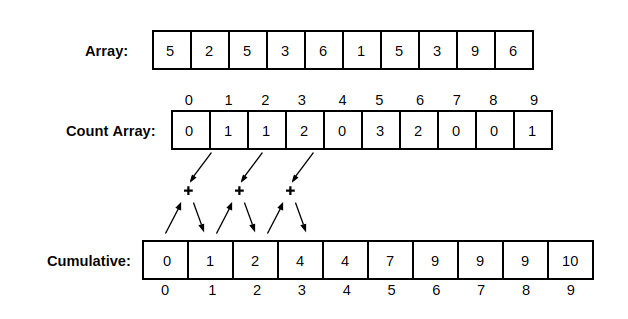
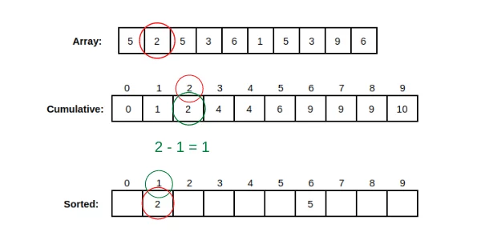

# List

## 배열

* 일정한 자료형의 변수들을 하나의 이름으로 열거하여 사용하는 자료구조(자료를 저장하는 방법)
* 파이썬에서는 **List**

### 필요성

* 프로그램 내에서 여러 개의 변수가 필요할 때 일일이 다른 변수명을 이용하여 자료를 접근하는 것은 매우 비효율적
* 배열을 사용하면 하나의 선언으로 둘 이상의 변수 선언 가능
* 단순히 다수의 변수 선언 의미 X 다수의 변수로는 하기 힘들 작업까지 가능함

### 1차원 배열

* 1차원 배열의 선언
  * 별도의 선언 방법이 없으면 변수에 처음 값을 할당할 때 생성
    * `Arr = list()`, `Arr = []`, `Arr = [1, 2, 3]`, `Arr = [0] * 10`
  * 접근
    * `Arr[0] = 10 `: 배열 Arr의 0번 원소에 10 저장
    * `Arr[idx] = 20` : 배열 Arr의 idx번 원소에 20 저장

<br/>

## 정렬

* 2개 이상의 자료를 특정 기준에 의해 오른차순 또는 내림차순으로 재배열하는 것

<br/>

### 버블 정렬 (Bubble Sort)

* 인접한 두 개의 원소를 비교하며 자리를 계속 교환하는 방식 => 비교 & 교환

* 시간 복잡도: O(n^2)

* 가장 손쉬운 코딩

* 버블 정렬 과정

  

  * 가장 큰 수를 맨 뒤로

  * 정렬된 뒤쪽 원소를 제외하고 나머지를 정렬

  * 수도코드

    ```python
    for j: 0 -> N-1
        if arr[j] > arr[j+1]
        arr[j] <=> arr[j+1]
       
    for j: 0 -> N-2
        if arr[j] > arr[j+1]
        arr[j] <=> arr[j+1]
    ...
    ```

    => 구간의 끝(i)이 계속 안으로 줄어드는 중! 

    ```python
    구간 결정 | for i: N-1 -> 1까지(2개 남길 때까지)
    ```

    ---

    ```python
    BubbleSort(a, N)
    	for i: N-1 -> 1
            for j: 0 -> i-1
                if a[j] > a[j+1]
                	a[j] <-> a[j+1]
    ```

* 실제 코드

  ```python
  def bubble_sort(a, N):
      for i in range(N-1, 0, -1):
          for j in range(i):
              if a[j] > a[j+1]:
                  a[j], a[j+1] = a[j+1], a[j]
  ```

<br/>

---

### 카운팅 정렬 (Counting Sort)

* 항목들의 순서를 결정하기 위해 집합에 각 항목이 몇 개씩 있는지 세는 작업을 하여, 선형 시간에 정렬하는 효율적인 알고리즘
* 정수나 정수로 표현할 수 있는 자료에 대해서만 적용 가능
* 시간 복잡도: O(n+k)

* 카운팅 정렬 과정

  

  1. Array에서 각 항목의 발생 횟수를 세고, 정수 항목들로 직접 인덱스가 가능한 카운트 배열 count array에 저장한다(횟수를!!)

  2. 개수를 누적한 배열을 만든다

     

     * 수도 코드

       

* 참고하면 좋을 사이트 [카운팅 정렬 설명](https://bowbowbow.tistory.com/8)
* 

## Reference

[버블 정렬](https://m.blog.naver.com/PostView.naver?isHttpsRedirect=true&blogId=justant&logNo=20204028286)

[카운팅 정렬](https://www.journaldev.com/42355/counting-sort-algorithm)
