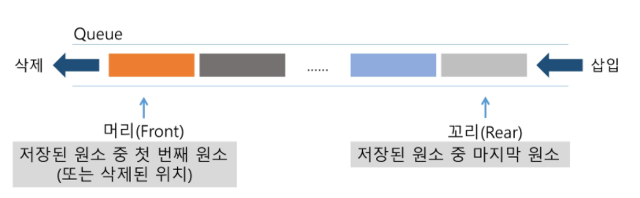
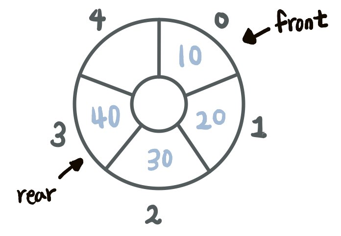
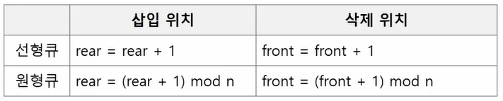
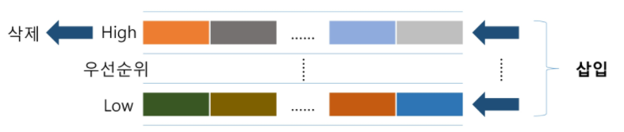
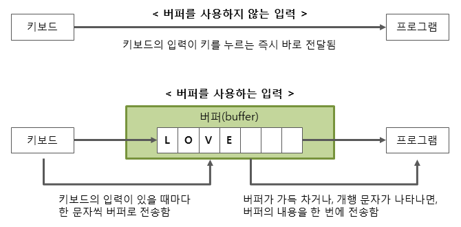

# Queue

* 선형큐
* 원형큐
* 우선순위 큐
* 큐의 활용 : 버퍼
* BFS
* [미로탐색]

---

## Queue

### 큐의 특성

* 스택과 마찬가지로 **삽입과 삭제의 위치가 제한**적인 자료 구조

  * 큐의 뒤에서는 삽입만, 큐의 앞에서는 삭제만!

  * 선입 선출(FIFO: First In First Out)

    

    * 삽입 : `enQueue`
    * 삭제 : `deQueue`

### 큐의 주요 연산

* `createQueue()` : 공백 상태의 큐를 생성
  * front = rear = **-1** 
    * `front` 마지막으로 삭제 된 위치
    * `rear` 마지막으로 저장된 위치
    * `front = rear = -1` => 한번도 삭제된 적도, 저장된 적도 없다! 깨끗!

* `enQueue(item)` : 큐의 뒤쪽(rear 다음)에 원소를 삽입
  * `rear`만 증가
* `deQueue()` : 큐의 앞쪽(front)에서 원소를 삭제하고 반환
  * `front` 증가, front가 가리켰던 자리에 있는 놈을 하나 꺼낸다
  * `front = rear != -1` => 다 꺼냈다 => 비어있다
* `isEmpty()` : 큐가 공백상태인지 확인
  * `front = rear`
* `isFull()` : 큐가 포화상태인지를 확인
* `Qpeek()` : 큐의 앞쪽(front)에서 원소를 삭제 없이 반환

<br/>

## 선형큐

* 1차원 배열을 이용한 큐
  * 큐의 크기 == 배열의 크기
  * `front` : 저장된 첫 번째 원소의 인덱스, 마지막으로 꺼낸 위치
  * `rear` : 저장된 마지막 원소의 인덱스, 마지막으로 저장한 위치

### 큐의 구현

* 상태 표현
  * 초기 상태 : `front = rear = -1`
  * 공백 상태 : `front == rear`
  * 포화 상태 : `rear == n-1` (n: 배열의 크기, n-1 배열의 마지막 인덱스)
    * 큐가 부족하다? 내가 잘못 설정했다 ^^

#### 삽입 : enQueue(item)

* 마지막 원소 뒤에 새로운 원소를 삽입하기 위해

  => rear 값을 하나 증가 시켜서 새로운 원소를 삽인할 자리를 만듦

  => 그 인덱스에 해당하는 배열원소 Q[rear]에 item을 저장

  ```python
  # 수도코드
  def enQueue(item):
      global rear
      if isFull() : print("Queue_Full") #=> 디버깅을 위한 파트 
      else:
          rear <- rear + 1;
          Q[rear] <- item;
  ```

#### 삭제 : deQueue()

* 가장 앞에 있는 원소를 삭제하기 위해

  => front 값을 하나 증가 시켜 큐에 남아있게 될 첫 번째 원소 이동

  => 새로운 첫 번째 원소를 리턴함으로써 삭제와 동일한 기능

* 진짜 삭제하고 데이터를 지워버리는 것은 아님! front만 움직이는 것

  ```python
  # 수도코드
  deQueue()
  	if(isEmpty()) then Queue_Empty();
      else{
          front <- front + 1;
          return Q[front]
      }
  ```

#### 공백상태 및 포화상태 검사 : `isEmpty()`, `isFull()`

* 공백상태 : `front == rear`

* 포화상태 : `rear == n-1` 

  ```python
  def isEmpty():
      return front == rear
  
  def Full():
      return rear == len(Q) - 1
  ```

#### 검색 : Qpeek()

* 가장 앞에 있는 원소를 검색하여 반환하는 연산

* 현재 front의 한 자리 뒤(front+1)에 있는 원소, 즉 큐의 첫 번째에 있는 원소를 반환

  ```python
  # 수도코드
  def Qpeek():
      if isEmpty() : print("Queue_Empty")
      else : return Q[front+1]
  ```


<br/>

### 선형 큐 이용 시의 문제점

#### 잘못된 포화상태 인식

* 선형 큐를 이용하여 원소의 삽입과 삭제를 반복할 경우, 배열의 앞부분에 활용할 수 이쓴 공간이 있음에도 `rear=n-1`인 상태, 즉 포화 상태로 인식함

  [해결 방법1]

  * 매 연산에 이루어질 때마다 저장된 원소들을 배열의 앞부분으로 이동?

    => NO! 원소 이동에 많은 시간이 소요. 큐의 효율성 저하

  [해결 방법2]

  * 1차원 배열을 사용하되, 논리적으로는 배열의 처음과 끝이 연결 된, 원형 형태의 큐라고 가정해서 사용!

    

<br/>

## 원형 큐

### 원형 큐의 구조

* 초기 공백 상태

  * `front = rear = 0`

* 인덱스의 순환

  * front와 rear의 위치가 배열의 마지막 인덱스인 n-1을 가르킨 후, 논리적 순환을 이루어 배열의 처음인 0으로 이동해야 함

    <= 나머지 연산자 `mod`를 사용!

  

* front 변수

  * 공백상태와 포화상태 구분을 쉽게 하기 위해 front가 있는 자리는 사용하지 않고 항상 빈자리로 둔다

    

<br/>

### 원형 큐의 연산 과정


### 원형 큐의 구현

#### 초기 큐의 생성

* 크기n인 1차원 배열 생성
* front와 rear를 0으로 초기화

#### 공백상태 및 포화상태 검사 : isEmpty(), isFull()

* 공백상태 : `front == rear`

* 포화상태 : `삽입할 rear의 다음 위치 == 현재 front`

    				 `(rear + 1) mode n == front`

  ​					=> rear의 다음 칸이 front라면!

  ```python
  def isEmpty():
      return front == rear
  
  def isFull():
      return (rear+1) % len(cQ) == front
  ```

#### 삽입 : enQueue(item)

* 마지막 원소 뒤에 새로운 원소를 삽입하기 위해

  => rear값을 조정하여 새로운 원소를 삽입할 자리 마련하고

  => 그 인덱스에 해당하는 배열원소 cQ[rear]에 item을 저장

  ```python
  def enQueue(item):
      global rear
      if isFull():
          print('Queue_Full') # 디버깅 용도
      else:
          rear = (rear+1) % len(cQ)
          cQ[rear] = item
  ```

#### 삭제 : deQueue(), delete()

* 가장 앞에 있는 원소를 삭제하기 위해

  => front 값을 조정하여 삭제할 자리를 준비함

  => 새로운 front원소를 리턴함으로써 삭제와 동일한 기능

  ```python
  def deQueue():
      global front
      if isEmpty():
          print('Queue_Empty') # 디버깅 용도
      else:
          front = (front + 1) % len(cQ)
          return cQ[front]
  ```

<br/>

## 우선순위 큐

* 우선순위 큐의 특성
  * 우선순위를 가진 항목들을 저장하는 큐
  * FIFO 순서가 아니라 우선순위가 높은(오름차순) 순서대로 먼저 나가게 된다
* 우선순위 큐의 적용 분야
  * 시뮬레이션 시스템
  * 네트워크 트래픽 제어
  * 운영체제의 테스크 스케줄링

* 우선순위 큐의 구현

  * 배열을 이용한 우선순위 큐

  * 리스트를 이용한 우선순위 큐

* 우선순위 큐의 기본 연산

  * 삽입: enQueue

  * 삭제: deQueue

    

### 배열을 이용하여 우선순위 큐 구현

* 배열을 이용하여 자료 저장
* 원소를 삽입하는 과정에서 우선순위를 비교하여 적절한 위치에 삽입하는 구조 (트리!)
* 가장 앞에 최고 우선순위 원소가 위치하게 됨

#### 문제점

* 배열을 사용 => 삽입이나 삭제 연산이 일어날 때 원소의 재배치 발생

  => 소요 시간이나 메모리 낭비가 큼

  * 트리를 사용하면 조금 덜 하다...!

<br/>

## 큐의 활용: 버퍼

* 버퍼

  * 데이터를 한 곳에서 다른 한 곳으로 전송하는 동안 **일시적으로 그 데이터를 보관**하는 메모리의 영역
  * 버퍼링 : 버퍼를 활용하는 방식 또는 버퍼를 채우는 동작

* 버퍼의 자료 구조

  * 버퍼는 일반적으로 입출력 및 네트워크 관련된 기능에서 이용
  * 순서대로 입/출/전달 되어야 하므로 FIFO방식의 자료구조인 큐 활용

* 키보드 버퍼

  


## Reference

[원형 큐 이미지](https://velog.io/@minjung-s/circular-queue)

[키보드버퍼](http://www.tcpschool.com/c/c_io_console)
