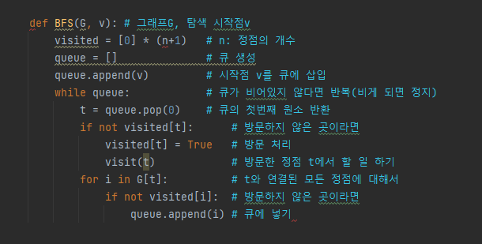
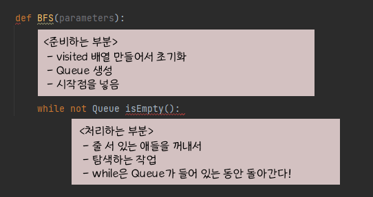

# BFS(Breadth Frist Search)

* 그래프를 탐색하는 두가지 방법

  

  * 깊이 우선 탐색(Depth First Search, DFS)
  * 너비 우선 탐색(Breadth First Search, BFS)
    * 탐색 시작점의 인접한 정점들을 먼저 모두 차례로 방문한 후에, 방문했던 정점을 시작으로 하여 다시 인접한 정점들을 차례로 방문하는 방식
    * **인접한 정점**들에 대해 탐색을 한 후, 차례로 다시 너비 우선 탐색을 진행해야 하므로, 선입 선출 형태의 자료구조인 큐를 활용함
  * 참고
    * 목적에 맞는 탐색 방법을 찾는게 중요하다. BFS로 가능한데 DFS로 돌다 보면 중복으로 탐색하는 경우도 있다.

### BFS Algorithm

* 입력 파라미터: 그래프 G와 탐색 시작점 v

  

* BFS는 크게 두 부분으로 나뉜다

  

 

## Reference

[DFS vs BFS](https://velog.io/@vagabondms/DFS-vs-BFS)

