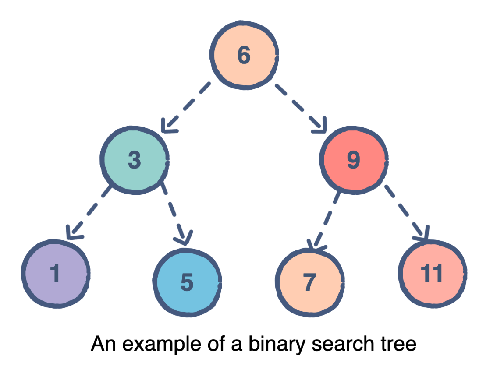
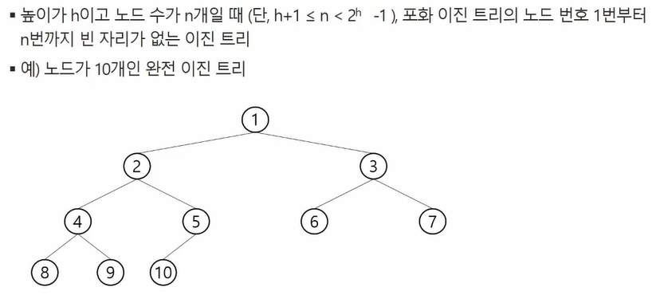
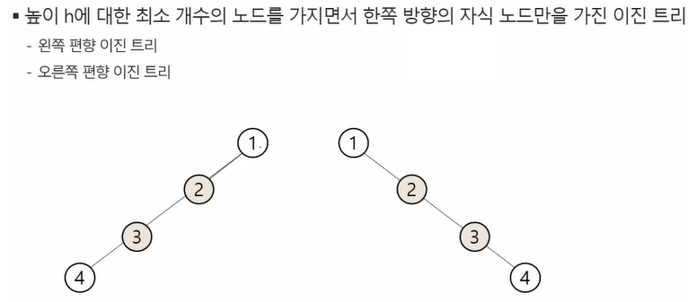
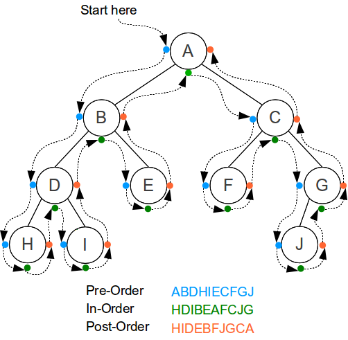

# 트리 tree

* 트리
* 이진트리
* 이진 탐색 트리
* 힙

 

## 트리

### 개념

​	: A `tree` is a collection of entities called `nodes`. Nodes are connected by `edges`. Each `node` contains a `value` or `data`, and it may or may not have a `child node` .

* 비선형 구조
* 원소들 간에 `1:N` 관계를 가지는 자료 구조
* 원소들 간에 계층 관계를 가지는 계층형 자료 구조
* 상위 원소에서 하위 원소로 내려 가면서 확장되는 트리(나무) 모양의 구조

### 정의

* **한 개 이상의 노드로 이루어진 유한 집합**이며 다음 조건을 만족한다

  * 노드 중 최상위 노드 => 루트(root)

  * 나머지 노드들은 n(>=0)개의 분리 집합 T1, ... TN으로 분리될 수 있다.

    

### 용어 정리

* **노드** : 트리의 원소

* **간선, edge** : 노드를 연결하는 선. The link between two nodes.

* **Path** : Path refers to the sequence of nodes along the edges of a tree.

* **루트, Root** : 트리의 시작 노드. The node at **the top of the tree** is called root. There is **only one** root per tree and one path from the root node to any node.

* **Parent** : Any node except the root node has one edge upward to a node called parent.

* **Child** : The node below a given node connected by its edge downward is called its child node.

  * 부모가 없으면 루트, 자식이 없으면 리프

* **형제 노드, sibling node** : 같은 부모 노드의 자식들

* **조상 노드** : 간선을 따라 루트 노드까지 이르는 경로에 있는 모든 노드들

* **단말 노드/잎 노드, Leaf** :The node which does not have any child node is called the leaf node.

* **Subtree** : Subtree represents the descendants of a node.

* **Degree, 차수** 

  * 노드의 차수 : 노드에 연결된 자식 노드의 수
  * 트리의 차수: 트리에 있는 노드의 차수 중에서 가장 큰 값

* **Levels, 높이(레벨)**

  * 노드의 높이: 루트에서 노드에 이르는 간선의 수. 노드의 레벨

    Level of a node represents the generation of a node. (If the root node is at level 0, then its next child node is at level 1, its grandchild is at level 2, and so on.)

  * 트리의 높이: 트리에 있는 노드의 높이 중에서 가장 큰 값. 최대 레벨

* **keys** : Key represents a value of a node based on which a search operation is to be carried out for a node.

 

 

## 이진트리

* 모든 노드들이 2개의 서브트리를 갖는 특별한 형태의 트리

* 각 노드가 자식 노드를 **최대한 2개까지만** 가질 수 있는 트리

  

### 이진트리의 특성

* 레벨 `i`에서 노드의 최대 개수는 `2^i`개
* 높이가 h인 이진트리가 가질 수 있는 노드의 최소 개수는 (h+1)개가 되며, 최대 개수는 `2^(h+1)-1`개 => 절대적인 것 X 높이를 0로 볼 때만!

### 이진트리의 종류

#### 포화 이진 트리 Full Binary Tree

#### 완전 이진트리 Complete Binary Tree

* 왼쪽부터 순서대로 중간 번호 빠짐 없이!

#### 편향 이진 트리 Skewed Binary Tree

### 순회 traversal

* 트리의 각 노드를 중복되지 않게 전부 방문하는 것
* 트리는 비선형 구조이기 때문에 선형구조처럼 선후 연결 관계를 알 수 없다.

#### 순회 방법

* 전위 순회(preorder traversal) : VLR
* 중위 순회(inorder traversal) : LVR
* 후위 순회(postorder traversal) : LRV

### 이진트리의 저장

1. 부모 번호를 인덱스로 자식 번호를 저장
   * 자식은 최대 2개이므로 자식 번호를 저장하기 위한 2개의 배열 필요
2. 자식 번호를 인덱스로 부모 번호를 저장

 

## 이진 탐색 트리

* 탐색 작업을 효율적으로 하기 위한 구조

* 모든 원소는 서로 다른 유일한 키를 갖는다

  

 

 

## Reference

[Definition](https://www.freecodecamp.org/news/all-you-need-to-know-about-tree-data-structures-bceacb85490c/)

[Tree structure](https://dev.to/christinamcmahon/understanding-binary-search-trees-4d90)

[Binary Tree](https://velog.io/@tataki26/%ED%95%99%EC%9D%80%EC%A0%9C-1%ED%95%99%EA%B8%B0-6%EC%A3%BC%EC%B0%A8-2%EA%B5%90%EC%8B%9C)

[Types of Binary Tree](https://towardsdatascience.com/5-types-of-binary-tree-with-cool-illustrations-9b335c430254)

[그래프 그려주는 사이트](https://csacademy.com/app/graph_editor/)

[traversal](https://blog.devgenius.io/dfs-depth-first-search-traversal-techniques-short-and-sweet-1e4c134babcf)