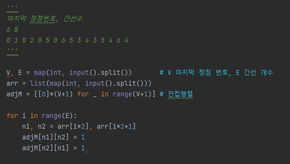
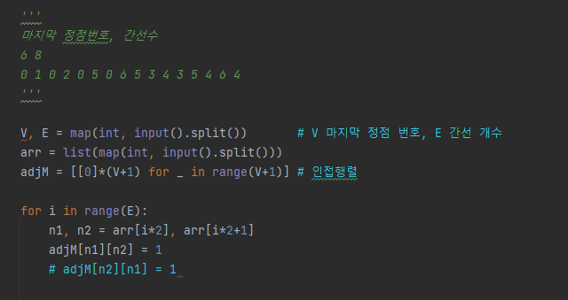
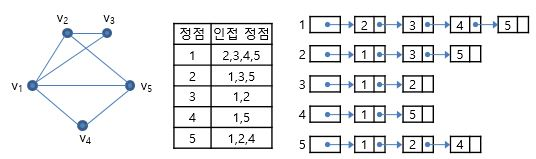
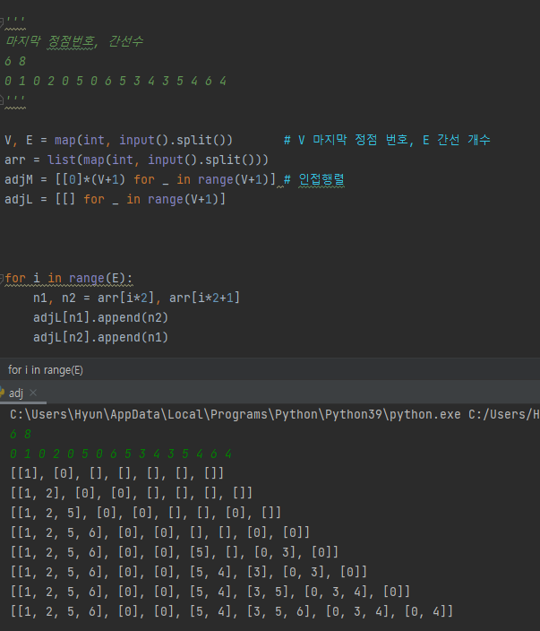

# Graph

* 그래프 기본
* 그래프 탐색
* 서로서 집합들
* 최소 비용 신장 트리(MST)
* 최단 경로

## 그래프 기본

### 인접행렬

* 무향 그래프
  *  저장 순간에만 차이가 발생!

* 유향 그래프(방향O)

  

 

### 인접 리스트

* 각 정점에 대한 인접 정점들을 순차적으로 표현

* 하나의 정점에 대한 인접 정점들을 각각 노드로 하는 연결 리스트로 저장

  

  

## Reference

[연결 리스트 이미지](http://www.ktword.co.kr/word/abbr_view.php?m_temp1=2453)