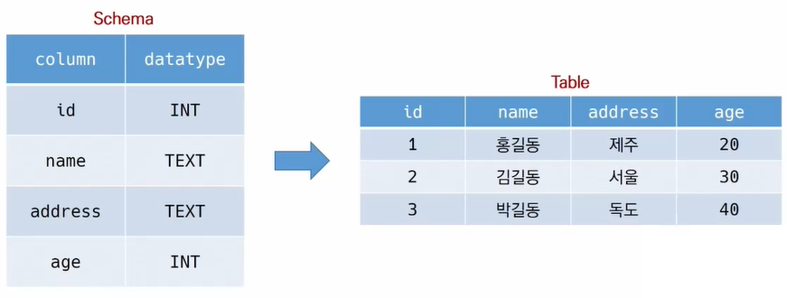
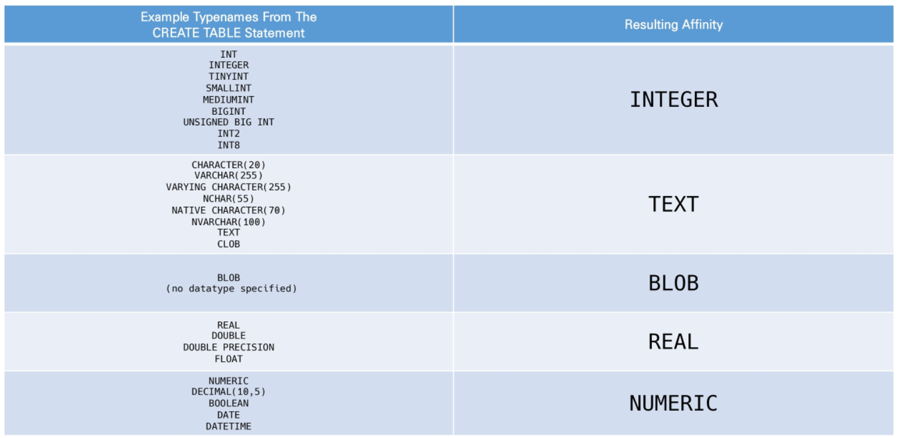

# SQL & DB

* Database
  * RDB
  * RDBMS
* SQL
  * Create & Delete Tables
  * CRUD
  * WHERE
  * Aggregate Functions
  * LIKE
  * ORDER BY & GROUP BY
  * ALTER TABLE

 

## Database

* **Data** is a collection of a distinct small unit of information. It can be used in a variety of forms like text, numbers, media, bytes, etc. it can be stored in pieces of paper or electronic memory, etc.
* A **database** is an <u>organized</u> collection of data, so that it can be easily accessed and managed.

#### 데이터베이스로 얻는 장점들

* 데이터 중복 최소화
* 데이터 무결성 => 정확한 정보를 보장
* 데이터 일관성
* 데이터 독립성(물리적/ 논리적)
* 데이터 표준화
* 데이터 보안 유지

 

### 관계형 데이터베이스 (Relational Database)

* A relational database is **a type of database that stores and provides access to data points that are related to one another**. Relational databases are based on the relational model, an intuitive, straightforward way of representing data in **tables.**

#### 용어 정리

* schema(스키마) : DB에서의 자료의 구조, 표현방법, 관게 등 전반적 명세를 기술한 것

* table(테이블) : 열(컬럼/필드)와 행(레코드/값)의 모델을 사용해 조직된 데이터 요소들의 집합

  

  * 열(column, field) : 각 열에는 고유한 데이터 형식이 지정
    * 연필  <= **연**(열)과 **필**드
    * 열차 <= **열**의 개수 **차**수
  * 행(row, record) : 실제 데이터가 저장되는 형태
    * 행카레 <= **행**의 수는 **카**디널리티, 행은 **레**코드라고도 하지

* 기본키(Primary Key): 각 행(레코드)의 고유값

  * 반드시 설정해야 함

 

### REDMS(Relational Database Management System)

* 관계형 모델을 기반으로 하는 데이터 베이스 관리 시스템

* MySQL, SQLite, Oracle, ...

  * SQLite : 서버 형태X 파일 형식 O. 비교적 가벼운 데이터페이스

    * Sqlite Data Type

      1. NULL
      2. INTEGER
      3. REAL
      4. TEXT
      5. BLOB

    * Type Affinity : 특정 컬럼에 저장하도록 권장하는 데이터 타입

      

 

### SQL : Structure Query Language

* 관계형 데이터베이스 관리시스템의 데이터 관리를 위해 설계된 특수 목적의 프로그래밍 언어
* 데이터베이스 스키마 생성 및 수정, 자료 검색 및 관리 등에 활용
* 

## References

[What is Database](https://www.javatpoint.com/what-is-database)