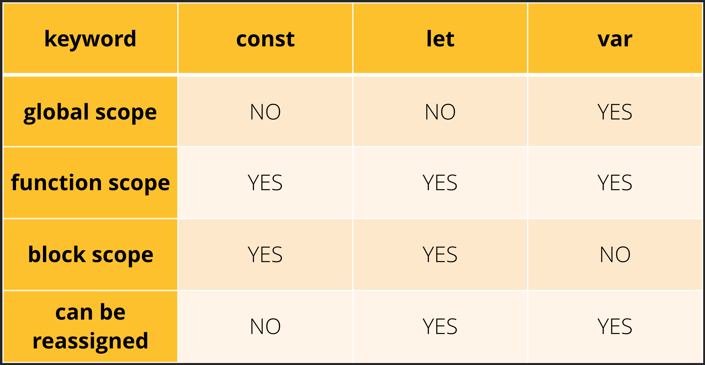

# Variable & Identifier 변수와 식별자

## Identifier

* 변수를 구분할 수 있는 변수명
  * 반드시 문자, 달러($), 밑줄(_)로 시작
  * 대소문자 구분
  * 클래스명 외에는 모두 소문자로 시작
  * 예약어 사용 불가능
* 카멜 케이스(camelCase)
  * 변수, 객체, 함수 등

* 파스칼 케이스(PascalCase)
  * 클래스, 생성자 등
* 대문자 스네이크 케이스
  * 상수(개발자의 의도와 상관없이 변경되 가능성이 없는 값)

 

## Variable 변수

### 변수 선언 키워드

* `const` 
  * 재선언X 재할당X 블록스코프
* `let`
  * 재선언X 재할당O 블록스코프
* `var`
  * 재선언O 재할당O 함수스코프O + 호이스팅

* 선언 Declaration

  * 변수를 생성하는 행위, 또는 시점

* 할당 Assignment

  * 선언된 변수에 값을 저장하는 행위 또는 시점

    * **값을 바꾸는 것 !== 재할당**

    * 값을 바꾸는 것은 가능하다!

      ex) 배열에 값을 추가하는 것

* 초기화 Initialization

  * 선언된 변수에 처음으로 값을 저장하는 행위 또는 시점

* 블록 스코프 (block scope)
  * if, for, **함수의 중괄호 내부**
  * 블록 스코프를 가지는 변수는 블록 바깥에서 접근 불가능
* 함수 스코프 (function scope)
  * 함수의 중괄호 내부
  * 함수 스코프를 가지는 변수는 함수 바깥에서 접근 불가능
* 호이스팅 Hoisting
  * var의 특성 중 하나
  * 변수 선언 이전에, 변수를 미리 참조함

* `let` vs `const`

  

  * 일단 const를 쓰고, 재할당이 필요해지면 그때 let으로 바꾸자. 보수적으로!
  * 생각보다 let이 필요한 경우가 별로 없다!

 

## Reference

* [변수 선언 키워드](https://velog.io/@cyongchoi/var-letconst-Scope)

  