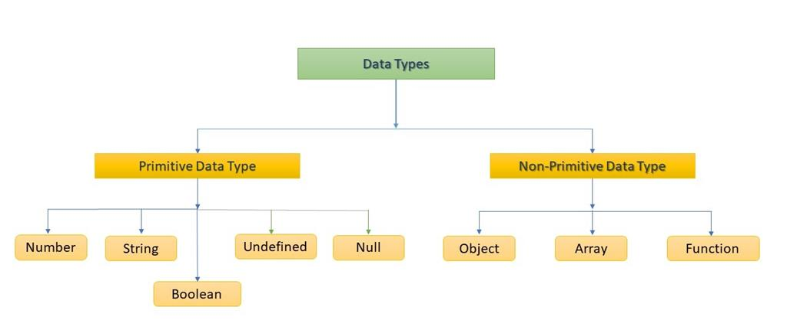

# 데이터 타입 & 연산자

## dataType

* 자바스크립트의 모든 값은 **특정한 데이터 타입**을 가짐

  

### Primitive Type

* 객체가 아닌 기본 타입

* 변수에 해당 타입의 값이 담김

* 다른 변수에 복사할 때 실제 값이 복사

  ```javascript
  let message = 'Buongorno!'
  
  let greeting = message
  console.log(greeting)		// Buongorno!
  
  message = 'Buonasera'
  console.log(message)		// Buongorno!
  ```

  * 숫자

    * 정수, 실수 구분 X => 부동 소수점 형식
    * **NaN** (Not-a-Number) : 계산 불가능할 경우 자동 반환
    * 무한을 나타내는 `Infinity`, -`Infinity`

  * 문자열

    * 16비트 유니코드 문자의 집합

    * **Template Literal**

      * 따옴표가 아닌 백틱

      * ${expression} 형태

        ```javascript
        const a = 'Hello'
        `${a}, World!`		// Hello, World!
        ```

  * undefined/null

    * undefined => 변수 선언 이후 직접 값을 할당하지 않으면, 자동으로 undefined가 할당

    * null => 변수의 값이 없음을 **의도적으로 표현**할 때

      * _원시타입이지만, **object 타입**_

      

  * Boolean

    * **ToBoolean Conversions (자동 형변환)**

      

      * **object는 항상 참이므로, 빈 배열 역시 참이다**

  

<br/>

### Reference Type

* 객체 타입의 자료형

* 변수에 해당 객체의 참조 값이 담김

* 다른 변수에 복사할 때 참조 값이 복사됨

  ```javascript
  const message = ['Buongorno!']
  
  const greeting = message
  conole.log(greeting)		// ['Buongorno!']
  
  message[0] = 'Buonasera'
  console.log(greeting)		// ['Buonasera']
  ```

  * 함수(Functions)
  * 배열(Arrays)
  * 객체(Objects)

  

<br/>

## operator

#### 할당 연산자

* 오른쪽에 있는 피연산자의 평가 결과를 왼쪽 피연산자에 할당

  ```javascript
  let x = 0
  
  x += 10
  console.log(x)	// 10
  
  x -= 3
  console.log(x)	// 7
  
  x *= 10
  console.log(x)	// 70
  
  x/= 10
  console.log(x)	// 7
  
  x++				// x += 1과 동일
  console.log(x)	// 8
  
  x--				// x -= 1과 동일
  console.log(x)	// 7
  ```

<br/>

#### 비교 연산자

* 피연산자들을 비교하고 결과를 boolean으로 반환
* 문자열은 유니코드(아스키코드) 값을 사용하며 표준 산서 순서를 기반으로 비교함
  * 영어 알파벳의 경우 후순위가 더 큰 값
  * 소문자의 값이 대문자의 값보다 더 큼

<br/>

#### 동등 비교 연산자 `==`

* 두 피연산자가 같은 값으로 평가되는지, 암묵적 타입 변화를 통해 타입을 일치시킨 후 비교!

* 두 피연산자가 모두 객체 => 메모리의 같은 객체를 바라보는지 판별

  

<br/>

#### 일치 비교 연산자 `===`

* 엄격한 비교! 암묵적 타입 변환 X
* 두 피연산자가 모두 객체 => 메모리의 같은 객체를 바라보는지 판별

<br/>

#### 논리 연산자

* `&&`, `||`, `!`

  

* 단축 평가 지원

  ```javascript
  1 && 2 && 3 && 4	// 4
  1 || 2 || 3 || 4	// 1
  ```

<br/>

#### 삼항 연산자 Tenary Operator

* 세 개의 피연산자를 사용하여 조건에 따라 값을 반환하는 연산자

* 가장 왼쪽의 조건식이 참이면 콜론 앞의 값, 그렇지 않으면 뒤의 값

  `조건식 ? true면 반환 : false면 반환`

  ```javascript
  console.log(true ? 1 : 2) // 1
  console.log(false ? 1 : 2) // 2
  ```

* 결과값이 반환되므로 변수에 할당 가능하다!

 <br/>

## References

* [dataType](https://ifpb.github.io/javascript-guide/ecma/values-and-types/)

* [logical operators](http://mycours.es/ems2/conditionals-if/)