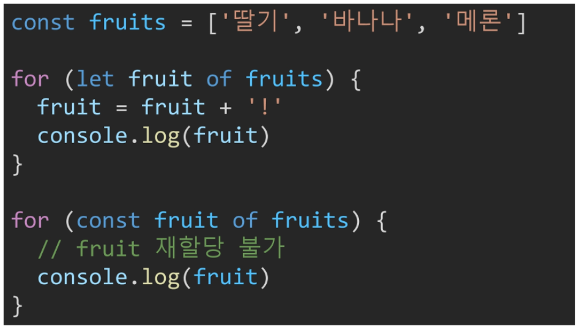

# 조건문과 반복문

## Condition

### if, else if, else

* 조건은 소괄호 안에 작성

* 실행할 코드는 중괄호 안에 작성

* 블록 스코프 생성

  ```javascript
  if (condition) {
    // do something
  } else if (condition) {
    // do something
  } else {
    // do something
  }
  ```

  ```javascript
  const nation = 'Korea'
  
  if (nation === 'Korea') {
    console.log('안녕하세요!')
  } else if (nation === 'Italy') {
    console.log('Ciao!')
  } else {
    console.log ('Hello!')
  }
  ```

<br/>

### switch 

* 표현식의 결과값을 이용한 조건문

* 표현식의 결과값과 case문의 오른쪽 값을 비교

* break와 default 문은 선택적으로 이용가능

* break가 없으면 계속 다음 조건문 실행

  ```javascript
  switch(expression) {
    case 'first value':{
  	// do something
      [break]
    }
      case 'second value': {
  	// do something
  	[break]
    }
  	[default: {
       // do something
     }]
  }
  ```

  ```java
  const nation = 'Korea'
  
  switch(nation) {
    case 'Korea': {
      console.log('안녕하세요!')
      break
    }
    case 'Italy': {
  	console.log('Ciao!')
      break
      }
    default: {
      console.log('Hello!')
    }
  }
  ```

  * `break`가없으면 **Fall-through** 모든 구문이 출력 됨

<br/>

## 반복문

1. while
2. for
3. for ... in
   * 객체의 속성들을 순회할 때 사용
   * 배열도 순회 가능하지만 인덱스 순으로 순회한다는 보장 X  => 권장하지 않음
4. for ... of
   * 반복 가능한(iterable) 객체를 순회하며 값을 꺼낼때 사용

<br/>

### while

* 조건은 소괄호 안에, 실행할 코드는 중괄호 안에

* 블록 스코프 생성

  ```javascript
  let i = 0
  
  while (i < 6) {
      console.log(i) // 0, 1, 2, 3, 4, 5
      i += 1
  }
  ```

  * 참고

    ```javascript
    i = 0
    
    while (i < 3) {
        var a = 1
        let b = 2
        const c = 3
        i += 1
    }
    ```

<br/>

### for

* 세미콜론으로 구분되는 세 부분으로 구성

* `initializtion` : 최초 반복문 진입시 1회만 실행되는 부분

* `condition` : 매 반복 **시행 전** 평가되는 부분

* `expression` : 매 반복 **시행 이후** 평가되는 부분

* 블록 스코프 생성

  ```javascript
  for (initializtion; condition; expression) {
      // do something
  }
  ```

  * 우리가 생각하는, 배열을 순회하는 for

    ```javascript
    arr = [1, 2, 3]
    for (let i=0; i<arr.length; i++) {
        console.log(arr[i])
    }
    ```

<br/>

### for ... in

* **객체(object)의 속성(key)들을 순회**할 때 사용

  => 여기서 말하는 객체란 `dictionary`

* 배열도 순회 가능하지만 권장하지 않는다

* 실행할 코드는 중괄호 안에 작성

* 블록 스코프 생성

  ```javascript
  for (variable in object) {
      // do something
  }
  ```

  ```javascript
  const bias = {
      male_solo: 'baekhyun',
      female_solo: 'yunha'
  }
  
  for (let singer in bias) {
      console.log(singer) // male_solo, female_solo
      console.log(`My favorite ${singer} is ${bias[singer]}.`)
  }
  ```

  * 특정 키값에 접근하려면 `${bias.male_solo}`
  * 배열을 넣으면 인덱스가 나온다 (배열의 키값을 인덱스라고 해석함)

<br/>

### for ... of

* **반복 가능한(iterable) 객체**를 순회하며 값을 꺼낼때 사용

* 실행할 코드는 **중괄호** 안에 작성

* 블록 스코프 생성

* object는 of를 사용할 수 없다!

  ```javascript
  for (variable of iterables) {
      // do something
  }
  ```

  ```javascript
  singers = ['baekhyun', 'suho']
  
  for (let singer of singers) {
      console.log(singer) // baekhyun, suho
  }
  ```

  ```javascript
  singers = ['baekhyun', 'suho']
  
  for (const singer of singers) {
      console.log(singer) // baekhyun, suho
  }
  ```

  * for 내에서 const 가능하다. 매번 블록이 새로 생성되기 때문에 상관 X

    * `let`과 `const`의 차이는 블록 내 재할당 여부!

    

