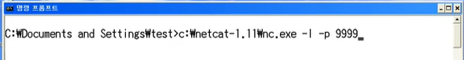
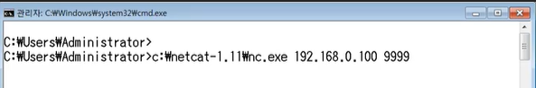

# 10. NAT와 포트 포워딩

* NAT

* 포트포워딩

* 실습

 

## NAT

* Network Address Translation

* IP 패킷의 TCP/UDP 포트 숫자와 소스 및 목적지의 IP 주소 등을 재기록하면서 라우터를 통해 네트워크 트래픽을 주고 받는 기술
  
  * 원래 가려던 곳 말고 다른 곳으로 가도록 바꿔 줌

* 패킷에 변화가 생기므로 IP나 TCP/UDP의 체크섬도 다시 계산해서 재기록 해야함

* NAT를 이용하는 이유
  
  * 사설 네트워크에 속한 여러 개의 호스트가 하나의 공인 IP 주소를 사용하여 인터넷에 접속하기 위해서

* 꼭 사설 IP를 공인 IP로 변화하는 데만 사용하는 것은 아님
  
  * 다른 식으로 응용 가능! 하나의 기술인데, 사설 IP를 공인 IP로 바꾸는데 사용했을 뿐

* 실제 일반적인 네트워크의 모습
  
  
  
  * 인터넷 세상에서 바라본 모습
    
    

 

## 포트 포워딩

### 포트 포워딩/포트 매핑(port mapping)이란?

* 패킷이 라우터나 방화벽과 같은 네트워크 장비를 가르지르는 동안 **특정 IP 주소와 포트 번호의 통신 요청을 특정 다른 IP와 포트번호로 넘겨주는** 네트워크 주소 변환(NAT)의 응용

* 게이트웨이(외부망)의 반대쪽에 위치한 사설 네트워크에 상주하는 호스트에 대한 서비스를 생성하기 위해 흔히 사용됨
  
  
  
  * 요청을 보내고 싶은데 보이지 않음
    
    => 직접 상대 컴퓨터의 IP(사설 IP)를 치는게 아니라, 공인 IP로 보냄
    
    * 공인 IP 2의 특정 포트로 전송
      
      
    
    * 공유기가 이제 처리하기 시작
      
      예) 특정포트 1234로 들어왔다면, 다른 특정 IP(사설 IP 등)의 특정포트 4321로 전송
    
    * 공유기가 대신 전달 해줌
      
      

 

## 실습

* 포트 포워딩 설정해보기
  
  * 포트 포워딩을 이용하여 다른 사용자들이 사설 IP를 사용하는 서버로 접속 할 수 있도록 설정해보기

* 사설 IP를 사용하는 서버로 접속해보기
  
  * 사설 IP를 사용하는 가상머신에 서버를 설정하고 해당 서버를 포트 포워딩을 통해 접속할 수 있도록 설정해보기

 

### 포트 포워딩 설정해보기 + 사설 IP를 사용하는 서버로 접속해보기

1. 공유기 설정 사이트로 가서 NAT 설정으로 들어가기
   
   

2. 아래 설정
   
   
   
   * 외부 포트는 웹 서버로 잘 알려진 `80`
   
   * 내부 포트는 80도 좋고 다른 번호도 괜찮음
     
     * 다른 번호로 할 때는 내가 꼭 설정에서 해당 포트 번호를 열어 둬야함
       
       그치만 헷갈리니까 둘다 80해두는게 좋음
       
       

3* VMware 확인
   
   * 프로그램으로 만들어진 가상 공유기 => NAT 로 설정 되어 있음
     
     

4* XP(가상)의 내부 IP 확인하기
   
   

5* Edit > Virtual Network Editor > VMnet8 설정
   
   
   
   
   
   * Add
     
     
     
     * Host Port : 외부의 사용자들이 공인 IP와 함께 접속할 포트 번호
     
     * Virtual machine IP : 내부 IP 주소
     
     * Virtual machine port : 내부의 특정 포트
     
     
     
     내 컴퓨터의 9999포트로 들어오면 싹다 192.168.10.100으로 보냄
     
     * 본체가 192.168.0.100
     
     * XP(virtual)가 192.168.10.100
     
     * XP에 있는 서버에 접속하려고 하면, 일단 0.100(HOST PC)으로 들어오고 NAT를 사용해서 10.100으로 넘어감

6* 본체에서 cmd로 연결 상태 확인해보기
   
   * `netstat -ano`
   
   * 9999번 포트 열려있는 것 확인 가능
     
     
     
     * 1936번이랑 연결 되어 있네 => 작업관리자에서 확인
       
       
       
       => 가상 공유기에서 사용 중

7. 서버 열기
   
   
   
   본체에서
   
   
   
   접속해서 소통 가능
   
   
