# 11. 7계층 프로토콜 HTTP

> 7계층 어플리케이션 계층의 프로토콜 중 가장 많이 사용하는 HTTP 프로토콜
> 
> 소켓 통신 => 7계층 프로토콜 만드는 것!

* HTTP 프로토콜

* HTTP 요청 프로토콜
  
  * HTTP 요청 프로토콜 작성 실습
  
  * URI 실습

* HTTP 응답 프로토콜

* HTTP 헤더 포맷

* 실습

 

## HTTP 프로토콜

### 웹을 만드는 기술들

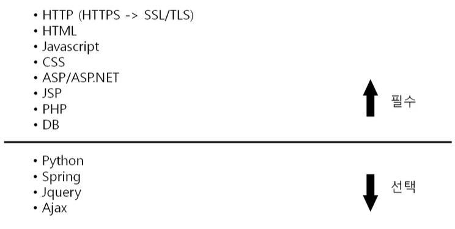

* `HTML + JavaScript + CSS`
  
  * **웹 표준** => 
  
  * 서버에 저장 but 클라이언트 컴퓨터에서 동작
    
    => 프론트엔드
  
  * HTML : 웹페이지를 채울 내용
  
  * JavaScript : 웹페이지에 들어갈 기능
  
  * CSS : 웹 페이지를 예쁘게 꾸밀 디자인

* `HTTP`
  
  * 위의 웹 표준 데이터를 받아오는 프로토콜
  
  * **HyperText Transfer Protocol**
  
  * HTTPS == HTTP + SSL/TLS(보안)

* `ASP/ASP.NET, JSP, PHP`
  
  * 웹표준과 달리 서버에서 동작. 클라이언트는 볼 수 없음
    
    => 백엔드
  
  * ASP/ASP.NET : MS가 만든 것. 그래서 활용도가 낮음
  
  * JSP : 자바 기반. 호환성 높고, 국내 공공기관은 모두 자바 기반이라 수요 많음.
  
  * PHP : 독자적임

 

### HTTP 프로토콜의 특징

* **HyperText Transfer Protocol**

* www에서 쓰이는 핵심 프로토콜. 문서 전송을 위해 쓰이고 오늘날 거의 모든 웹 애플리케이션에서 사용
  
  * 음성, 화상 등 여러 종류의 데이터를 MIME로 정의하여 전송 가능

* 특징
  
  * Request(요청)과 Response(응답) 동작에 기반하여 서비스 제공

#### HTTP 1.0

* 요즘은 잘 안 쓰임

* `연결 수립 / 동작 / 연결 해제` 의 단순함이 특징
  
  * 하나의 URL은 하나의 TCP 연결

* HTML 문서를 전송 받은 뒤 연결을 끊고 다시 연결하여 데이터를 전송
  
  => 데이터가 적은 과거에는 괜찮았음

* 네트워크 부하가 심하다는 문제점
  
  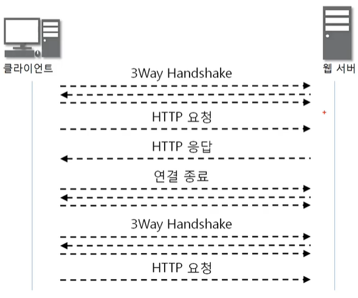
  
  * 요청 한 번 보내고 응답 받으면 연결을 종료 해버려서 다시 3Way Handshake를 해야함
    
    => HTTP/1.1이 보완. 한 번 연결 하면 끝
    
    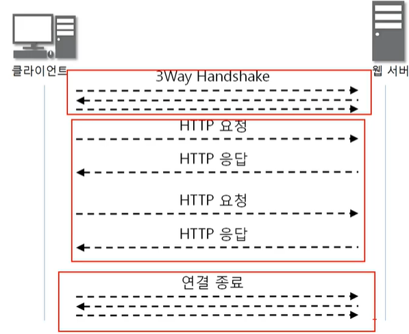

 

## HTTP 요청 프로토콜

### HTTP 요청 프로토콜의 구조

* 요청하는 방식을 정의하고 클라이언트의 정보를 담고 있음
  
  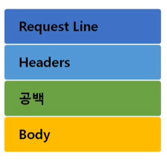
  
  * 우리가 알고 있는 영어와 특수 문자를 쓴다! (16진수X)
  
  * `Headers`: 패킷의 헤더X 옵션과 유사함.
    
    * 10개 넘게 들어가기도 함!
  
  * `공백` : 한 줄
  
  * `Body` : 데이터
  
  * 예시
    
    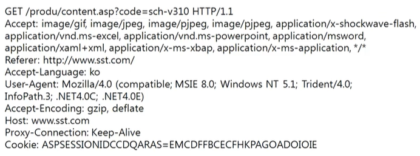
    
    * 첫번째줄이 Request
    
    * 나머지 모두 Headers

#### Request Line

* 띄어쓰기 필수!

* 요청 타입
  
  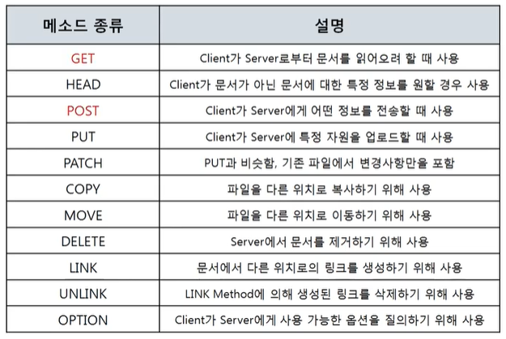
  
  * `GET` : 데이터 요청
  
  * `HEAD` : 페이지를 보내달라고X 페이지 정보만 따로 요청
  
  * `PUT` : 사진 업로드와는 다름!
  
  * `COPY`, `MOVE`, `DELETE`
    
    * 클라이언트 마음대로 서버 데이터를 조작한다? => 안돼! 막아버림

* 예시
  
  * POST
    
    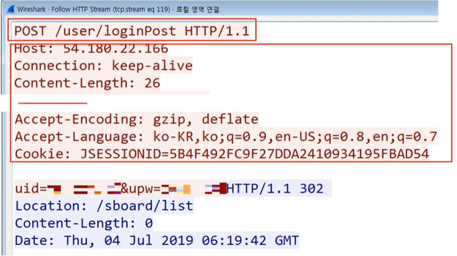
    
    Request Line + HEADER + 공백 + Data(uid~)
    
    * 데이터는 BODY에 넣어서 보냄.
  
  * GET
    
    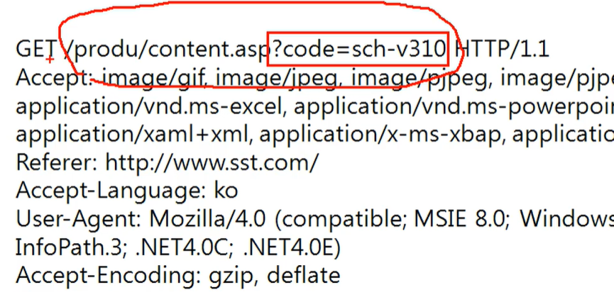
    
    * 데이터를 주소창에 포함시켜서 보냄

* GET 방식과 POST 방식의 차이점
  
  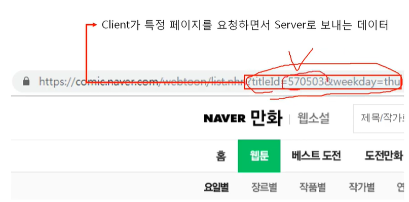
  
  * GET은 주소창에 포함 되어서 사람들이 볼 수 있음
    
    * 중요한 데이터는 GET방식으로 보내지 않는다
  
  * POST는 body에 들어가므로 패킷 캡쳐하지 않는 이상 볼 수 없음

 

#### URI의 구조

* Uniform Resource Identifier
  
  * 옛날에는 URI와 URL을 혼용. 정확히는 URI가 맞는 표현

* 인터넷에서 특정 자원(파일)을 나타내는 유일한 주소
  
  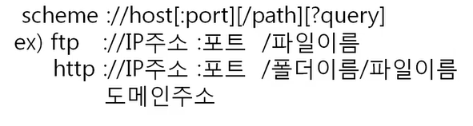
  
  * `scheme(스키마)` : 7계층 프로토콜을 지정
  
  * `IP주소 :포트번호`
    
    * 보통은 IP 주소 자리에 도메인 주소를 씀
    
    * 컴퓨터 내부에서 도메인 주소 => IP 주소로 변환 (DNS 서버가 하는 일)
    
    * 포트 번호는 80번 또는 443번을 웹 브라우저가 알아서 설정함
      
      * 주로 생략됨
  
  * `[/path]`, `[?query]`
    
    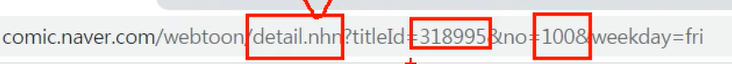
    
    * webtoon은 경로, detail.nhn은 내가 원하는 파일
      
      => webtoon이라는 폴더안에 detail이라는 파일을 열어주세요
      
      * 보통 프로그래밍 코드가 저장된 파일
    
    * ?를 달고, 뒤의 데이터(쿼리)를 파일에 전달하는 것
      
      => detail.nhn아, titleId는 318995, no은 100인 걸 열어줘!
      
      * 프로그램한테 숫자값을 입력한 셈!
  
  * 즉, 원격지(host)에 있는 어떤 파일(path에 위치)에 데이터(query)를 전달

 

### HTTP 요청 프로토콜 실습

#### 1. HTTP 프로토콜 작성 실습

> Netcat을 이용하여 HTTP 프로토콜을 직접 작성해보기

* 네이트에 연결해보기
1. cmd에서 nc.exe 프로그램 부르기 (nc는 클라이언트-서버 연결해서 메시지 주고 받게 해줌)
   
   * HTTP 프로토콜 형식으로 주고 받기 + 클라이언트 쪽에서 웹 서버 접속하기
     
     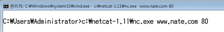

2* Request Line 작성 (헤더 이후는 생략)

   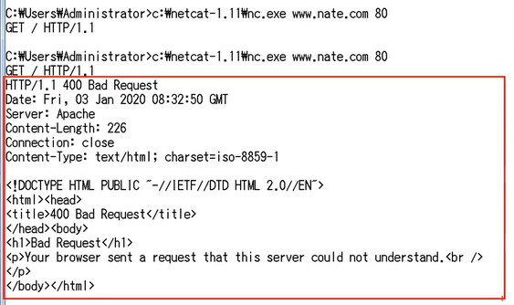

3* 400번대 응답을 받음 (클라이언트 잘못 ㅜㅜ)

* 네이버에 연결해보기
  
  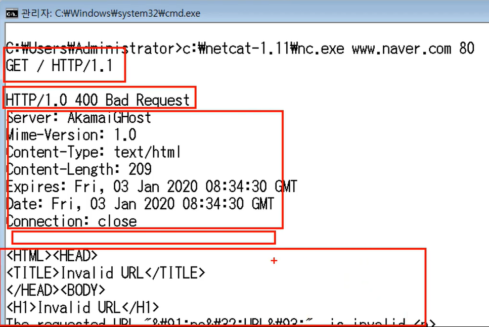

 

### URI 실습

1. apache-tomcat(아파치에서 제공하는 웹 어플리케이션 중 하나),  jak(apache-tomcat이 자바 기반이라서) 설치

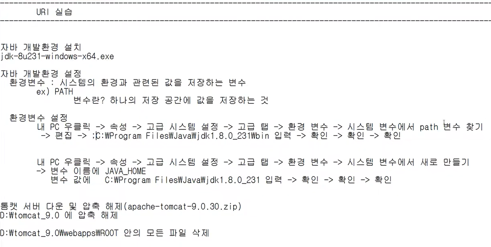

2. 기존 경로 두고 그 뒤에 세미콜론 더해서 붙여 넣기
   
   * Window 7 기준

3. 새로운 cmd 켜고 `javac -version` 확인하기

4. tomcat 폴더 C드라이브 아래로 이동하고 이름 간단하게 변경(선택)

5. startup.bat 파일 실행하면 웹 서버 실행된 것
   
   * 톰캣 확인하려면 웹브라우저에 `본체 IP주소:8080` 검색

6. 톰캣 폴더 > webapps 폴더 내에 폴더 여러개 + 메모장 파일 하나 생성

7. 웹브라우저에서 URI 입력
   
   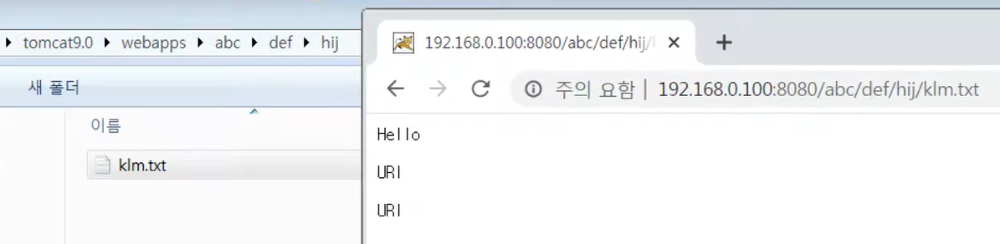
* query까지 만들어보기
1. 아무 이름의 폴더 + 파일 만들기
   
   * 파일 확장자는 `jsp`

2* 메모장으로 파일 편집하기 (간단한 jsp 코드)

   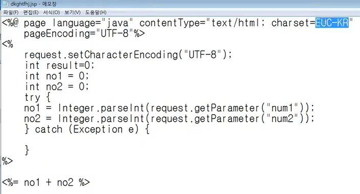

* no1을 받고 no2를 받아서 두개의 합을 반환하는 코드
  
  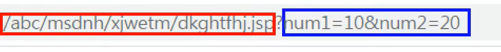

* 빨간색 박스 : 경로

* 파란색 박스 : 데이터(query)
  
  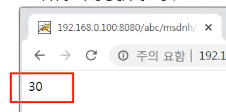

 

## HTTP 응답 프로토콜

### HTTP 응답 프로토콜의 구조

* 사용자가 볼 웹 페이지를 담고 있음
  
  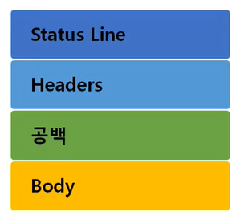
  
  * Request Line이 아닌 **`Status Line`**
  
  * `Body` : 사용자가 요청한 데이터
  
  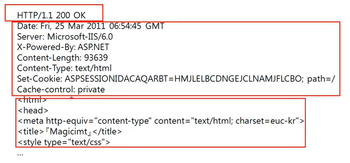
  
  (공백이 빠짐)

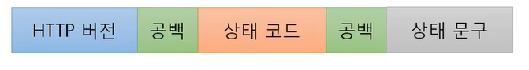

* 요청과 달리 HTTP 버전이 맨 앞에 옴 (중요X)

* 상태코드와 상태문구는 하나의 쌍
  
  * 코드만 기억하기

#### 상태코드

* 서버가 알려주는 여러가지 정보가 담겨 있음

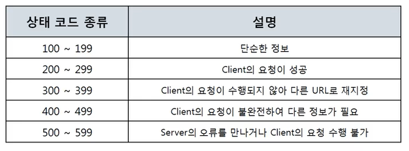

* 성공적인 통신 **200 OK**
  
  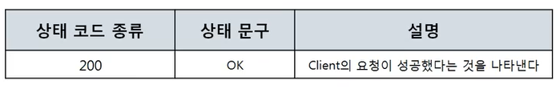

* 클라이언트의 실수, 잘못, 오류 **400번대**
  
  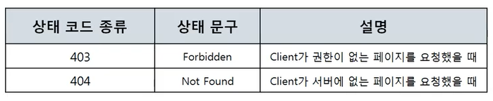

* 서버의 실수, 잘못, 오류 **500번대**
  
  - 코드를 잘못 썼을 때!
  
  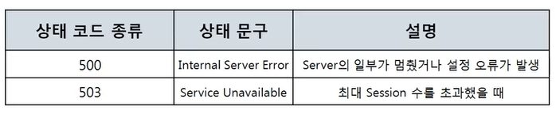

 

## HTTP 헤더 포맷

### HTTP 헤더 구조

* 수많은 정보를 담고 있음

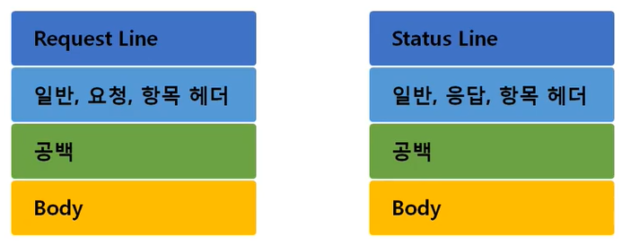

* 일반 헤더
  
  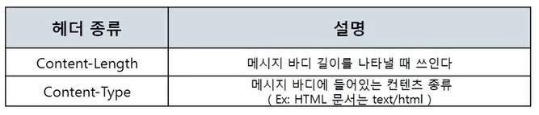

* 클라이언트 정보를 담고 있는 **요청 헤더**
  
  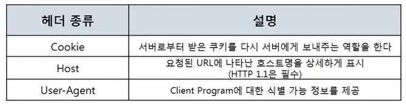
  
  * User-Agent를 통해서 PC/모바일 접속 구분 가능

* 서버 정보를 담고 있는 **응답 헤더**
  
  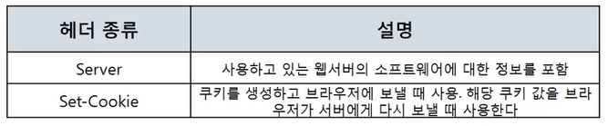
  
  * 민감한 정보가 있다면 이 부분을 막아 놓고, 쓸 수 없게 해둠

 

## HTTP 프로토콜 분석 실습

> Burpsuite라는 프로그램을 이용해서 내 웹 브라우저를 오고 가는 HTTP 요청 프로토콜과 HTTP 응답 프로토콜의 모양을 확인하고, 수정할 수 있음

1. burpsuite 설치

2. 구글에 크롬 falcon proxy 검색하여 확장 프로그램으로 추가

3. falcon proxy 사용해서 설정 추가
   
   * 톰캣이 켜져 있다면 포트 8080 사용 X (포트 번호 하나 당 프로그램 1개)
     
     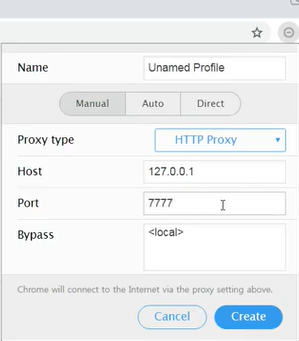
     
     * 내 컴퓨터 IP 주소 127.0.0.1의 7777번 포트로, 웹 브라우저와 하는 모든 통신을 다 보내라!
       
       => burpsuite가 받아야함

4. 체크하고 켜기
   
   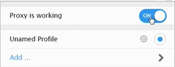

5. burpsuite에서 설정하고 running 체크
   
   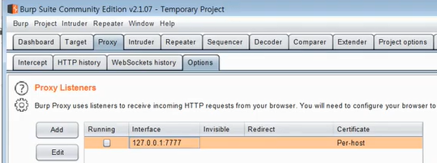
   
   * 아래 옵션들도 체크하기 (Intercept Client~, Intercept Server~)

6. 요청 캡쳐
   
   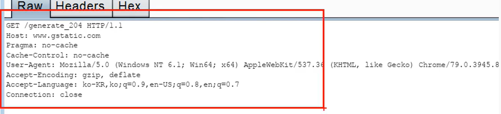
   
   * 한 번 클릭 한다고 요청이 하나만 가는게 아니라서 여러 개가 잡힐 것

7. HTTP 응답
   
   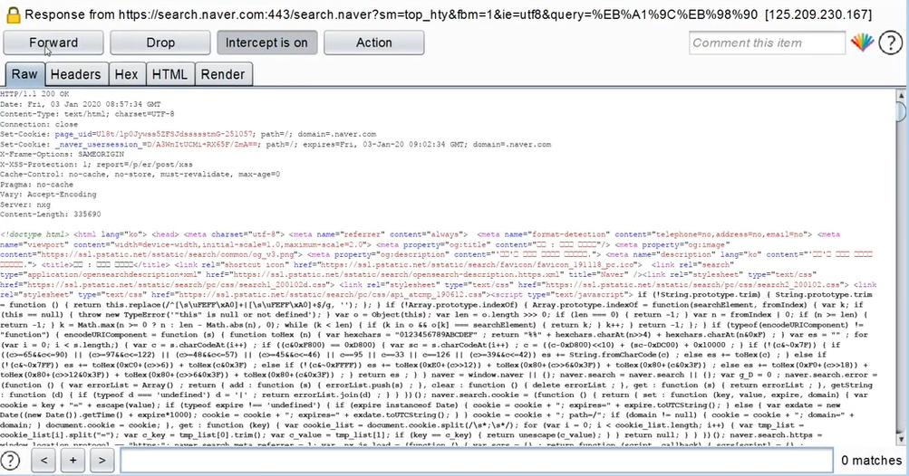
   
   * Forward 누르면 웹 브라우저 화면에 뜸

8. 아래 칸에서 ball 검색해보기
   
   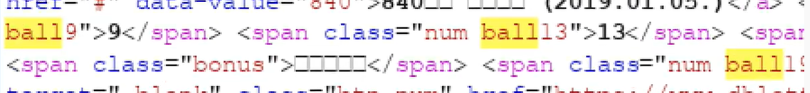
   
   * ball 뒤의 숫자를 다른 숫자로 변경해보기

9. 다시 forward 누르기
   
   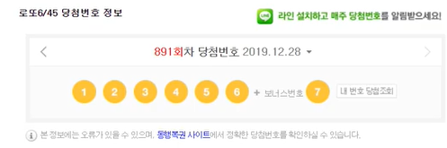
   
   번호가 바껴서 뜸!
* JavaScript 바꾸기
1. falcon proxy 켜서 요청 보내고 응답 받기

2. `rightClickOpenYn` 값을 false로 바꾸기
   
   * 응답 프로토콜의 Body에 포함되어 있던 JavaScript 바꾼 것

3. Forward 여러번 눌러주면 웹 브라우저 화면에서 우클릭 풀림
