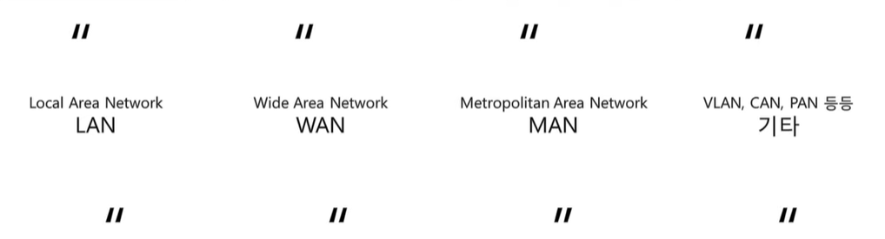

# 네트워크란 무엇인가

## 네트워크란 무엇인가

#### 네트워크

* 노드들이 데이터를 공유할 수 있게 하는 디지털 전기통신망의 하나
  * 즉, 분산되어 있는 컴퓨터를 통신망으로 연결한 것
  * 네트워크에서 여러 장치들은 노드간 연결을 사용하여 서로에게 데이터를 교환한다
  * `노드` : 네트워크에 속한 컴퓨터 또는 통신 장비를 뜻하는 말

 

#### 인터넷

* 문서, 그림, 영상과 같은 여러가지 데이터를 공유하도록 구성된 세상에서 가장 큰, 전세계를 연결하는 네트워크
  * 네트워크 > 인터넷
* `www` != `인터넷`
  * www는 인터넷을 통해 웹과 관련된 데이터를 공유하는 것

 

## 네트워크의 분류

#### 크기에 따른 분류

* **LAN (Local Area Network)**
  * 가까운 지역을 하나로 묶은 네트워크
  * `같은 네트워크 대역`
* **WAN (Wire Area Network)**
  * 멀리 있는 지역을 한데 묶은 네트워크
  * 가까운 지역끼리 묶인 LAN과 LAN을 다시 하나로 묶은 것

 

#### 연결 형태에 따른 분류

* **Star형**

  * 중앙 장비에 모든 것이 연결되어 있음
  * 가까운 것들을 중심으로!
  * LAN을 만들 때에는 star형을 자주 사용함 => 가까우니까!

  

* **Mesh형**

  * 여러 노드들이 서로 그물처럼 연결되어 있음
  * 모~든 노드와 연결 되어 있는 것은 아님

  

  

* **혼합형**

  * 실제 인터넷은 여러 형태를 혼합해서 연결

  

## 네트워크의 통신 방식

#### 네트워크에서 데이터는 어떻게 주고 받는가?

* **유니 캐스트**
* **멀티 캐스트**
* **브로드 캐스트**
  * 같은 네트워크 대역에 있는 모든 사람과 통신

 

## 네트워크 프로토콜

#### 프로토콜이란?

* 일종의 약속, 양식
* 네트워크에서 노드와 노드가 통신할 때 `어떤 노드가 어느 노드에게 어떤 데이터를 어떻게 보내는지` 작성하기 위한 양식
  * ex) 택배 송장처럼!
* 각 프로토콜들도 해당 프로토콜만의 양식이 있음

 

#### 여러가지 프로토콜

* 여러 프로토콜들로 캡슐화 된 `패킷`
  * 데이터를 보내기 위해서 어떤 프로그램이랑 통신할지 (포트번호), 어떤 지역에서(IP주소), 특정 컴퓨터(MAC주소)를 찾아갈 수 있도록 여러 개의 프로토콜을 함께 사용함