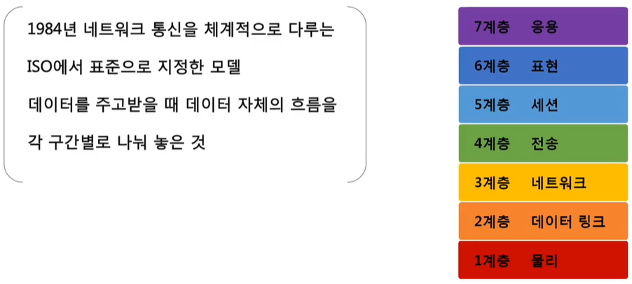
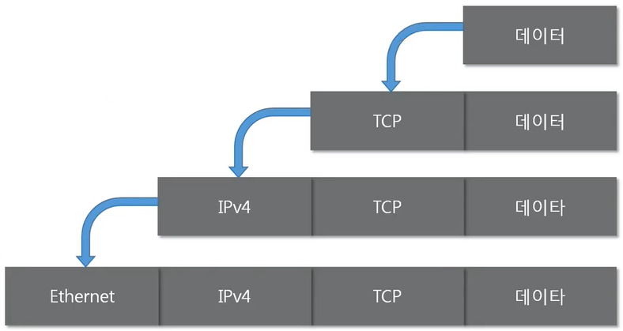

# 네트워크 모델

## 네트워크 모델의 종류

### TCP/IP 모델

 

### OSI 7계층

* ~~실제로 살펴 보면, OSI보다 TCP/IP 모델에 더 가까움~~

> HTTP / TCP, UDP / IP, ICMP, ARP / 이더넷 => 프로토콜 구조까지 알아야함

 

## 두 모델 비교

* 공통점
  * 계층적 네트워크 모델
  * 계층간 역할 정의
* 차이점
  * 계층의 수 4 vs 7
  * TCP/IP는 네트워크를 통해서 데이터를 전달할 때의 실제 프로토콜 구조 기반(조금 더 실무적인 느낌), OSI는 논리적 역할 기반
    * 시험에서는 OSI를 더 많이 물어본다
  * TCP/IP는 데이터 전송 기술에 특화, OSI는 통신 전반에 대한 표준

 

## 네트워크를 통해 전달되는 데이터 `패킷`

* 네트워크 상에서 전달되는 데이터를 통칭하는 말
* 네트워크에서 전달하는 데이터의 형식화된 블록
* 제어 정보와 사용자 데이터로 이루어져있고, 사용자 데이터는 페이로드라고 함

### 구조

* 여러번 포장 된 택배 상자라고 생각하면 됨
  
  * 프로토콜에도 순서가 있음!

* 일반적인 구조
  
  * `페이로드` : 사용자 데이터
  
  * `헤더`
  
  * `풋터` : 거의 쓰지 않는다
  
  * 예시
    
    
    
    * `HTTP 프로토콜`이 페이로드, TCP가 헤더 => 하나의 패킷
    * `TCP + HTTP`를 페이로드 삼아서, IPv4를 헤더로
    * `IPv4 + (TCP + HTTP)`를 페이로드 삼고, Ethernet을 헤더로

### 캡슐화

* 여러 프로토콜을 이용해서 최종적으로 `보낼` 패킷을 만드는 과정(헤더를 붙이고 붙이는)

* 상위 계층에서 하위 계층으로 내려가면서 프로토콜을 붙인다
  
  
  
  * TCP는 4계층, IPv4는 3계층, Ethernet은 2계층
  * 가장 바깥에는 이전에 붙은 것보다 같거나 더 낮은 계층(숫자가 작은)만 붙을 수 있다

### 디캡슐화 (캡슐까기)

* 패킷을 `받았을 때` 프로토콜들을 하나씩 확인하면서 데이터를 확인하는 과정

* 바깥에서부터 **순서대로** 확인
  
  

### PDU (Protocol Data Unit)

* 각각의 계층에서 패킷을 부르는 이름이 다르다
  
  * `TCP` + `데이터` : 세그먼트
    
    
  
  * `IPv4` + `페이로드` : 패킷 (!= 우리가 통칭하는 패킷)
    
    
  
  * `Ethernet` + `페이로드` : 프레임
    
    

 

## 실습 (Wireshark)

* `arp`로 필터링을 해보자
  
  * arp는 3계층 프로토콜이다
    
    
  
  * 푸터를 사용하는 것은 단 하나, `Ethernet`
    
    * Ethernet이 헤더, ARP이 가운데에
    
    * [Ethernet] + [ARP] + [Ethernet's footer]

* cmd를 실행하고 `ping 8.8.8.8`
  
  
  
  => 와이어샤크에서 `ICMP`(3계층)로 필터링
  
  
  
  * [2 Ethernet] + [3 IP] + [3 ICMP]
