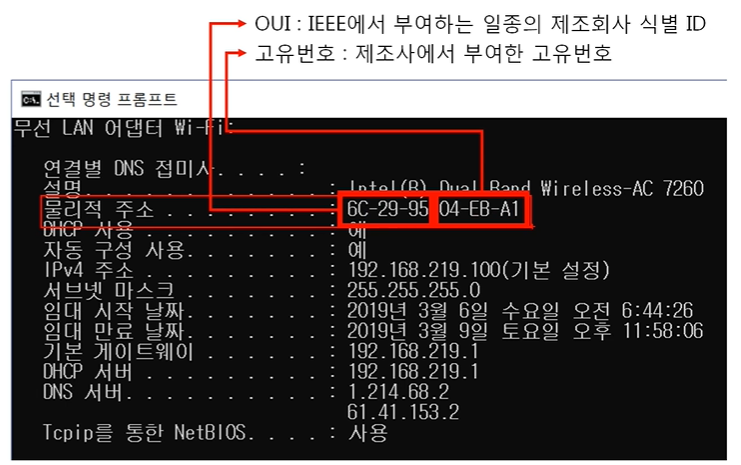
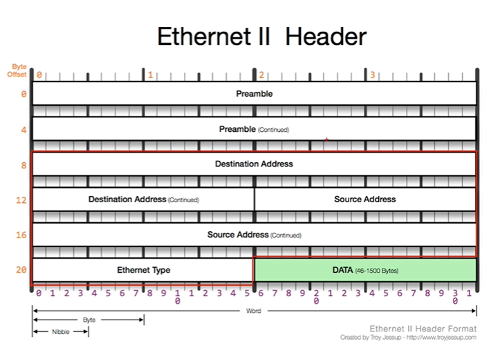
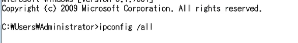
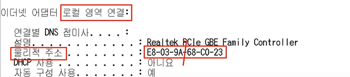
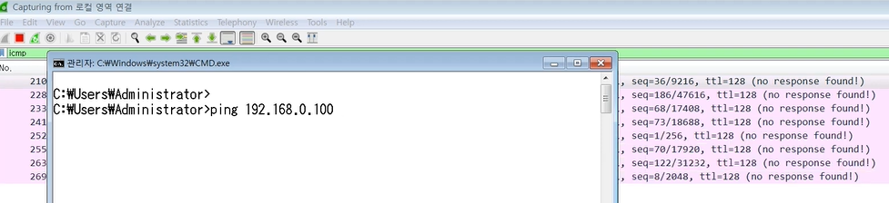
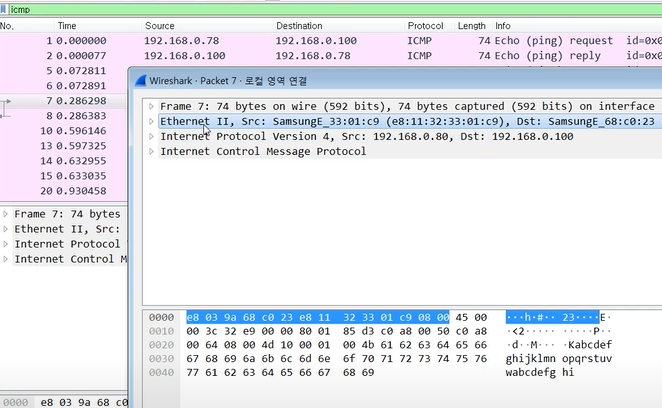

# 데이터 통신

> OSI 7계층에서 2계층에 대한 내용
> 가까이에 있는, 즉 Local Area 내의 컴퓨터들끼리 어떻게 데이터를 주고 받는지

## 2계층에서 하는 일

* 하나의 네트워크 대역(LAN), 즉 같은 네트워크 상에 존재하는 여러 장비들 중에서 어떤 장비가 어떤 장비에게 보내는 데이터를 전달
  
  * 2계층은 **하나의 네트워크 대역 LAN**에서만 통신할 때 사용
    
    => 다른 네트워크와 통신할 때는 항상 **3계층**이 도와주어야 함
    
    => 3계층의 주소 + 3계층의 프로토콜을 이용해야만 다른 네트워크랑 통신 가능

* 추가적으로 `오류제어`와 `흐름제어` 수행

 

## 2계층에서 사용하는 주소

* LAN에서 통신할 때 사용하는 **MAC 주소**
  
  * 물리적인 장비가 부여받은 고유 주소값이기 때문에 물리적인 주소로도 불림
  
  
  
  * 12개의 16진수(16진수 2개당 1바이트이므로 총 6바이트)를 사용하여 표시

* OUI : 제조회사의 고유 값(삼성, 애플)

* 고유 번호 : 제조회사에서 네트워크 장비에 부여한 고유값

 

## 2계층 프로토콜

* LAN에서 통신할 때 사용하는 Ethernet 프로토콜 (14바이트)
  
  
  
  * Destination Address(6바이트)
    
    * 이더넷 목적지(받는 사람)의 맥 주소
  
  * Source Address(6바이트)
    
    * 출발지의 맥 주소
  
  * Ethernet Type(2바이트)
    
    * 프로토콜 타입에 가까움
    
    * DATA(Payload) 안에 들어있는 상위 계층 프로토콜에 대한 정보를 담아둠 (미리 알려주는 것)
      
      => 전기적 신호(이진수 10101)로 데이터가 전달 되는데, 받는 입장에서는 DATA가 뭔지 전혀 알 수 없으므로 미리 알려주는 것이 좋음
    
    * IPv4(0x0800), ARP(0x0806)
      
      * 0x는 뒤의 숫자가 16진수라는 걸 의미함

 

# 실습

1. 내 PC의 MAC주소 확인해보기

2. Ethernet 프로토콜 캡쳐

3. Ethernet 프로토콜 분석

 

### 1. 내 PC의 MAC주소 확인해보기

> 윈도우에서 간단하게 내 PC의 MAC 주소를 확인하는 법 알아보기

* 명령프롬프터에서 `ipconfig /all` 입력
  
  
  
  * `E8-03-9A` 제조 회사 고유 번호
  
  * `68-C0-23` 제품 고유 번호
  
  * 확인해보고 싶으면 [mac address oui](https://aruljohn.com/mac.pl)

 

### 2. Ethernet 프로토콜 캡쳐

* 같은 네트워크 내에 있는 강사의 컴퓨터로 요청 보내기
  
  
  
  * 이더넷 확인
    
    
    
    `e8 03 9a 68 c0 23 e8 11 32 33 01 c9 08 00` => 총 8개
    
    * 앞의 6바이트 : 받는 사람 주소
    
    * 다음 6바이트 : 보내는 사람 주소
    
    * 마지막 2바이트 : 상위 프토토콜 타입
