# IP 주소

> 실제로 컴퓨터끼리는 IP 주소를 사용해 데이터를 주고 받는다

* 3계층의 기능

* 일반적인 IP 주소

* 특수한 IP 주소

 

## 3계층의 기능

### 3계층에서 하는 일

* 다른 네트워크 대역, 즉, 멀리 떨어진 곳에 존해자는 네크워크까지 어떻게 데이터를 전달할지 제어하는 담당

* LAN과 LAN을 연결
  
  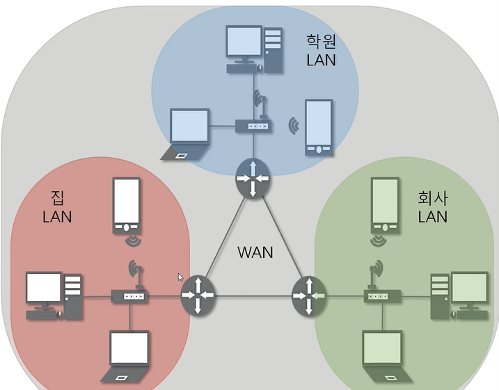
  
  * 서로 다른 네트워크 대역을 연결하기 위해 **라우터** 사용

### 3계층에서 쓰는 주소

* WAN에서 통신할 때 사용하는 IP 주소
  
  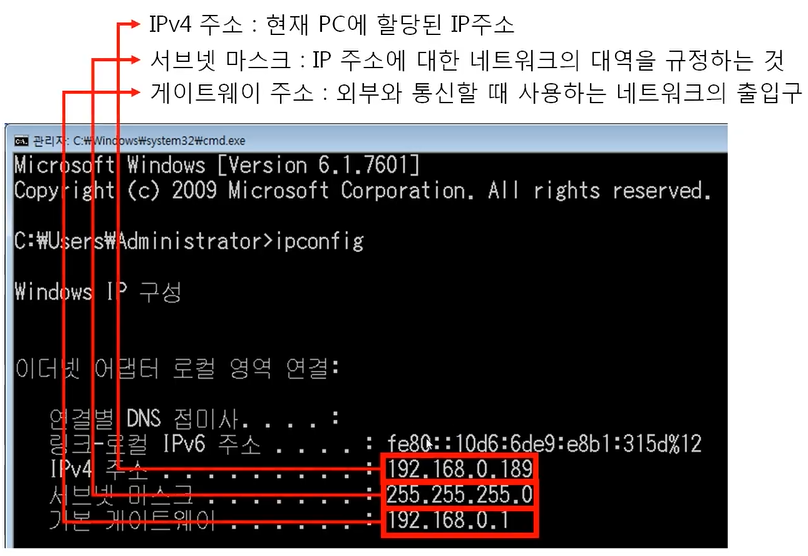
  
  * IPv4 주소 뿐만 아니라 서브넷 마스크와 기본 게이트웨이 주소가 필요

### 3계층 프로토콜

* IP 주소를 이용해 MAC 주소를 알아오는 **ARP 프로토콜**
  
  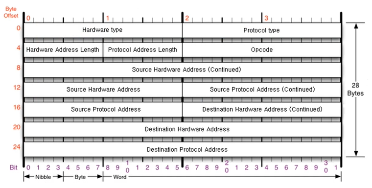

* WAN에서 통신할 때 사용하는 **IPv4 프로토콜**
  
  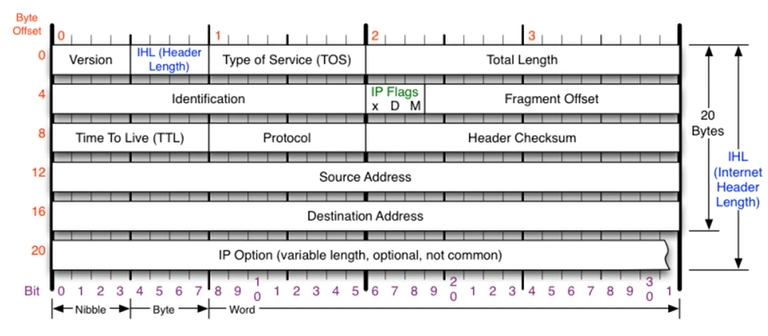
  
  * IPv6 프로토콜은 version을 4에서 6으로 바꾼다고 바뀌는게 아니다! 완전히 다르게 생겼음!

* 서로 통신이 되는지 확인할 때 쓰는 **ICMP 프로토콜**
  
  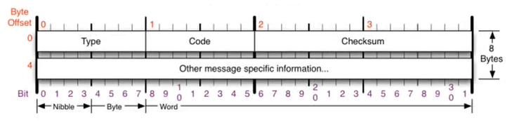

 

## 일반적인 IP 주소

### classful IP 주소 : 클래스에 맞는 IP 주소

* 10진수, 4바이트로 씀
  
  * 1byte == 8bit == 2진수 8개로 표현 가능(00000000 ~ 11111111~) == 10진수 0 ~ 255 (총 256개의 숫자)
    
    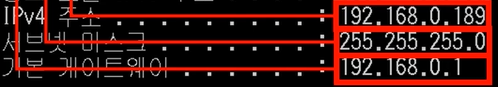
    
    * 1바이트만 들어갈 수 있는데 10진수로 적었기 때문에 0부터 255사이의 숫자만 들어갈 수 있음

* 낭비가 심함
  
  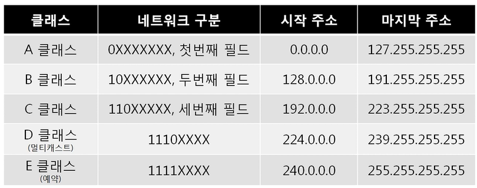
  
  * 외울 필요 X 알 필요도 X (지금은 안 쓰니까...)
  
  * 그치만 외우고 싶다면! 2진수로 바꿔서 기억하면 된다
    
    * A클래스 `0 0000000.00000000.00000000.00000000` 
      
      ~ `0 1111111.11111111.11111111.11111111`
    
    * B클래스 `10 000000.00000000.00000000.00000000`
    
    * C클래스 `110 00000.00000000.00000000.00000000`
      
      ...
  
  * **A클래스**
    
    * 첫 번째 필드는 네트워크 대역을 구분하는데 씀
      
      => 총 128개의 네트워크 대역만 존재
      
      => 개수가 너무 적음 => 그래서 해당 네트워크에 속한 컴퓨터를 구분하는데 씀 (최대 2의 24제곱 개)
      
      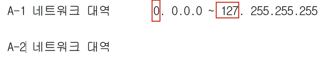
  
  * **B클래스**
    
    * 앞의 두 필드를 네트워크 대역 구분에 사용, 해당 네트워크에 속하는 컴퓨터 구분(2의 16제곱)에 사용
  
  * **C클래스**
    
    * 세번째 필드까지를 활용해서 네트워크 대역 구분에 사용
      
      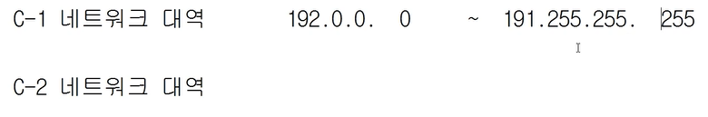
  
  * **D클래스**
    
    * 멀티캐스트를 위해 사용
  
  * **E클래스**
    
    * 실험을 위해 남겨둔 것

 

### Classfulless IP 주소

> 낭비되지 않도록 아껴 쓰는 IP 주소

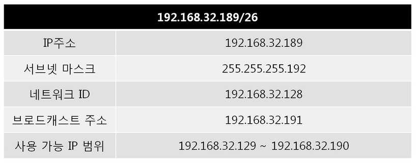

* 서브넷 마스크 : 네트워크 대역을 어디까지 쓸 건지, 알려주는 보조
  
  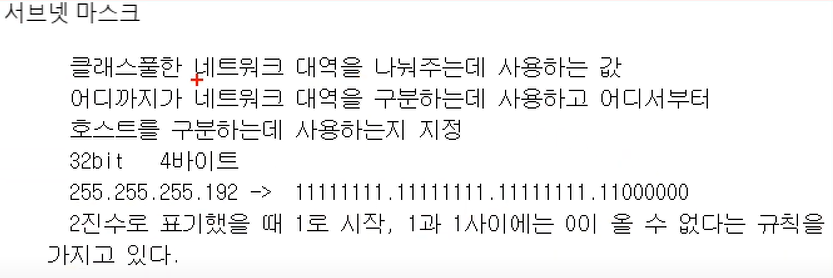
  
  0이 한번 나오면 싹 다 0이다~~ => 1과 0이 바뀌는 부분!으로 구분

 

### 사설 IP와 공인 IP

> 부족한 IP 주소 문제를 해결하기 위해 등장

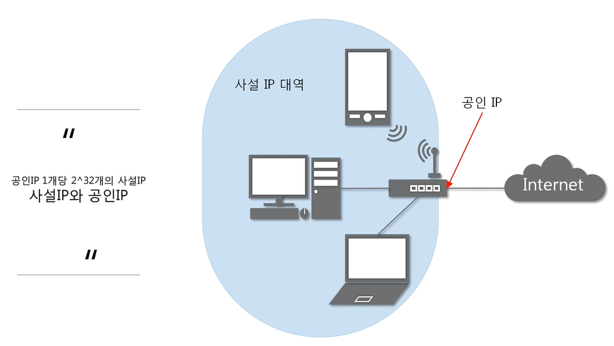

* 사설/공인 IP와 Classfulless 주소를 함께 사용 중

* 외부와 통신하기 위해서는, 무조건 공인 IP를 통해서! 통신
  
  * 내부에 100개의 컴퓨터가 있더라도, 공인 IP는 한 개만 씀!
  
  * `NAT`를 활용해 공인 IP로 변경
  
  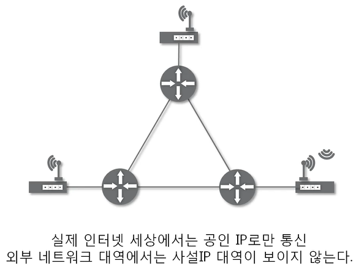

 

## 실습

### 특수한 IP 주소

> 0.0.0.0/0

* Wildcard

* **나머지** 모든 IP

* 일반적인 주소X 컴퓨터에 사용X

 

> 127.0.0.1 (127로 시작하는 주소)

* 내 컴퓨터를 의미

* 통신에 문제가 있을 때, 내 컴퓨터와 통신하면서 통신 체크

 

> 게이트 웨이 주소

* 어딘가로 가려면 일단 여기로!
  
  => 외부 세상으로 나가려면 이 문을 통과해야해

* 일반적으로 공유기 IP를 씀
  
  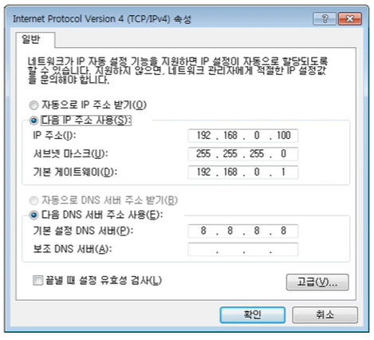
