# ARP 프로토콜

> 실제로 우리가 통신할 때는 IP 주소를 입력하지만, 이더넷 프로토콜을 사용하기 위해서는 MAC 주소가 필요하다. IP주소만 알고 MAC 주소를 모를 때, 자동으로 상대방의 MAC 주소를 알아오는 ARP 프로토콜에 대해 알아보자

* ARP 프로토콜

* ARP 프로토콜의 통신 과정

* ARP 테이블

* 실습

 

## ARP 프로토콜

### ARP가 하는 일

* 같은 네트워크 대역에서 통신을 하기 위해 필요한 MAC 주소를 IP 주소를 이용해 알아오는 프로토콜
* 같은 네트워크 대역에서 통신을 하더라도 데이터를 보내기 위해서는 7계층부터 캡슐화하여 데이터를 보내기 때문에, IP 주소와 MAC 주소가 모두 필요함. 이때 IP 주소만 알고 MAC 주소는 모르더라도 ARP를 통해 통신이 가능함
* 보안상 중요
  * `ARP 스푸핑` 공격에 대비

 

### ARP 프로토콜의 구조

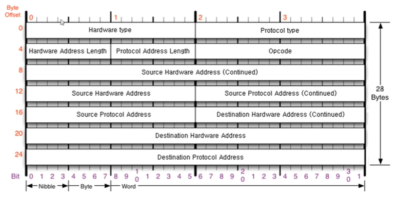

* 총 28바이트

* `Hardware type` : 2계층에서 사용하는 프로토콜의 타입
  
  * 깊게 공부하지 않는한, 가장 많이 볼 프로토콜은 **이더넷** `0 0 0 1`

* `Protocol type` 
  
  * 거~의 늘~ **IPv4** `0 8 0 0`

* `Hardware Address Length` : 6바이트가 오므로 `0 6`

* `Protocol Address Length` : 4바이트가 오므로 `0 4`

* `Opcode`  : 오퍼레이션 코드. 어떻게 동작하는지를 나타냄
  
  * 요청 중인지 응답 중인지!
  
  * `0 0 0 1` 을 보내면(요청) `0 0 0 2`로 응답
  
  ---

* `Source Hadware Address` (6바이트) : 출발지의 물리적인 주소 (MAC)

* `Source Protocol Address` (4바이트) : IP 주소

* `Destination Hardware Address` (6바이트) : 목적지(도착지)의 물리적 주소 (MAC)

* `Destination Protocol Address` (4바이트) : 목적지의 IP주소

 

## APR 프로토콜의 통신 과정

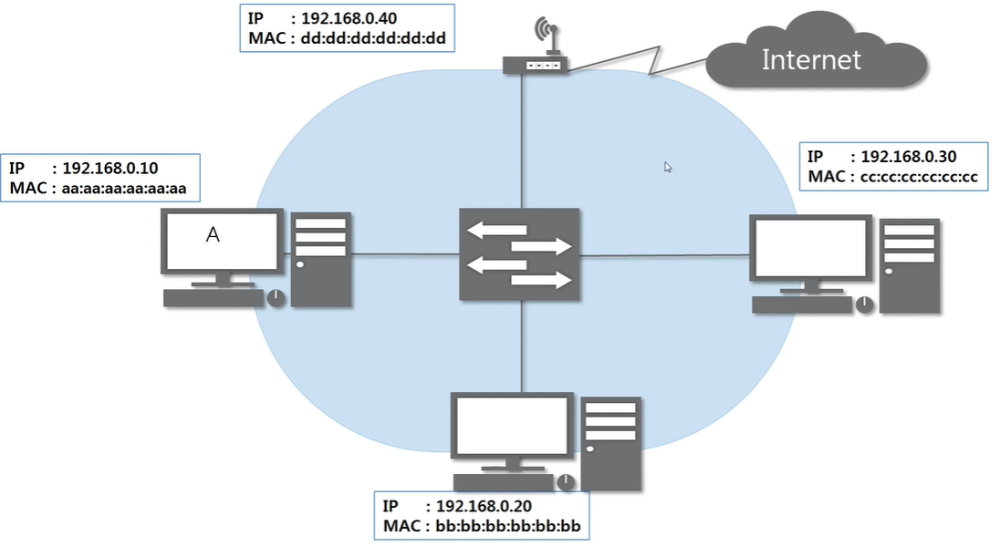

* A가 C의 맥주소가 궁금할 때!
  
  A가 먼저 ARP 요청 프로토콜(3계층)을 만들어서 보냄
  
  * [Ethernet + ARP 요청]
  
  * 그런데, 이더넷에도 ARP에도 목적지 맥주소가 필요함! 모르는데 어떡해?
    
    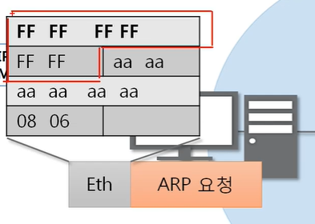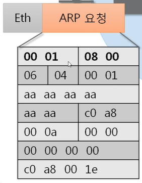 
    
    => Ethernet : 목적지 주소 모르니까 16진수 FF로 꽉 채워서 보냄(브로드캐스트)
    
    => 목적지 맥주소 모르니까, ARP는 `00 00 00 00 00 00` 으로 다 비워서 보냄
  
  * C가 어딨는지 모르니까 같은 대역 내 모두에게 다 보내야함
    
    스위치가 이더넷만 까보고, 같은 대역 내 모두에게 전송!
    
    * 브로드캐스트는 같은 대역 내에서만! 그래서 바깥으로 보내진 않고 안에서만 해결함
    
    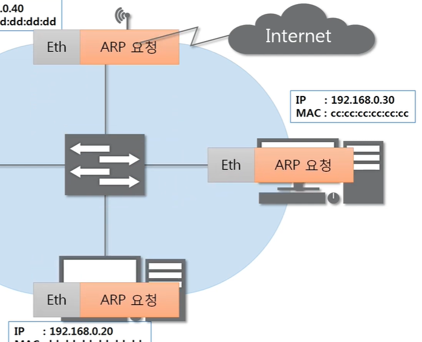
    
    => 이더넷 까고, 3계층을 까본다
    
    `목적지 IP 주소 == 본인 IP 주소` 인 애들은 패킷 안 버리고 응답 해줌
    
    출발지 맥주소에 자신의 맥주소를 써서 보내준다!
    
    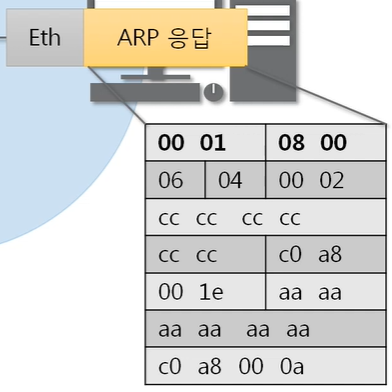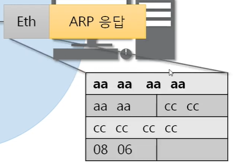
  
  * 스위치에게 보내면 스위치는 이더넷만 까보고 A한테 바로 보내준다
  
  * A는 모두 까보고, 상대의 맥주소를 알게 되면 ARP 캐시테이블에 등록
    
    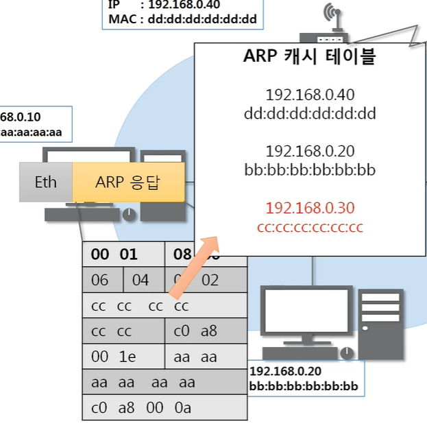

* 최초의 통신 때, 이걸 무조건 한 번 하고! 저장하고! 다음으로 넘어간다

 

## ARP 테이블

* 통신했던 컴퓨터들의 주소를 남겨 둠

* 영구 저장X 일정 시간이 지나면 없어짐
  
  * 수동으로 등록하면 영구 저장

 

## 실습

### 1. ARP 테이블 확인해보기

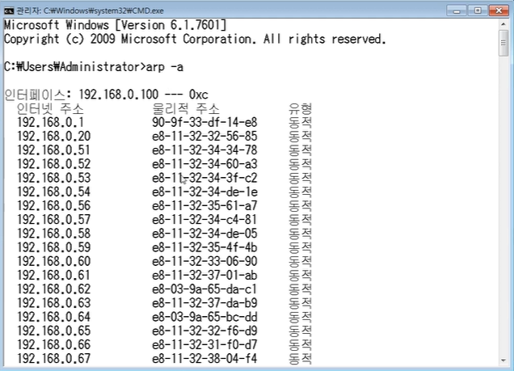

### 2. ARP 프로토콜 분석하기

#### 요청

* ARP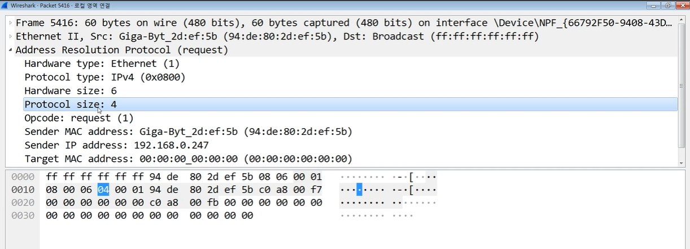
  
  * 모르고 보냈기 때문에, 목적지 맥 주소는 00으로 세팅

* Ethernet
  
  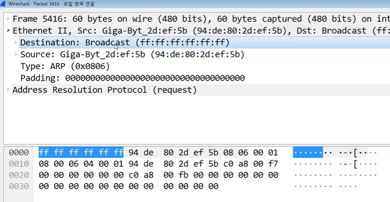
  
  * 맥주소를 모르므로 ff로 세팅

* 프레임의 최소 단위는 60바이트인데, 이더넷 14 + ARP 28 하면 부족함
  
  => 뒤에는 그냥 패딩으로 18바이트를 붙여서 맞춰둠
  
  * 가끔 패딩이 없는 패킷도 있음 => 와이어샤크에서 2계층에서 요청 할때, 패딩이 붙기 전에 와이어샤크가 캡쳐한 것
    
    * 1계층에서 전기적 신호로 보낼 때에는 패딩 잘 붙어 있음

* 참고로, 프레임의 최대 단위는 일반적으로 1514바이트

#### 응답

* ARP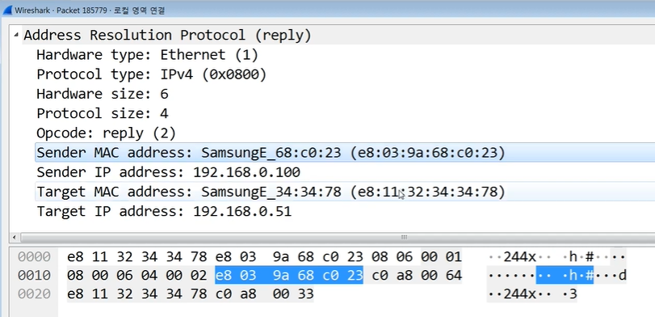

* Ethernet
  
  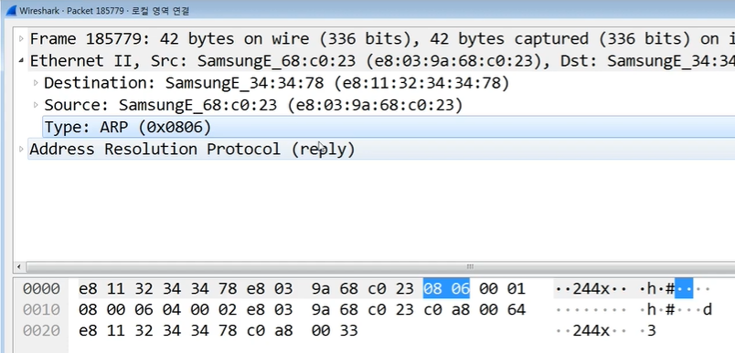
