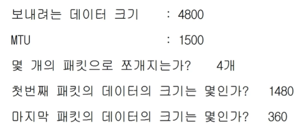
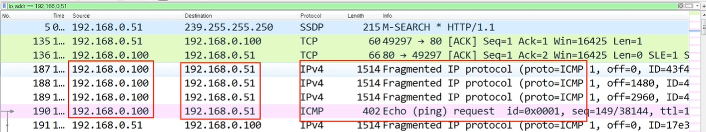

# IPv4, ICMP 프로토콜

> OSI  7계층 모델에서 3계층에 속한 IPv4 프로토콜에 대해 알아보자

* IPv4 프로토콜

* ICMP 프로토콜

* 라우팅 테이블

* 다른 네트워크와 통신 과정

* IPv4의 조각화

* 실습

<br/>

## IPv4 프로토콜

### IPv4가 하는 일

* 네트워크 상에서 데이터를 교환하기 위한 프로토콜 (멀리 멀리)

* 데이터가 **정확하게 전달된다고 보장하지 않음**
  
  * 깨져서 갈 수도 있음! => 4계층(TCP, 신뢰성 있는 통신)에서 보완

* 중복된 패킷을 전달하거나 패킷의 순서를 잘못 전달할 가능성 O

<br/>

### IPv4 프로토콜의 구조

* 한 줄이 4바이트 => 총 20바이트! (마지막은 옵션)
  
  * 옵션 없이 사용하는 것이 일반적임


* `Version` : 4
  
  * IPv6는 프로토콜 구조가 아예 다르기 때문에 6이 올 일이 없다

* `IHL(Header Length)` : 4비트 자리 => 2진수 4개의 최댓값 `1111` => 15
  
  * 헤더 길이가 최소 20부터 최대 60인데 15가 최댓값? => 나누기 4해서 넣음
  
  * 보통 5가 옴

* `Type of Service (TOS)` : 요즘에는 그냥 비워둠
  
  * 아주 옛날에 씀

* `Total Length` : Payload까지 합쳐서 즉, 상위 계층부터 캡슐화해서 내려온 전~체 길이

* `Identification` , `IP Flags` , `Fragment Offset` : 한 세트 처럼 기억하자
  
  * 데이터의 최대 전송 단위 정해져 있기 때문에, 너무 큰 데이터일 경우에는 쪼개서 전달해야 함
  
  * `identification` : 모두 같은 데이터에서 쪼개져 나온 거라는 걸 알 수 있게 ID 부여 
    
    * 순서는 몰라! 일단 같은 데이터끼리 모으는 거
  
  * `IP Flags` : 3 비트로 이루어져 있음
    
    * 첫 번째는 안 씀
    
    * 두 번째는 `Don't Fragmentation` : 안 쪼개서 보낸다고 명시
      
      * 최대 전송 단위가 100MB인데 700MB를 안 쪼개서 보낸다? 안 보내짐
        
        (최대 전송단위 1500인데 7000짜리를 DF 설정해서 보내려고 하면 안 됨)
        
        
    
    * 세 번째는 `More Fragmentation`  : 쪼갤게용
      
      * 첫 번째 패킷 뒤에 더 있어! 더 올거야~ 기다려라~ 하고 알려줌
      
      * 최대 전송단위보다 큰 데이터를 전송하면 설정됨 ; `1`
  
  * `Fragment Offset` 
    
    * 보내는 순서 != 받는 순서. 늘 순서가 보장되지 않음
    
    * 순서를 알아볼 수 있게 offset을 지정함
      
      * 일반적으로 offset은 기준점으로부터 얼마나 떨어져있는지를 의미
    
    * 시작점으로부터 얼마나 떨어져있는 데이터인지 (앞에 붙일 데이터의 값만큼 적혀 있음=> 그래야 내가 붙을 위치를 찾지)

* `TTL (Time To Live)` : 패킷이 살아있을 수 있는 시간
  
  * 3계층의 역할은 `멀리 있는 곳까지 최적의 경로를 찾아 도달하게 해주는 것`
    
    그러나 데이터의 '정확성'은 보장하지 않음
    
    이 떄문에 중간에 엉켜서 잘못된 경로에 갇힐 수 있는데, 그걸 모르고 계속 요청을 보내면 네트워크 패킷이 쌓여서 셀프 공격하는 꼴이 됨. 그래서 쌓이지 않도록 TTL을 설정
  
  * 장비를 하나씩 지나칠 때마다 1씩 줄어듦
  
  * 응용하기 : OS마다 설정 값이 다르므로 상대방 컴퓨터의 OS가 뭔지 알 수 있음
    
    * 보안의 첫번째는 상대의 정보를 수집하는 거니까..! ㅎㅎ

* `Protocol` : 이더넷 타입처럼 다음에 올 상위 프로토콜이 뭔지 알려줌
  
  * ICMP `0 1`, TCP `0 6`, ...

* `Header Checksum` : 헤더에 오류가 있는지 없는지 체크함

* `Source Address` : 출발지 IP 주소, 4바이트

* `Destination Address` : 목적지 IP 주소, 4바이트

<br/>

## ICMP 프로토콜 (Internet Control Message Protocol)

### ICMP가 하는 일

* 네트워크 컴퓨터 위에서 돌아가는 운영체제에서 **오류 메시지**를 전송 받는데 주로 쓰임

* 프로토콜 구조의 Type과 Code를 통해 오류메시지를 전송 받음

* 상대와 통신이 되는지 안되는지 확인

### ICMP 프로토콜의 구조


* `Type` : 카테고리, 대분류
  
  
  
  * 0번, 8번 : 기본
    
    * 8번 요청, 0번 응답
  
  * 3번, 11번 : 뭔가 잘못 됐을 때
    
    * 3번: 목적지에 도달하지 못한 경우
      
      * ex) 중간에 경로 설정이 잘못 됨
    
    * 11번: 목적지까지는 갔지만, 응답을 받지 못한 경우 (상대방 문제)
      
      * ex) 상대방의 방화벽에 막힘
  
  * 5번 : 보안상 알아두면 좋음
    
    * 옛날에 쓰던 것. 원격지에 있는 상대방의 라우터 테이블(지도)을 수정하는 것
      
      => 보안 상 중요

* `Code` : 소분류

<br/>

## IPv4, ICMP 프로토콜 실습

* 강의장 내 아무에게나 핑!
  
  `ping` : IP 네트워크를 통해 특정한 호스트가 도달할 수 있는지의 여부를 테스트하는 데 쓰이는 컴퓨터 네트워크 도구 중 하나
  
  

* ICMP
  
  
  
  * 자기 자신만 간 게 아니라, 다른 거.. 쓸데 없는 애들까지 보냄
    
    abcdefg~ hi까지 보냄
  
  * 맨 앞의 타입만 알면 된다 `08`
    
    

* IPv4
  
  
  
  * version 4
  
  * 4로 나눈 값 5 (원래는 그럼 60이겠지)
  
  
  
  * 조각화 X => More fragments Not Set, offset 0
  
  * 아직 아무 장비도 안지나갔으니까 윈도우 7의 TTL 128 그대로
  
  * 상위 프로토콜은 ICMP `1`

<br/>

## 라우팅 테이블

> 내가 보낸 패킷은 어디로 가는가

* 어디로 보내야할지 설정되어 있음

* 일종의 지도!
  
  

* 기본 게이트웨이를 저장
  
  * 모르는 네트워크가 나왔으면 일단 문 밖으로 나가봐

* 다른 네트워크 대역 경로를 찾아가기 위한 지도

<br/>

## 다른 네트워크와 통신 과정


* A의 라우팅 테이블을 확인해보자
  
  
  
  => B의 네트워크 대역이 라우팅 테이블에 저장되어 있으므로 통신 가능
  
  * 최종 목적지는 B의 네트워크 대역인 `192.68.20.0/24`
  
  * 여기를 가기 위해 처음 들려야 하는 곳은 `192.168.10.1`
  
  
  
  * A가 B한테 보낼 때, 이더넷에 세팅되는 목적지의 MAC주소는 뭘까?
    
    => 바로 다음 기기인 `CC CC CC CC CC CC` 
    
    최종 목적지 아님! 이더넷은 가까운 곳에서 통신하는 거니까, 가장 먼저 들릴 곳을 적어줘야함

* 패킷을 받은 스위치가 2계층까지만 확인하고 C로 가세요~ 하고 보내줌
  
  **여기서부터 중요! 다른 네트워크 대역으로 넘어간다!**
  
  
  
  * 공유기 입장
    
    * 패킷을 받고 2계층을 확인해보니, 나(공유기)한테 온 게 맞아!
      
      그럼 3계층을 열어서 목적지를 확인해보자  => 일단 나는 아니네!
      
      내가 가진 라우팅 테이블을 확인해보자!
      
      
      
      * ㅇㅋㅇㅋ 확인했음 이제 이더넷 다시 포장할게!
        
        => 나랑 가장 가까운 기기한테 갈 수 있게 이더넷 붙일게!
  
  * 이걸 반복해서 B까지 간다
    
    => 이더넷은 계속 변경!

<br/>

## 라우팅 테이블 실습

* cmd를 켜서 확인해보자
  
  ```bash
  netstat -r
  ```
  
  * 네트워크 상태 등을 확인할 수 있는 명령어므로 기억하자!
  
  
  
  * 네트워크 대역이 쓰여져 있음
  
  * 가끔 IP 주소가 적혀져 있기도 함
  
  * 네트워크 통신이 안 될 때, 여기서 확인해보기!

<br/>

## IPv4의 조각화

#### 조각화

* 큰 IP 패킷 들이 적은 `MTU`(Maximum Transmission Unit)를 갖는 링크를 통하여 전송되려면, 여러 개의 작은 패킷으로 쪼개어/조각화해 전송 돼야 함
  
  즉, 목적지까지 패킷을 전달하는 과정에서 통과할 각 라우터마다 전송에 적합한 프레임으로 변환해야 함

* 일반적으로 일단 조각화 되면, 최종 목적지에 도달할 때까지 재조립X

* IPv4에서는 발신지 뿐만 아니라 중간 라우터에서도 IP 조각화 가능
  
  * IPv6에서는 발신지에서만 가능

* 재조립은 항상 최종 수신지에서만 가능

* 예시1
  
  IPv4 프로토콜 포함 12,000바이트짜리 데이터를 보내려는데, MTU가 3300바이트일 때
  
  
  
  * MTU는 IPv4 프로토콜(20바이트)를 합해서 계산한 것
    
    => 순수하게 보낼 수 있는 페이로드는 3280바이트임
  
  * 총 4개로 나누어서 보냄
  
  * 오프셋
    
    * 첫 번째 데이터는 시작이니까 오프셋이 0
    
    * 두 번째 데이터는 3280바이트를 8로 나눈 값만큼 떨어져있음
    
    * ... 반복
  
  * 더 작은 장비를 만나면 또 쪼개기 (보통은 1500)

* 예시2
  
  1500을 기준으로 다시 연습해보기
  
  
  
  * 안 쪼개면, 프로토콜이 붙으면서 1500 백퍼 넘어서 못 보냄
  
  
  
  * ICMP는 마지막 애한테만 붙음
  
  * 보통 2계층까지해서 1514바이트가 많이 보임 (1500까지 맞춘 후에 14바이트 이더넷을 붙여서)
  
  
  
  * `4 | 5 | 00` : IPv4 버전, IHL (헤더길이)는 보통 5, 이제 안쓰는 값 00
  
  * `05 dc`, `02 24`  : 총 길이는 지금 각각 1500과 548
  
  * `12 ab` : 같은 데이터에서 떨어져 나온 거니까, ID는 동일
  
  * `2 | 0 00` : 2는 3비트(X DF MF)에 0 0 1이 들어가는데(뒤에 쪼갠 데이터 더 따라올테니 MF) 이게 2진수 네 자리에는 `0 0 1 0`의 값으로 들어가고, 이게 16진수로 변환되면 **2**

<br/>

## 조각화 실습

* 실습1
  
  
  
   

* 실습2
  
  
  
  
  
  * 필터를 `ICMP`라고 걸면 잘 안보임 (이건 마지막에만 걸리니까!)
    
    =>  IP를 기준으로 필터링!
  
  
  
  100번이 51번에게 총 4개의 패킷을 보냄
  
  * 마지막에 보내는건 360으로 계산했는데 실제로는 402?
    
    * ICMP 8 붙고
    
    * 그 앞에 IPv4 20 붙고
    
    * 그 앞에 이더넷 14 붙음 => 계산 맞음
  
  * 맨 끝의 fragment에는 `More fragments` No Set
    
    
