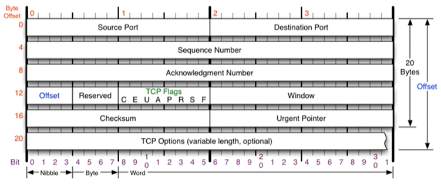
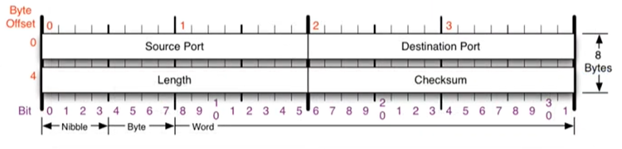
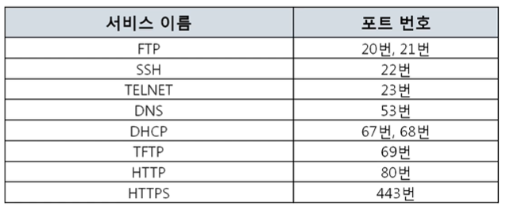
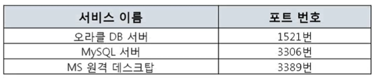
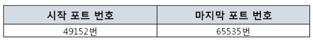
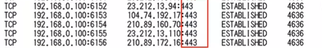
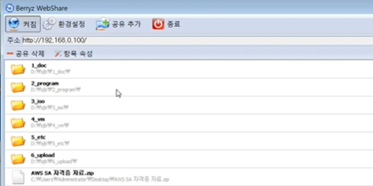

# 전송계층 및 포트

> 컴퓨터의 프로그램끼리는 이렇게 데이터를 주고 받는다!
> 
> > OSI 7계층에서 4계층 전송계층에 대한 설명

* 4계층 프로토콜

* 포트 번호

* 프로그램의 연결 정보

* 실습

 

## 4계층 프로토콜

### 4계층에서 하는 일

* 전송 계층은 송신자의 프로세스와 수신자의 프로세스를 연결하는 통신 서비스를 제공
  
  * 프로세스: 메모리에서 현재 동작 중인 프로그램
    
    * ex. 내 컴퓨터의 카카오톡과 상대 컴퓨터의 카카오톡끼리 연결

* 연결 지향 데이터 스트림 지원, 신뢰성, 흐름 제어, 그리고 다중화와 같은 편리한 서비스 제공

* 가장 잘 알려진 것: TCP, UDP
  
   

### 4계층 프로토콜의 종류

#### 전송 제어 프로토콜(TCP)

* 연결 지향형
  
  * 연결이 되고난 후에 전송
  
  * 안전한 연결을 지향
  
  

#### 사용자 데이터 프로토콜(UDP)

* 비연결 지향형 
  
  * 연결 여부와 상관 없이 데이터를 보냄
  
  * 매우 간단한 구조
  
  * 단순한 전송에 사용
  
  

 

## 포트 번호

### 포트 번호의 특징

* 특정 프로세스와 특정 프로세스가 통신을 하기 위해 사용

* **하나의 포트는 하나의 프로세스만** 사용 가능
  
  * 내 컴퓨터 기준
  
  * 상대의 여러 프로그램이 내 포트 하나에 연결되는 것은 가능

* 하나의 프로세스가 여러 개의 포트를 사용하는 것은 가능

* 포트 번호는 일반적으로 정해져있지만, 무조건 지켜야 하는 것은 아님
  
  * ex. 일반적으로 웹서비스는 80번 포트, 하지만 항상 80번을 써야하는 것은 아님

#### Well-known 포트

* 서버는 실행하는 프로그램(서비스)
  
  * 이 부분 다시 듣기..!

#### Registered 포트와 Dynamic 포트

* 클라이언트는 다이나믹 포트 49152~65535번(약 1.5만개) 중에서 아무거나 씀

 

## 프로그램의 연결 정보

### 나와 현재 연결되어 있는 컴퓨터들

* 활성 연결 테이블: 현재 포트 활성 여부를 나타냄

 

## 실습

### 1. 현재 연결 상태 확인하기

> `netstat -ano` 명령어를 이용하여 내 컴퓨터와 현재 연결된 다른 컴퓨터들을 확인해보기

1. 크롬을 켜서 네이버에 들어가기

2. 접속하자마자 명령프롬프트에 `netstat -ano`
   
   * 프로토콜 / 로컬주소 / 외부 주소 / 상태 / PID
   
   
   
   왼쪽은 내 컴퓨터의 포트, 오른쪽 443은 HTTPS가 연결된 포트

3. 작업관리자 > 보기 > 열선택 > PID 또는 세부 정보 탭
   
   

 

### 2. 특정 서비스의 포트번호 확인하기

> 내 컴퓨터를 서버로 만들어서 웹 서비스와 같은 유명한 특정 서비스의 포트번호 확인하기

1. Berryz WebShare 다운로드

2. 공유하고 싶은 파일을 드래그앤 드랍하고 켜짐 누르기
   
   

3. 환경 설정 - 서버
   
   * 랜카드에 할당된 주소 - 본체 컴퓨터에 할당된 IP 주소
   
   * 포트번호는 기존 80번이 아닌 다른 번호 A로 변경해보기

4. `본체아이피주소:포트번호` 를 웹브라우저에 검색하기

5. cmd에서 `netstat -ano` 치고 포트번호가 A인 서비스의 PID 확인

6. 작업관리자에서 일치하는 PID 번호를 찾으면 => WebShare
