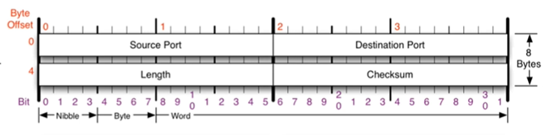
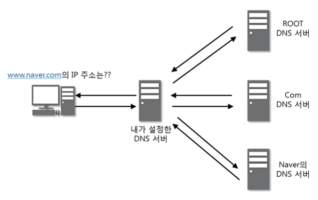
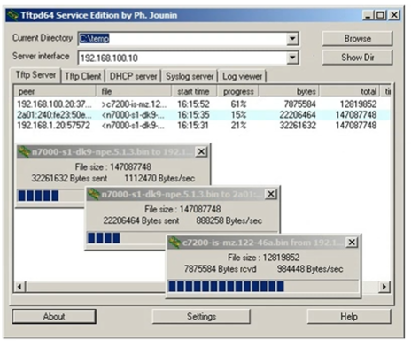
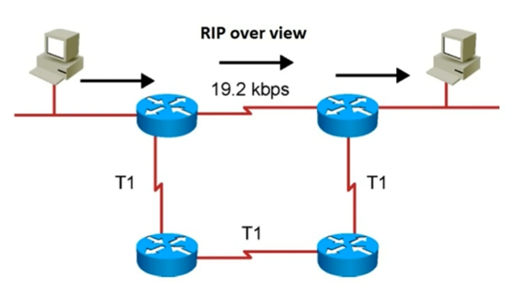
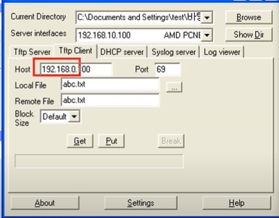
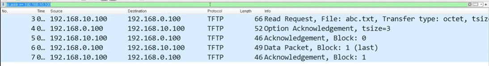
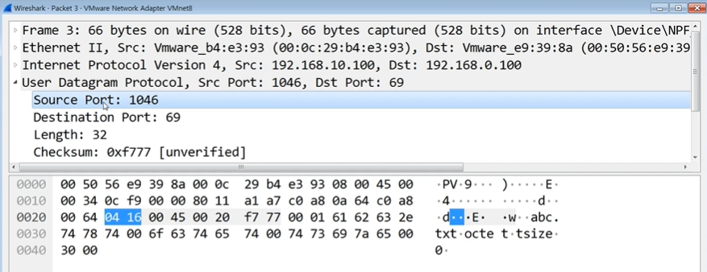

# 비연결지향형 UDP 프로토콜

> OSI 7계층에서 4계층 전송 계층의 프로토콜 중 하나인 UDP 프로토콜

* UDP 프로토콜

* UDP 프로토콜을 사용하는 프로그램

* 실습

 

## UDP 프로토콜

### UDP가 하는 일

* 사용자 데이터그램 프로토콜(User Datagram Protocol, UDP) 또는 유니버설 데이터그램 프로토콜(Universal Datagram Protocol)

* 전송 방식이 너무 단순해서 서비스의 **신뢰성이 낮고**, 데이터그램 도착 순서가 바뀌거나 중복되거나 통보 없이 누락되기도 함

* 일반적으로 오류의 검사와 수정이 필요 없는 프로그램에서 수행

 

### UDP 프로토콜의 구조

* `Source Port` : 출발지 포트번호 0~65535

* `Destination Port`: 목적지 포트번호

* `Length` : UDP 프로토콜의 헤더 포함 + 뒤의 페이로드까지

* `Checksum` : 중간에 프로토콜이 잘못된 건 없는지 확인하는 값

 

## UDP 프로토콜을 사용하는 프로그램

* 도메인을 물으면 IP를 알려주는 **DNS 서버**
  
  

* UDP로 파일을 공유하는 **tftp 서버**
  
  

* 라우팅 정보를 공유하는 **RIP 프로토콜**
  
  

 

## 실습

### 1. tftpd를 사용하여 데이터 공유해보기

> tftpd 프로그램을 이용하여 UDP를 이용한 데이터 통신 해보기

1. tftpd 실행 파일이 있는 곳에 txt파일 하나 만들기

2. tftpd 실행해서 Server intercfaces에서 실제 사용하는 IP주소(네트워크 장치에 할당된)를 선택

3. 클라이언트에서는 클라이언트 탭을 선택하고, 서버 아이피와 포트 번호를 설정
   
   * tftpd는 잘 알려진 프로그램으로, 69번을 사용
   
   * `Local File` : 내가 컴퓨터에 저장할 때 파일명
   
   * `Remote file` : 서버에서 생성한 파일명
   
   

### 2. 패킷 캡쳐 및 분석해보기

> UDP패킷을 캡쳐해보고 분석해보기

1. WireShark 켜기

2. VMware(가상머신, NAT로 연결)인 VMnet8번을 네트워크로 선택

3. 패킷 캡쳐
   
   
   
   
