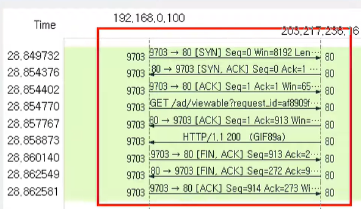

# 연결지향형 TCP 프로토콜

* TCP 프로토콜

* TCP 플래그

* TCP를 이용한 통신과정

* TCP 상태전이도

* 실습

 

## TCP 프로토콜

### TCP가 하는 일

* 전송 제어 프로토콜(Transmission Control Protocol, TCP)

* 인터넷에 연결된 컴퓨터에서 실행되는 프로그램 간에 통신을 **안정적으로, 순서대로, 에러 없이** 교환할 수 있게 함

* TCP의 안정성을 필요로 하지 않다면 일반적으로 TCP 대신 비접속형 사용자 데이터그램 프로토콜을 사용

* 안전하지만 느림
  
  * 체감X

 

### TCP 프로토콜의 구조

일반적인 길이는 20바이트, 최대 60바이트까지

* `Sequence Number`

* `Acknowledgement Number`

* `Offset`  : 헤더 길이
  
  * 4로 나누어서 씀

* `Reserved` : 예약된 필드. 사용X

* `Window` : 상대랑 연결된 상태에서 데이터를 주고 받으므로, 상대방과 통신할 때 사용
  
  * '얼마나 보내도 돼?'에 대한 답변
  
  * 남아 있는 TCP 버퍼 공간을 알려줌

* `TCP Options` : IP프로토콜의 옵션과 유사.
  
  * 잘 붙이지 않고, 붙더라도 최대 4바이트. 최대 10개까지

 

## TCP 플래그

### TCP 플래그의 종류

* `플래그` : 상대와 계속 통신을 하면서 데이터 전송을 하는데, 그 때 어떤 일을 할 건지! 등등 TCP의 주된 기능을 나누는 부분
  
  
  
  * `A` : **Acknowledgement**
    
    * 물어본 것에 대한 답변, 즉 승인. '응, 지금 데이터 보내도 돼'
  
  * `P` : Push
    
    * 내가 받을 수 있는 공간, 버퍼가 어느 정도 쌓여야 보낼 수 있는데 그거랑 상관 없이 밀어넣겠다는 것 => 자주 사용X
  
  * `R` : **Reset**
    
    * 문제 발생한 것 같아. 우리 둘 사이 관계 새로고침/리셋 하자!
  
  * `S` : **Sync**
    
    * 제일 중요함
    
    * 동기화 비트
    
    * 상대와 연결을 시작할 때 무조건 사용하는 플래그
    
    * 서로의 상태를 계속 주고 받으면서 동기화
  
  * `F` : **Finish**
    
    * 종료 비트
    
    * 연결을 끊을 때 사용
  
  * 예시
  
  

* `Urgernt Pointer` : 어디가 급하게 처리해야하는 데이터인지 알려줌

 

## TCP를 이용한 통신과정

### 연결 수립 과정

* TCP를 이용한 데이터 통신을 할 때 프로세스와 프로세스를 연결하기 위해 **가장 먼저 수행되는 과정**

* **3 way Handshake**
  
  1. 클라이언트가 서버에게 요청 패킷을 보내고
     
     * 플래그 `02` : SYN
  
  2* 서버가 클라이언트의 요청을 받아 들이는 패킷을 보내고
  
  - Flag: SYN+ ACK
  
  3* 클라이언트는 이를 최종적으로 수락하는 패킷을 보냄
  
  * 예시

* 컴퓨터는 번호(ex. S:100, A:0)를 사용해서 서로 동기화 함
  
  * 예시
    
    
    
    
    
    * 처음에 보낼 때 S:100, A:0
      
      
    
    * ACK는 받은 번호 +1, 처음 보내는 SYN는 랜덤으로 2000
      
      
    
    * 다시 돌려보낼 때 ACK는 받았던 SYN 번호를, SYN는 받았던 ACK => `동기화`
  
  * 서로 번호를 맞추기 때문에, 보안이 중요 (중간에 번호를 뺏기지 않도록)

 

### 데이터 송수신 과정

* TCP를 이용한 데이터 통신을 할 때, 단순히 TCP 패킷만을 캡슐화해서 통신X
  
  페이로드를 포함한 패킷을 주고 받을 때 일정한 규칙 O
  
  1. 보낸 쪽에서 또 보낼 때에는 SEQ번호와 ACK번호가 그대로
  
  2. 받는 쪽에서는 SEQ 번호 => ACK 번호로
  
  3. 받는 쪽에서의 ACK번호는 받은 SEQ 번호 + 데이터 크기

* 예시
  
  1.
  
  2. 
  
  3. 

 

## TCP 상태전이도

### TCP 연결 상태의 변화

* 실선: 클라이언트의 상태 변화

* 점선: 서버의 상태 변화

#### LISTEN

* 포트 번호를 사용하는 4계층. 이 포트 번호를 열어 둔 상태
  
  클라이언트의 요청을 계속 듣고 있는 상태(항상 응답해줄 수 있게, 서버가 열려있음)

* `netstat -ano` 같은 명령어를 써서 포트 상태 확인

#### ESTABLISHED

* 서로 연결된 상태

* 3 way handshakes 가 끝나면 이렇게 연결 상태가 됨

#### 기타 상태 - 클라이언트 입장

* `active open` : 능동적으로 포트를 연다 => 클라이언트 (서버는 가만히 있음)
  
  클라이언트가 포트를 능동적으로 열면서 SYN를 보냄
  
  
  
  클라이언트의 요청 패킷을 받으려면 서버는 리스닝 상태여야 함(always)

* 서버가 받고 나면 서버는 SYN_RECEIVED 상태로 바뀜
  
  그리고 다시 보내주지
  
  

* 클라이언트가 다시 보내고, 둘다 ESTABLISHED 상태가 됨 (연결 되었다!)
  
  

 

## 실습

* WireShark 이용, tcp필터링 후
  
  

* TCP 3way handshakes
  
  
  
  * 그래프처럼 보기
    
    
    
    * 아래의 limit to display 선택하기
    
    

* 자세히 살펴보기
  
  
