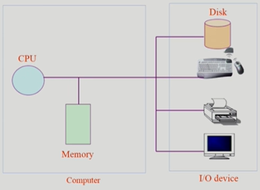
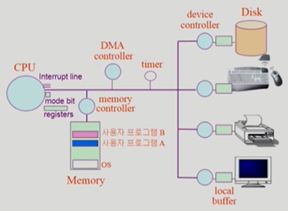
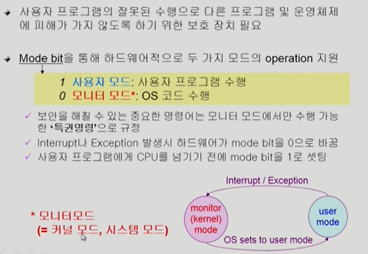
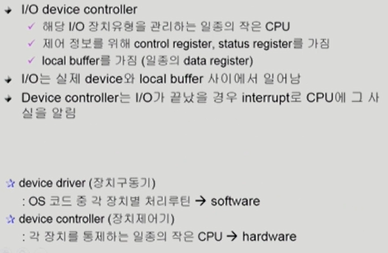
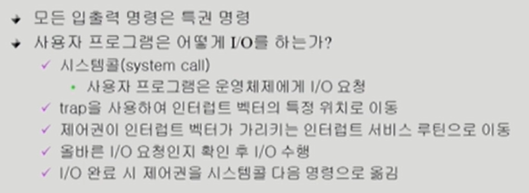
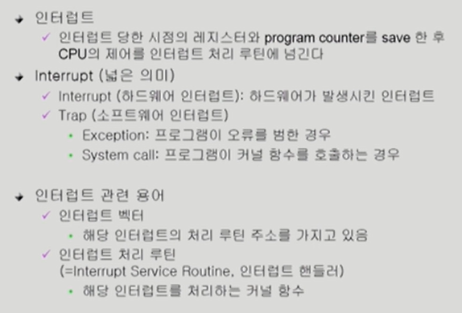

# System Structure & Program Execution 1

> 컴퓨터 시스템 구조, Mode bit, Timer, Device Controller, 입출력(I/O)의 수행, 동기식 입출력과 비동기식 입출력, 시스템콜(System Call), 인터럽트(Interrupt)

 

## 컴퓨터 시스템 구조

* 컴퓨터 = CPU + 메모리

* Input/Output Device

* 구체적인 구조
  
  
  
  * local buffer: 각각의 작업공간
  
  * device controlloer: CPU와 각 I/O 디바이스의 처리 속돈느 매우 다르기 때문에 필요함
  
  * timer: 무한루프를 도는 프로그램이 시작되면 CPU가 다른 프로그램 작업을 전혀할 수가 없음. 그럴 때 timer가 특정 프로그램이 CPU를 독점하는 것을 막음.
    사용자 프로그램에게 CPU를 넘겨줄 때에는, timer에 시간을 설정한 뒤 넘겨준다

### CPU

* interrupt line: CPU는 메모리하고만 일을 하며, 한 번 실행이 시작 되면 쭉 일을 순서대로 진행한다. 이 때 timer 또는 device controller가 interrupt line을 통해 진행 중인 일을 순차적X 잠시 이 일 좀하고 넘어가자! 하고 끼어들게 해주는 것
  
  * 하드웨어가 CPU와 정보교신하기 위해 걸거나 (하드웨어 인터럽트)
  
  * 사용자 프로그램이 OS에게 요청할 게 생길 때 사용(SW인터럽트)

* register: CPU 내부의 저장소

#### Mode bit

#### Device Controller

* Device Controller: 각 디바이스를 관리하는 작은 CPU. 하드웨어

* Device Driver: 디바이스 컨트롤러에 접근하게 해주는 SW.

### 입출력의 수행

* 시스템콜: 사용자 프로그램이 운영체제에게 요청하는 것(커널함수를 호출)

#### 인터럽트

* 일반적인 인터럽트는 timer나 I/O controlloer가 거는 하드웨어 인터럽트
  
  
