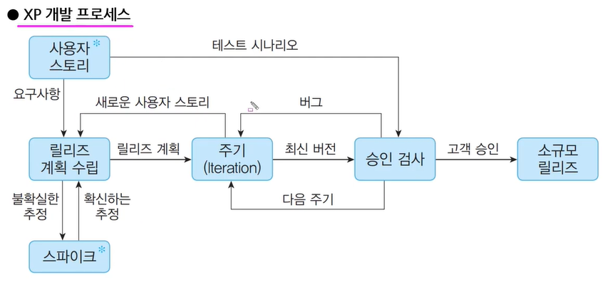
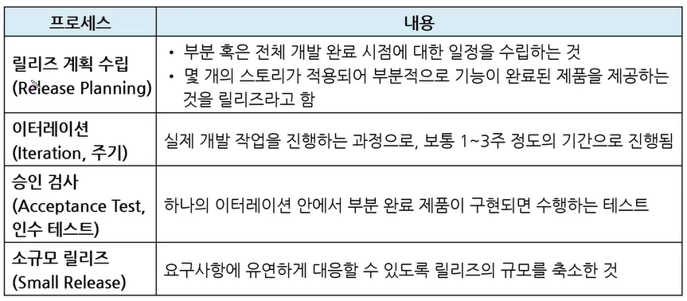
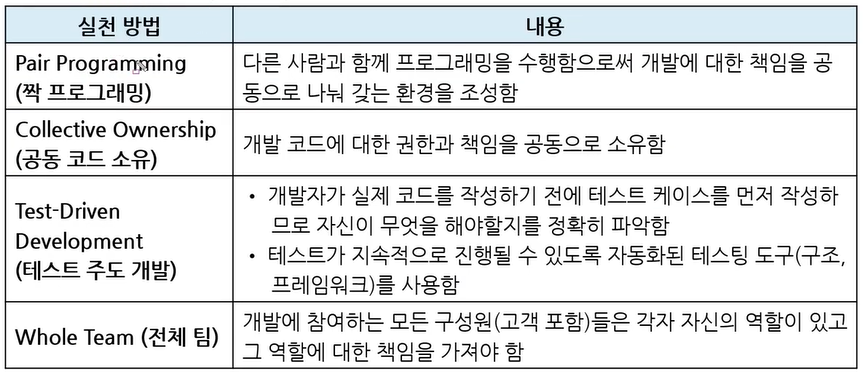

# XP(eXtreme Programming) 기법

* `고객과의 소통을 극대화`시킨다!

  => 고객을 참여시켜서 고객의 요구 사항에 유연하게 대응하고, 개발과정 반복을 극대화 시켜 생산성을 향상시키는 방법

  * 소규모 프로그램에 사용

  * 짧고 반복적인 개발주기
  * 고객들도 참여하기 쉽게 단순한 설계
  * 릴리즈(배포, 제공) 기간을 짧게 반복하여 고객의 요구사항 반영한 것을 보여줌(높은 가시성)

### XP의 5가지 핵심가치

1. 의사소통(Communication) : 고객과의 의사소통하기!
2. 단순성(Simplicity) : 고객이 이해할 수 있게 단순하게 설명하기!
3. 용기(Courage) : 모르면 모른다, 알면 안다 용기내서 말하기!
4. 존중(Respect) : 고객이 잘 모른다고 해도 무시하지 말고 존중하기!
5. 피드백(Feedback) : 고객 요구사항에 대한 피드백하기!
   * `피존의` `용기`는 `단순`하게 만들어야 한다

 

### XP 개발 프로세스

* 계획 > 진행 > 검사 > 출시(릴리즈)

1. 사용자 스토리 : 사용자들이 편하게 이야기처럼 설명 => 요구사항을 정리
2. 릴리즈 계획 수립 : 공통된 기능들끼리 묶어서 개발 계획 수립
3. 주기(Iteration) : 개발 진행하는 것
   * 1~3주
   * 새로운 사용자 스토리(고객 요구 사항 추가) 추가
     * 현재 진행 상황에서 바로 추가하기 힘들 수 있음(불확실한 추정) => 따로 개발! `스파이크`
     * 한번 돌려봤더니 잘 되더라! => 확신하는 추정
4. 승인 검사(인수 테스트)
   * 고객들에게 승인 검사 받기
   * 한 주기가 완료 되면 해당 주기에 대해서만 검사하는 것(부분 완료 제품)
   * 다음 주기로 넘어갈 때에는 다음 요구사항(남아 있는)을 처리하는 것
   * 예시
     * 1.0 version: 요구사항 1~20
     * 2.0 version: 요구사항 21~40
     * ...
5. 소규모 릴리즈

 

### XP의 주요 실천 방법 (Practice)

* 영문명까지 기억하세요...^^...

* 짝 프로그래밍
  * 드라이버 : 키보드를 잡고 코드 쓰는 사람
  * 네비게이터 : 점검해주고 리드하는 사람