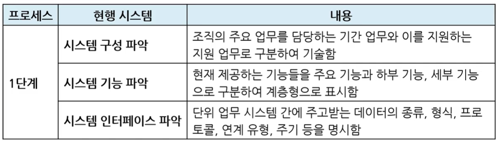
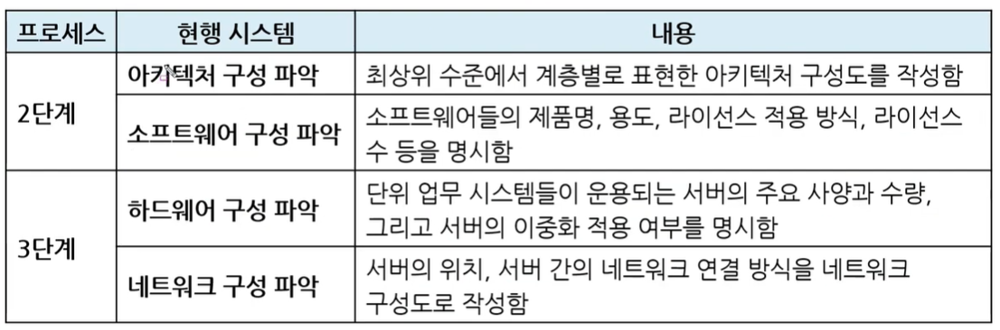

# 현행 시스템 파악

* 현재 회사에서 사용 중인 시스템을 파악하는 것
  * 특정 회사에서 소프트웨어 개발을 요청한다고 가정해보면, 현재 사용 중인 소프트웨어를 분석해야하고, 어떤 기능을 필요로 하는지, 어떤 데이터를 주로 사용하는지 등을 파악해야 소프트웨어 개발이 원활함
* 크게 3단계로 나누어져 있음

* 시스템 구성 파악
  * 기간 업무 : 특정 기간X 특정 회사에서 주요 업무! (ex. 국가기간사업)
  * 지원 업무 : 지원해주는 업무
* 시스템 기능 파악
  * 주요 기능
  * 하부 기능
  * 세부 기능
* 시스템 인터페이스 파악

* 아키텍처 구성
* 소프트웨어 구성
  * 현재 사용 중인 소프트웨어를 파악
* 하드웨어 구성
  * 서버의 주요 사양(CPU, 하드디스크 용량 등)
  * 서버의 이중화 : 서버 컴퓨터를 두 대 구입해서 똑같은 데이터를 저장하는 것(백업)
* 네트워크 구성

#### => 친구 `구기인`에게 뭔가 부탁을 했더니 `아`랐`소`라고 `하네`

* 1단계 시스템 `구성 / 기능 / 인터페이스` 파악
* 2단계 `아키텍처 / 소프트웨어` 구성 파악
* 3단계 `하드웨어/ 네트워크` 구성 파악

ㅋㅋㅋㅋㅋㅋㅋㅋㅋㅋㅋㅋㅋㅋㅋㅋㅋㅋㅋㅋㅋㅋㅋㅋㅋ