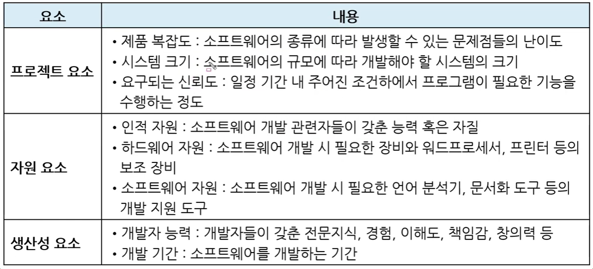
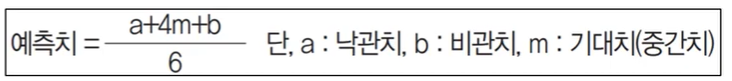
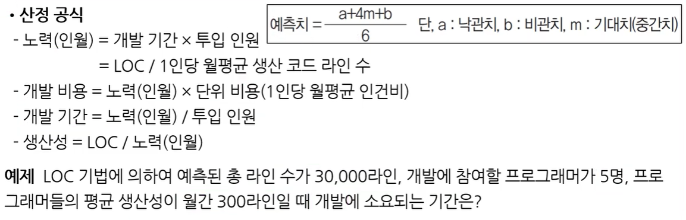
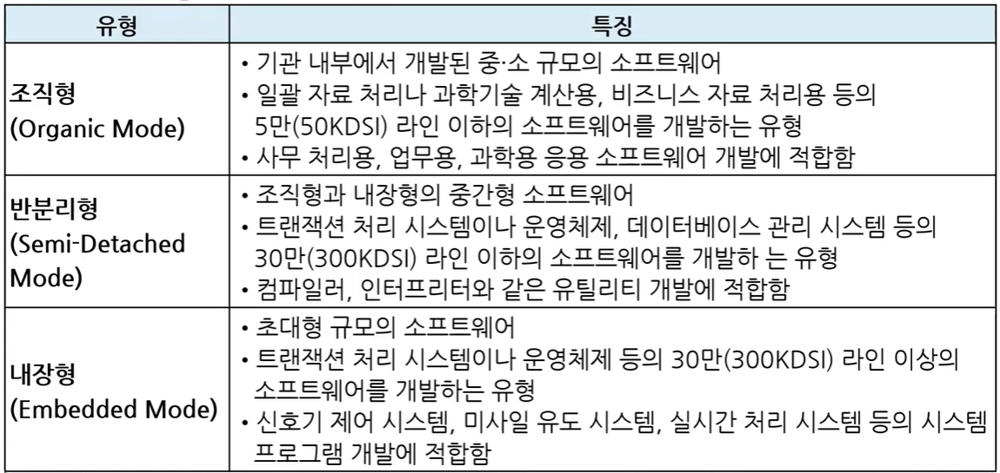
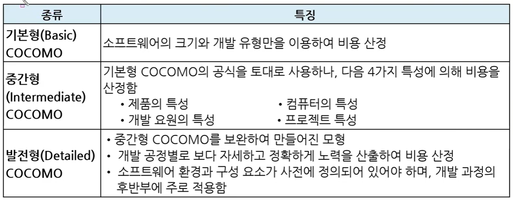
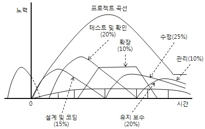

# 비용 산정 기법

## 소프트웨어 비용 산정

`돈을 얼마나 받아야 할까?`

* 개발에 소요되는 인원, 자원, 기간 등으로 소프트웨어의 규모를 확인하여 개발 계획 수립에 필요한 비용을 산정하는 것이다.
  * 개발 계획 수립 시기에 한다
* 너무 높게 선정 => 예산 낭비, 일의 효율성 저하
* 너무 낮게 선정 => 개발자의 부담이 가중, 품질 문제 발생
* `하향식 비용 산정 기법`과 `상향식 비용 산정 기법`이 있음
  * (예시) 친구들과 제주도 놀러가는 상황을 가정해보자 => 항공권, 렌트, 숙박, 밥, ...
    * **일단 돈을 걷고** 그 한도 내에서 해결한다 => `하향식`
    * 필요한 **항목의 예산을 고려**해서 총합/인원수한 금액을 걷는다 => `상향식`

 

### 소프트웨어 비용 결정 요소

(어떤 요소가 어디에 속하는 지 알 정도로 보면 됨)

 

## 비용 산정 기법 - 하향식

: 과거의 유사한 경험을 바탕으로 전문 지식이 많은 개발자들이 참여한 회의를 통해 비용을 산정

* 비과학적
* 프로젝트의 전체 비용을 산정 => 각 작업별로 비용을 세분화
* 주요 하향식 산정 기법
  * 전문가 감정 기법
  * 델파이 기법

 

### 전문가 감정 기법

: 조직 내에 있는 경험이 많은 **두 명 이상의 전문가**에게 비용 산정을 의뢰하는 기법

* 가장 편리하고 신속
* 의뢰자로부터 믿음 얻을 수 있으나
* 개인적이고 주관적

 

### 델파이 기법

: 전문가 감정 기법의 주관적인 편견을 보완하기 위해 **많은 전문가의 의견을 종합**하여 산정하는 기법

* 편견이나 분위기에 지배되지 않도록 **한 명의 조정자(중재자)** + **여러 전문가**
* 각자 생각하는 금액을 비공개로 중재자에게 제출

 

## 비용산정 기법 - 상향식

: 프로젝트의 **세부적인 작업 단위별로 비용을 산정한 후 집계**하여  전체 비용을 산정하는 기법

* 주요 상향식 비용 산정 기법
  * LOC(원시 코드 라인 수) 기법
  * 개발 단계별 인원수 기법
  * 수학적 산정 기법

 

### LOC(원시 코드 라인 수, source Line Of Code) 기법

* 프로그램 코드 라인의 수를 가지고 비용 산정

* 공식이 정해져 있음
  
  * 세부 작업 단위에 대해 개발자들이 생각하는 필요 코드 라인 수를 제출
    
    => 최소값(낙관치), 최대값(비관치), 평균값(기대치) 계산 => 예측치 계산
    
    
  
  * 인원은 예측치를 기준으로 필요한 개발자 인원수!
  
  
  
  * 노력(인월) = 30000/300 = 100
  * 기간 = 100/5 = 20개월

 

### 개발 단계별 인월수(Effort Per Task) 기법

: LOC 기법을 보완하기 위한 기법, 각 **기능을 구현시키는데 필요한 노력을 생명 주기의 각 단계별로 산정**

* LOC 기법은 코드의 난이도를 고려하지 않음!
  
  => 이를 보완했기 때문에 더 정확함!

 

### 수학적 산정 기법(경험적 추정 모형, 실험적 추정 모형)

* 개발 비용 산정의 자동화가 목표

* 비용의 자동산정을 위해 사용하는 공식은 과거의 유사한 프로젝트를 기반으로 유도한 것
  
  * ???란 사람이 60여개의 개발 업체를 돌아다니면서 데이터를 수집해서 통계적 공식 만듦

* 주요 수학적 산정 기법
  
  (LOC를 활용)
  
  * COCOMO 모형
  
  * Putnam 모형
    
    ---
  
  * 기능 점수(FP) 모형

 

#### COCOMO(COnstructive COst MOdel) 모형

: 원시 프로그램의 규모인 **LOC에 의한 비용 산정 기법**

* 개발할 소프트웨어의 규모를 LOC로 예측한 뒤, 소프트웨어 종류에 따라 다르게 측정하는 비용산정 방정식에 대입하여 비용 산정

* 결과는 프로젝트를 완성하는데 필요한 노력(Man-Month)으로 나타냄

* 보헴이 제안함

* 소프트웨어 개발 유형
  
  
  
  * 조직형 : 5만 라인 이하
  * 반분리형 : 30만 라인 이하
  * 내장형 : 30만 라인 이상
    * 라인 수 제한 X => 초대형 규모!

* 모형 종류
  
  

 

#### Putnam 모형(생명 주기 예측 모형)

: 소프트웨어 생명주기의 전 과정동안 **사용될 노력의 분포를 예상**하는 모형

* 푸트남이 제안

* 시간에 따른 함수로 표현되는 Rayleigh-Norden 곡선의 노력 분포도가 기초
  
  

* 대형 프로젝트의 노력 분포 산정에 이용

* 개발 기간이 늘어날수록 프로젝트 적용 인원의 노력이 감소 (우하향)

 

#### 기능 점수(FP: Function Point) 모형

: **소프트웨어의 기능을 증대시키는 요인별로 가중치를 부여** 하고, 요인별 가중치를 합산 => 총 기능 점수를 산출. 총 기능 점수와 영향도를 이용하여 기능 점수를 구한 후 이를 이용해서 비용을 산정

* 알브레히트가 제안

* 고객의 요구 => 기능
  
  * ex. 로그인할 때 카카오톡이랑 공인인증서 로그인 추가해주세요!

* 소프트웨어 기능 증대 요인
  
  * 자료 입력(입력 양식)
  * 정보 출력(출력 보고서)
    * 화면으로만 출력할 건지, 파일도 저장하게 할 건지, ...
  * 명령어(사용자 질의수)
    * 이 프로그램을 통해서 뭐를 조회할 건지, ...
  * 데이터 파일
    * 사진을 올리고 싶어요(img파일의 형식)
    * 동영상도 올리고 싶어요
  * 필요한 외부 루틴과 인터페이스
    * 엑셀이랑 파워포인트랑 호환 됐으면 좋겠어요

 

#### 비용 산정 자동화 추정 도구

* SLIM
  * Rayleigh-Norden 곡선과 Putnam 예측 모델을 기초로 개발

---

* ESTIMACS
  * 다양한 프로젝트와 개인별 요소를 수용하도록 FP 모형을 기초로 개발