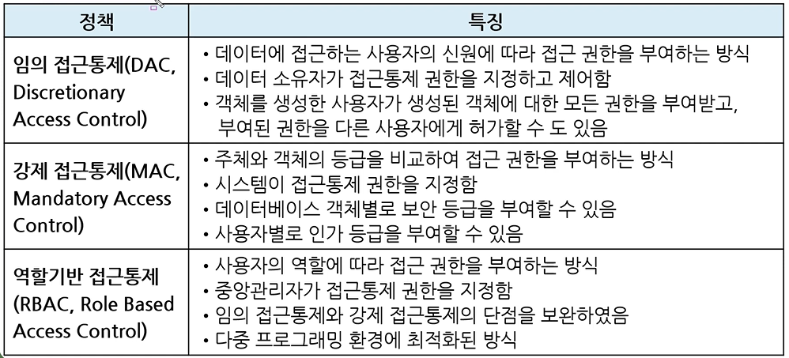
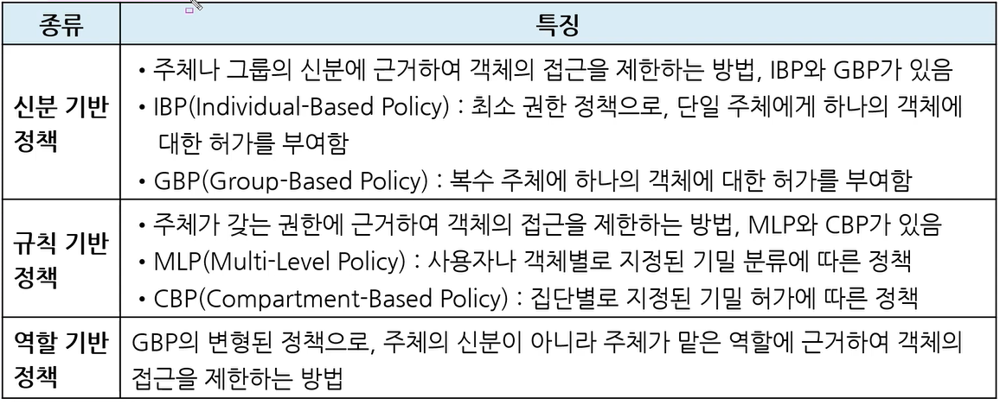
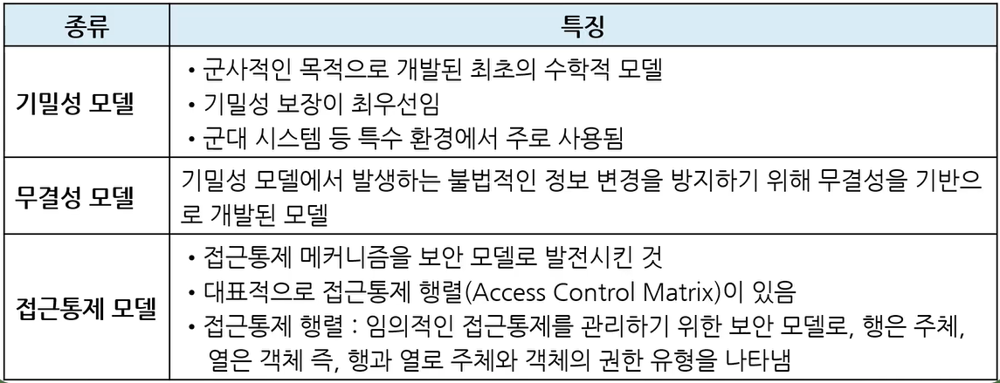

# 데이터 베이스 보안

* 데이터베이스의 일부 또는 전체에 대해서 권한이 없는 사용자가 접근하는 것을 금지하기 위해 사용하는 기술

* 보안을 위한 데이터 단위에는 **케이블 전체**로부터 특정 테이블의 특정 행과 열에 있는 **데이터값**에 이르기까지 매우 다양

 

## 암호화

* 데이터를 보낼 때 송신자가 지정한 수신자 이외에는 그 내용을 알 수 없도록 평문을 암호문으로 변환하는 것

* **암호화(Encryption) 과정**
  
  * 평문을 암호문으로

* **복호화(Decryption) 과정**
  
  * 암호문을 평문으로

* **암호화 기법**
  
  * 개인키 암호 방식
  
  * 공개키 암호 방식

 

## 접근 통제

* 데이터가 저장된 객체와 이를 사용하려는 주체 사이의 정보 흐름을 제한하는 것
  
  * 객체 : 데이터 베이스에 저장된 행, 열, 값 등의 개체
  
  * 주체: 데이터 베이스 사용자
  
  * ex) 병원의 접근 통제 구역

* 접근 통제 3요소
  
  * 접근 통제 **정책**
  
  * 접근 통제 **매커니즘**
  
  * 접근 통제 **보안 모델**

 

### 접근 통제 기술

* 임의 접근통제
  
  * 접근하려는 사용자의 신원에 따라서
  
  * 데이터 소유자가 권한을 지정하고 제어
  
  * 객체 생성한 사용자가 해당 객체에 대한 모든 권한을 부여 받고, 타인에게 허가 가능
  
  * `discretionary` : not fixed by rules but are decided on by people in authority, who consider each individual case

* 강제 접근통제
  
  * 주체와 객체의 등급을 비교, 접근 권한을 부여
  
  * 시스템이 권한을 지정

* 역할기반 접근통제
  
  * 사용자의 역할에 따라 접근 권한을 부여
  
  * 중앙관리자가 권한 지정
  
  * 다중 프로그래밍 환경에 최적화

* 각각의 통제 방식을 정확하게 구분할 것!

 

## 접근통제 정책

* 어떤 주체가, 언제, 어디서, 어떤 객체에 어떤 행위를 허용할 것인지를 정의한 것

### 종류

 

## 접근통제 매커니즘

* 정의된 접근통제 정책을 구현하는 기술적인 방법

* 종류
  
  * 접근통제 목록
  
  * 능력 리스트
  
  * 보안 등급
  
  * 패스워드
  
  * 암호화

 

## 접근통제 보안 모델

* 보안 정책을 구현하기 위해 정형화된 모델

* 보안 모델의 종류
  
  
  
  * 기밀성 : 벨라파둘라 모델 `벨기에`
  
  * 무결성 : 비바 모델 `무비`
  
  * 접근통제 모델
    
    * 접근통제 메커니즘: 접근통제 정책을 구현하는 기술적인 방법
    
    * 이런 방법들을 보안 모델로 발전 시킨 것

 

## 접근통제 조건

* 접근통제 메커니즘의 취약점을 보안하기 위해 접근통제 정책에 부가하여 적용할 수 있는 조건

#### 값 종속 통제

* 일반적으로는 객체에 저장된 값에 상관없이 접근 통제를 동일하게 허용

* 값 종속 통제는 객체에 저장된 값에 따라 다르게 접근통제를 허용할 때 사용

#### 다중 사용자 통제

* 지정된 객체에 다수의 사용자가 동시에 접근을 요구할 때 사용 

#### 컨텍스트 기반 통제

* 특정 시간, 네트워크 주소, 접근 경로, 인증 수준 등에 근거하여 접근을 제어

* 다른 보안 정책과 결합하여 보안 시스템의 취약점을 보완할 때 사용

 

### 감사 추적

* 사용자나 어플리케이션이 데이터베이스에 접근하여 수행한 모든 활동을 기록

* 오류가 발생한 데이터베이스를 복구하거나 부적절한 데이터 조작을 파악하기 위해 사용

* 
