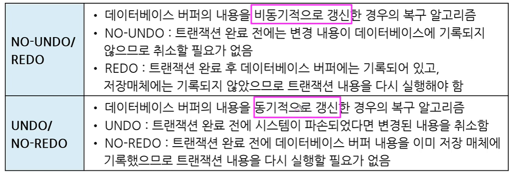
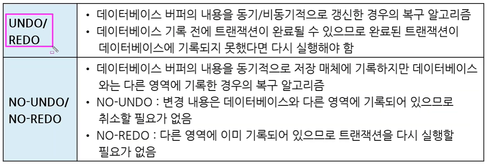

# 데이터베이스 백업

* 전산 장비의 장애에 대비하여 데이터베이스에 저장된 데이터를 보호하고 복구하기 위한 작업

* 치명적인 데이터 손실을 막기 위해서는 데이터베이스를 정기적으로 백업해야함

 

## 로그파일

* 데이터베이스의 처리 내용이나 이용상황등 상태 변화를 시간의 흐름에 따라 모두 기록한 파일
  
  * 자동차의 블랙박스와 유사

* 데이터베이스의 복구를 위해 필요한 가장 기본적인 자료

* 로그 파일을 기반으로 데이터베이스를 과거 상태로 복귀(UNDO, 취소)시키거나 현재 상태로 재생(REDO)시켜 데이터베이스 상태를 일관성 있게 유지할 수 있음

* 로그 파일은 트랜잭션 시작 시점, 롤백(rollback) 시점, 데이터 입력, 수정 삭제 시점 등에서 기록 됨
  
  * 트랜잭션(transaction) : DB 상태를 변화시키기 위해서 수행하는 작업의 단위
    
    * SELECT, INSERT, DELETE, UPDATE
  
  * 롤백(rollback) : 업데이트에 오류가 발생할 때 이전 상태로 되돌리는 것

 

## 데이터베이스 복구 알고리즘

#### NO-UNDO / REDO

* 비동기적 갱신
  
  * 트랜잭션이 완료되고 난 후, 주기나 작업량에 따라 시간차를 두고 저장매체에 저장(기록)

#### UNDO / NO-REDO

* 동기적 갱신
  
  * 트랜잭션이 완료되기 전에도 주기적으로 계속 저장(기록)
  * 중간 중간 계속 저장

* UNDO, REDO, 동기, 비동기 개념 기억하기

 

## 백업 종류

* 복구 수준에 따라서 운영체제를 이용하는 물리 백업과 DBMS 유틸리티를 이용하는 논리 백업으로 나뉨

#### 물리 백업

* 데이터베이스 파일을 백업
  
  * 복사 붙여넣기

* 백업 속도가 빠르고 작업이 단순

* 문제 발생 시 원인 파익 및 문제 해결이 어려움

#### 논리 백업

* DB 내의 논리적 객체들을 백업

* 복원 시 데이터 손상을 막고 문제 발생 시 원인 파악 및 해결이 수월

* 백업/복원 시 시간이 많이 소요됨
