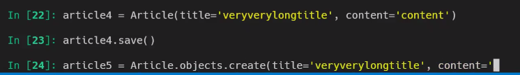

* 조회 방법

  1. 전체 조회

     ```bash
     Article.objects.all()
     
     articles = Article.objects.all()
     for article in articles:
     	print(article)
     ```

     

  2. 단 1개 조회

     ```django
     article = Article.objects.get('고유값임을 명시할 수 있는 데이터')
     article.title
     >> 
     ```

     

  3. 조건에 맞는 것만 조회

     ```
     articles = Articles.objects.filter(title='django')
     ```

     

### 삭제

* 