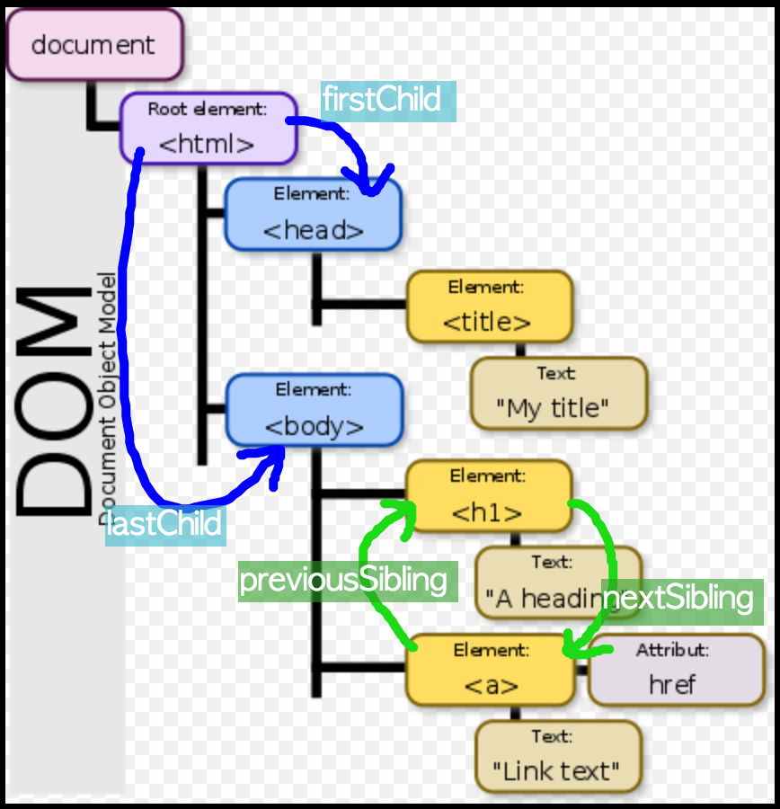
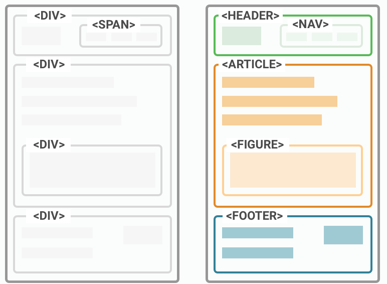
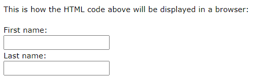

# HTML

## Web Standard 웹표준

1) W3C
2) WHATWG(Web Hypertext Application Technology Working Group)
   * **HTML Living Standard**
   * Browser Vendors: Apple, Google, Microsoft, Mozilla 

  

## Development Environment 개발환경

* Visual Studio Code
  * Open in browser, Auto rename tag, Highlight Matching Tag
* Chrome Development Tools

  

## HTML : Hyper Text Markup Language

### Hyper Text

: a text displayed don a computer display or other electronic devices with **references(hyperlinks)** to other text that the reader can immediately access.

 

### Markup Language

* 태그 등을 이용하여 문서나 데이터의 구조를 명시하는 언어 => 웹페이지를 작성(구조화)하기 위한 언어

  **Standard text-encoding system** consisting of a set of symbols inserted in a text document to _**control its structure, formatting,** or the relationship between its parts._

 

 

## Basic Structure 기본 구조

* html: Root(문서의 최상위 요소)
* head: Meta data
  * Title of documents, encoding, style, loading external files
  * what usually users can't see
* body: Main text
  * related to the real display for users

 

### Examples of `<head>`

* `<title>` : Title on the top of browser
* `<meta>` : Element for document level meta data
  * Open Graph Protocol
* `<link>` : Element to link External resources
* `<script>` : Script elements (ex. JavaScript file or code)
* `<style>` : for CSS

 

### DOM(Document Object Model) Tree

[DOM이 뭐죠?](https://youtu.be/PizkhskZrKk)

* 텍스트 파일인 HTML 문서를 브라우저에서 렌더링하기 위한 구조

  

* 2 space

 

### element 요소

* An HTML element is defined by a start tag, some content, and an end tag.

  The HTML **element** is everything from the start tag to the end tag

  * [HTML Elements](https://www.w3schools.com/html/html_elements.asp)

  

* Tag w/o contents
  * `br`, `hr`, `img`, `input`, `link`, `meta`

 

### attribute 속성

* Each tag has its own attribute
  * [한눈에 보는 HTML 요소(Elements & Attributes) 총정리](https://heropy.blog/2019/05/26/html-elements/)
* HTML Global Attribute
  * `id` : 문서 전체에서 유일한 고유 식별자 지정
  * `class`
  * `data-*`
  * `style`
  * `title`
  * `tabindex`

 

### 시맨틱 태그

* from HTML5

  

* Non semantic : `div`, `span`, ...
* Semantic : `header`, `nav`, `article`, `main`, `section`, `article`, `aside`, `footer`, .... `h1`, `table`

 

 

## HTML Document Structure HTML 문서 구조화

[w3schools Tag list](https://www.w3schools.com/tags/tag_comment.asp)

### Text Element 텍스트 요소

* [HTML Text Formatting](https://www.w3schools.com/html/html_formatting.asp)

|          tag           |                          definition                          |
| :--------------------: | :----------------------------------------------------------: |
|      `<a>` `</a>`      | a hyperlink. The `href` attribute specifies the URL of the page the link goes to |
|      `<b>` `</b>`      |           bold text, without any extra importance.           |
| `<strong>` `</strong>` | text with strong importance.  The content inside is typically displayed in bold. |
|      `<i>` `</i>`      | a part of text in an alternate voice or mood. The content inside is typically displayed in italic. used to indicate a technical term, a phrase from another language,  a thought, a ship name, etc. |
|     `<em>` `</em>`     | emphasized text. The content inside is typically displayed in italic. ( A screen reader will pronounce the words in `<em>` with an emphasis, using verbal stress.) |
|         ` `         |                        a line break.                         |
|        ``         | used to embed an image in a web page.   attribute 1) src - Specifies the path to the image  attribute 2) alt - Specifies an alternate text for the image |
|   `` ``   |                                                              |

 

### HTML Paragraphs

|              tag               |                          definition                          |
| :----------------------------: | :----------------------------------------------------------: |
|          `
` `
`          | a paragraph. always starts on a new line, and browsers automatically add some white space (a margin) before and after a paragraph. |
|             `
`             | a thematic break in an HTML page, and is most often displayed as a horizontal rule. it's used to separate content (or define a change) in an HTML page |
|         `<ol>` `</ol>`         | An ordered list starts with the `<ol>` tag. Each list item starts with the `<li>` tag. The list items will be marked with numbers by default |
|         `<ul>` `</ul>`         | An unordered list starts with the `<ul>` tag. The list items will be marked with bullets (small black circles) by default |
|        `<pre>` `</pre>`        | preformatted text. Text in a `<pre>` element is displayed in a fixed-width font, and the text preserves both spaces and line breaks. The text will be displayed exactly as written in the HTML source code. (HTML 작성 내용 그대로 표현 => 고정폭 글꼴, 공백문자 유지) |
| `<blockquote>` `</blockquote>` |        a section that is quoted from another source.         |
|        `
` `
`        |         a division or a section in an HTML document.         |

 

### form

* 정보(데이터)를 서버에 제출하기 위한 영역

  An HTML form is used to collect user input. The user input is most often sent to a server for processing.

  

* **basic attributes**
  * action : form을 처리할 서버의 url
  * method : form을 제출할 떄 사용할 HTTP 메서드(GET(default) or POST)
  * enctype : method가 post인 경우 데이터의 유형 (encoding type)

 

### input

* **attributes**
  * `name` 
  * `value`
  * `required`, `readonly`, `autofocus`, `autocomplete`, `disabled`, ...
  * `placeholder` : 입력칸에 보이다가 커서를 누르면 사라짐(for UX)

#### input label

* The `<label>` tag defines a label for many form elements.
* `<input>`에는 id 속성을, `<label>`에는 for 속성을 활용하여 상호 연관을 시킴

#### input type

* `text`

* `password`

* `email`

* `number`

* `file`

* 항목 중 선택 => 동일 항목에 대해서 name 지정, 선택된 항목에 대한 value 지정

  * `checkbox` : 다중 선택

  * `radio` : 단일 선택