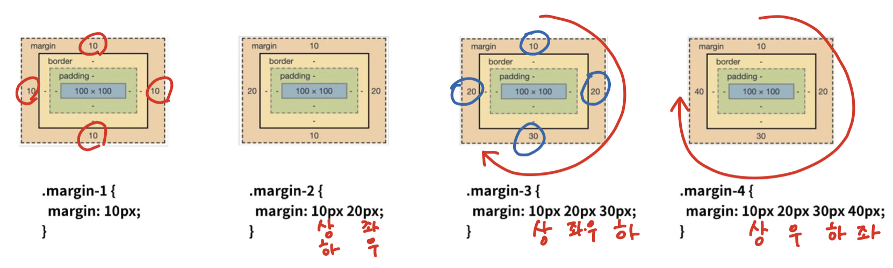
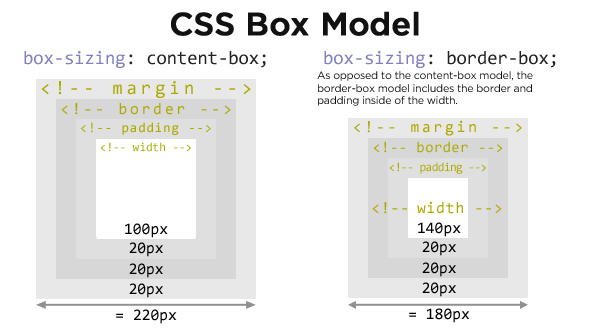

# CSS: Cascading Style Sheets

: the language we use to style a Web page.

### CSS Syntax


* The **selector points to the HTML element you want to style**.
* The declaration block contains one or more declarations separated by semicolons.
* Each declaration includes **a CSS property name and a value**, separated by a colon.
  * property: which one's style
  * value: how to style
* Multiple CSS declarations are **separated with semicolons**, and declaration blocks are surrounded by curly braces.

<br/>

### Three Ways to Insert CSS

* Inline CSS: apply a unique style for a single element

* Internal CSS: Embedding `<style>`
* External CSS: Each HTML page must include a reference to **the external style sheet file** inside the `<link>` element, inside the head section.

<br/>

### CSS with DevTools

* styles: 해당 요소에 선언된 모든 CSS
* computed: 해당 요소에 최종 계산된 CSS

<br/>

<br/>

## CSS Selectors


<br/>

---

### 선택자 유형

#### Simple selectors (기본 선택자)

: select element based on name, id, class

* 전체 선택자 `*` 
* 요소 선택자

* 클래스 선택자 `.`
* 아이디 선택자 `#`
  * 하나의 문서에 한 번만 사용! **ONE and ONLY**
* 속성(name) 선택자(=> checkbox 같은 것)

<br/>

---

#### Combinator selectors (결합자)

: select elements based on **a specific relationship between them**

​	(2스페이스 뒤 부터 그 안에 들어오는 애들 다)

* 자손 결합자(descendant selector) `space`

  * matches all elements that are descendants of a specified element

    ```css
    /*all <p> elements inside <div> elements*/
    div p {
      background-color: yellow;
    }
    ```

* 자식 결합자(child selector) `>` 

  *  selects all elements that are the **children of a specified element**

    (직계만=2스페이스 차이만)

    ```css
    /*all <p> elements that are children of a <div> element*/
    div > p {
      background-color: yellow;
    }
    ```

* 일반 형제 결합자(general sibling selector) `~`

  * select all elements that are next siblings of a specified element

    (이후에 나오는 애들 다~)

    ```css
    /*all <p> elements that are next siblings of <div> elements*/
    div ~ p {
      background-color: yellow;
    }
    ```

* 인접 형제 결합자(adjacent sibling selector) `+`

  * select an element that is **directly after** another specific element

    (바로 다음에 오는 애만 선택)

    ```css
    /*selects the first <p> element that are placed immediately after <div> elements*/
    div + p {
      background-color: yellow;
    }
    ```

<br/>

#### Pseudo-classes (의사 클래스)

#### Pseudo-element (의사 요소)

<br>

---

### CSS Cascading Order

1. `!important`

2. 우선 순위

   * inline > id > class, property, pseudo-class > element, pseudo-element
   * (id; 문서에서 단 한 개) > (class ; 내가 굳이 지정한 애들) > (elements; 기본 태그들)

3. Loading(source) order (ex. 덮어쓰기)

   

<br/>

### CSS Inheritance (CSS 상속)

* 상속 가능; 내용에 관한 것(같은 주제를 다룸, 눈에 보이는 시각적인 것)

  * text 관련 요소(font, color, text-align), opacity, visibility

* 상속 불가능; 영역에 관한 것

  * box model 관련 요소(width, height, padding, border, box-sizing, display),

    position 관련 요소(position, top/right/bottom/left, z-index) 등

<br/><br/>

## CSS Basic Style

### Units 크기 단위

#### Absolute Lengths

* `px`

#### Relative Lengths

* `%`
  * Relative to the parent element
* `em` (배수)
  * **바로 위/ 부모 요소**에 대한 상속의 영향을 받음
  * Relative to the font-size of the element (2em means 2 times the size of the **current** font)
* `rem` (배수)
  * 상속 영향 XXX
  * Relative to font-size of the **root** element
  * root => 최상위 요소(html)의 사이즈를 기준으로. 보통 16px

* viewport

  : the user's visible area of a web page (디바이스 화면)

  * 디바이스의 viewpoint를 기준으로 상대적인 사이즈가 결정
    * `vw`, `vh`, `vmin`, `vmax`

<br/>

---

### Colors

* color keyword: `red`, `blue`, ...
* RGB
* HSL (색상, 채도, 명도)

<br/>

<br/>

## CSS Box Model

_모든 요소는 네모(박스모델)이고, 위에서부터 아래로, 왼쪽에서 오른쪽으로 쌓인다._

 

* **Content** : The content of the box, where text and images appear

* **Padding** : Clears an area around the content. The padding is transparent 

  => 이미지는 패딩까지 적용

* **Border** : A border that goes around the padding and content

* **Margin** : Clears an area outside the border. The margin is transparent



<br/>

### box-sizing

* 기본적으로 모든 요소의  box-sizing은 content-box  (content기준)

  = padding을 제외한 순수 contents 영역만을 box로 지정

* **border-box** 설정 시 border까지의 너비를 기준으로 삼을 수 있음

  

<br/>

<br/>

## CSS Display

Compared to `display: inline`, the major difference is that `display: inline-block` allows to set a width and height on the element.

Also, with `display: inline-block`, the top and bottom margins/paddings are respected, but with `display: inline` they are not.

Compared to `display: block`, the major difference is that `display: inline-block` does not add a line-break after the element, so the element can sit next to other elements.

<br/>

### display: block (덩어리!)

* 줄 바꿈이 일어나는 요소
* 화면 크기 전체의 가로폭 차지
* 블록 레벨 요소 안에 인라인 레벨 요소 가능
* `div` / `ul`,`ol`, `li` / `p` / `hr` / `form` / ...

### display: inline (낱개)

* 줄 바꿈이 일어나지 않는 행의 **일부** 요소
* content 너비만큼만 가로폭 차지
* width, height, margin-top, margin-bottom 지정 불가능
* **상하 여백은 `line-height`로 지정**
* `span` / `a` / `img` / `input`, `label` / `b`, `em`, `i`, `strong` / ...

### display: inline-block

* block + inline
* the **top and bottom margins/paddings** are respected + the **element can sit next to** other elements 

### display: none

* 표시X, 공간조차 부여X
* `visibility: hidden` : 있는데 안 보일 뿐

<br/>

<br/>

## CSS Position

* `static`
* `relative`
* `fixed`
* `absolute`
* `sticky`

