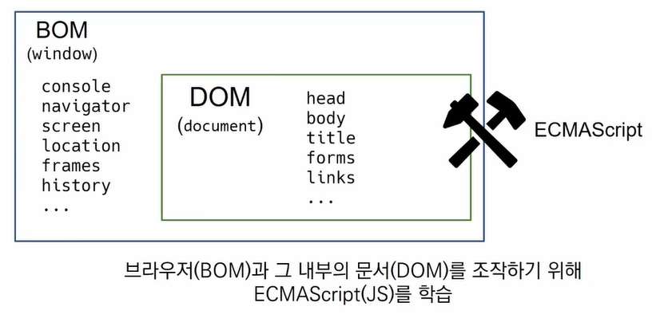
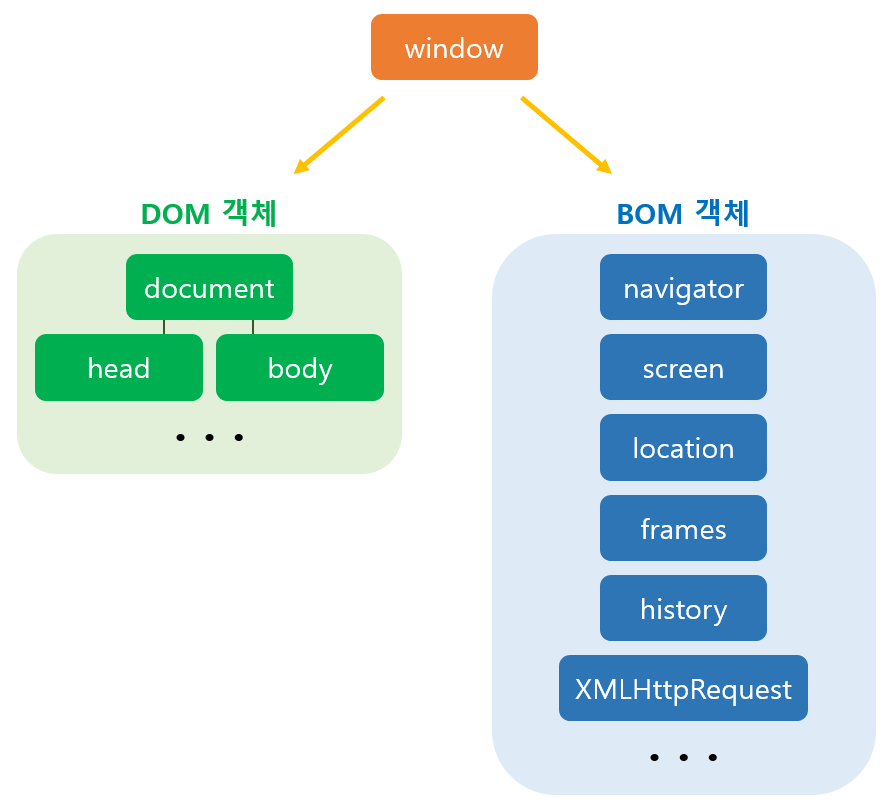

# JavaScript Intro

## Intro

### 자바스크립트의 필요성

* 브라우저 화면을 '동적'으로 만들기 위함
* 브라우저를 **조작**할 수 있는 유일한 언어

 

## Browser

### 브라우저에서 할 수 있는 일

* DOM(Document Object Model) 조작

* BOM(Browser Object Model) 조작

* JavaScript Core (ECMAScript)

  

  

 

### DOM 이란?

* HTML, XML과 같은 문서를 다루기 위한 프로그래밍 인터페이스

* 문서를 구조화하고, 구조화된 구성요소를 하나의 객체로 취급하여 다루는 논리적 트리모델

* 문서가 객체(object)로 구조화 되어 있으며 key로 접근 과정

  => 문서를 프로그램으로 다루려면 필요하다!

  

* Parsing
  * 브라우저가 문자열을 해석하여 DOM Tree로 만드는 과정

 

### BOM 이란

* 자바스크립트가 브라우저와 소통하기 위한 모델

 

### JavaScript Core

* 브라우저(BOM & DOM)을 조작하기 위한 명령어 약속(언어)

 

### ECMA

* ECMA International

  : 정보 통신에 대한 표준을 제정하는 비영리 표준화 기구

* ECMAScript는 ECMA에서 규격에 따라 정의한 언어
* ECMAScript6는 ECMA에서 제안하는 6번째 표준 명세를 의미

 

### 세미콜론 (semicolon)

* 자바스크립트는 세미콜론을 선택적으로 사용

 

### 코딩 스타일 가이드

* 코딩 스타일의 핵심은 합의된 원칙과 일과성
* 코딩 스타일은 코드의 품질에 직결되는 중요한 요소
* 참고 사이트
  * [에어비엔비 코딩 스타일 가이드](https://github.com/airbnb/javascript)

 

## References

* [DOM/BOM, Web API, 이벤트 캡쳐링/버블링](https://blog.kakaocdn.net/dn/cbr1oB/btrhVYMwJVw/BXzXZzuwvmtflkjH7OVskK/img.png)

* [DOM tree](https://cheonmro.github.io/2018/09/13/what-is-dom/)