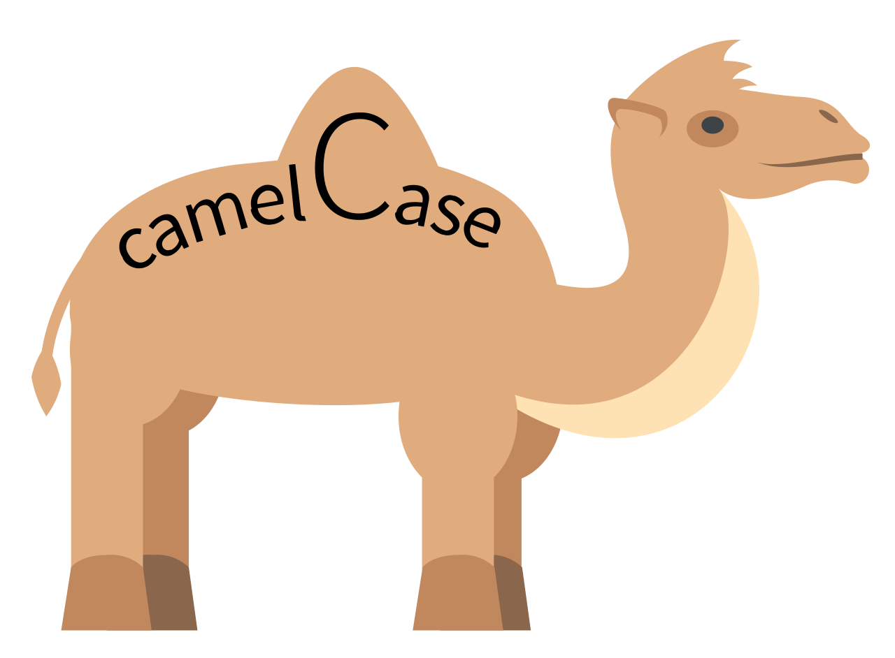

# JavaScript Overview

* Code is procedural

 

## how to declare a variable

#### const

* **a key word in JS the same like I'm declaring a new variable**

* no longer be altered
* no longer be assigned

#### let

* can be assigned later

#### var

* old way to declare
* no reason to use anymore

 

### coding convention

* **things that I can't call my variable**

  * class, const, var, let, ...

* **camelCasing**

  * it's a naming convention

    

* **SCREAMING_CASE**
  * which will never be reassigned
  * what is considered a constant

 

## semicolon

* for the end of sentence or the end of statement;
* optional

## references

* [camelCasing](https://en.wikipedia.org/wiki/Camel_case)