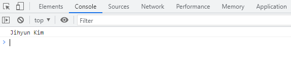
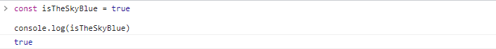
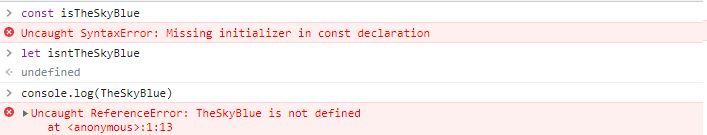
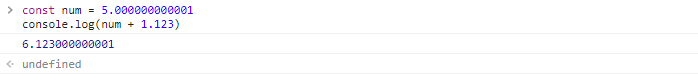

# Primitive types

* **irreducible**
  * what we cannot split into further other things
* **NOT object**
* the value of the type will be assigned into variable
* the origin value will be copied

## Strings

* `""` , `''`, 백틱

  ```javascript
  const myName = "Jihyun Kim"
  
  console.log(myName)
  ```

  

#### string concatenation

* connecting strings together

  ```javascript
  // string concatenation (connecting strings together)
  const firstName = "Jihyun"
  const lastName = "Kim"
  
  const sentence = "Hello " + firstName + " " + lastName + "! How are you?!"
  ```

<br/>

#### Template Strings

* with ``(backticks)`! 

  ```javascript
  const firstName = "Jihyun"
  const lastName = "Kim"
  
  const sentence = `Hello ${firstName} ${lastName}! How are you?!`
  console.log(sentence)
  ```

  * space & enter => valid

<br/>

## Booleans

* `true` / `false`

  

* default value is `undefined`

  

  * `const` can't never be be reassigned
  * `let` would be `undefined` because we haven't define it yet.

* **JS doesn't care `types`**

  

<br/>

## numbers

* positive, negative, integers, floats, ... => **number**

* Doing math with JS is notoriously fickle... lol

  

