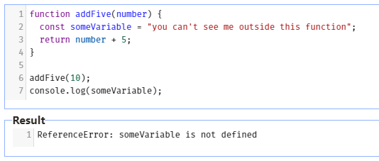
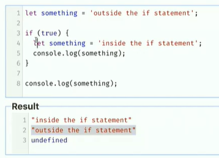
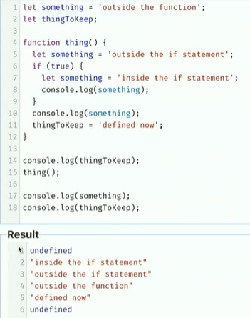

# Functions & Scope

## Functions&Parameters

* `Function` : a bit of re-usable code
  
  * procedures, methods in other languages
  
  ```javascript
  function addTwo(number) {
      return number + 2;
  }
  
  const finalAnswer = addTwo(5);
  console.log(finalAnswer);
  // 7
  ```

https://frontendmasters.github.io/bootcamp/functions-and-scope

* if don't pass anything in parameters
  
  => no Error
  
  => just return `undefined`

* sometimes functions return nothing

<br/>

## Scope

* A function has its own scope



* `someVariable` just works in fuction addFive

* As soon as a block `{ }` finishes, anything that was declared inside of there is going to go away.

* It matters where a valueable was declared.




