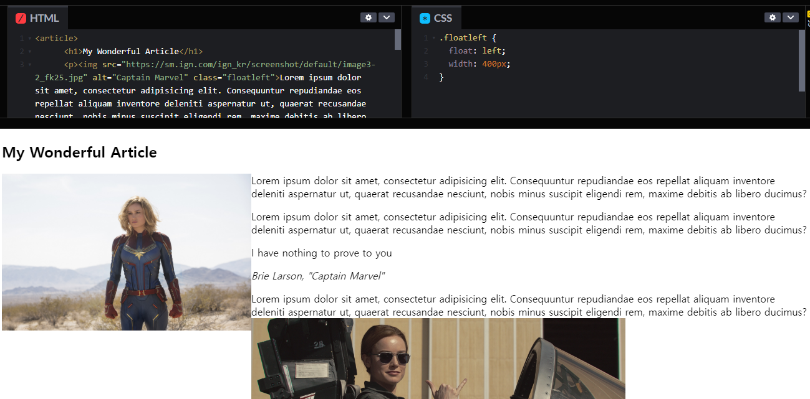
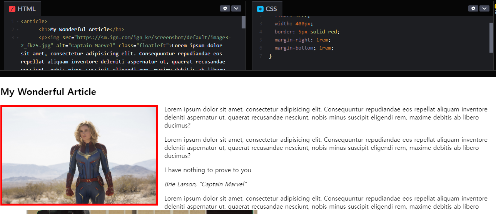
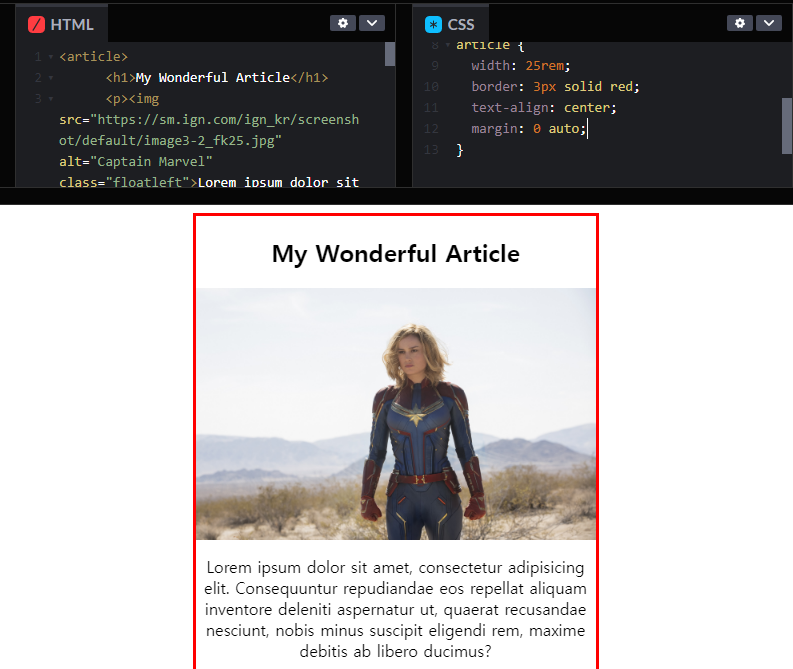
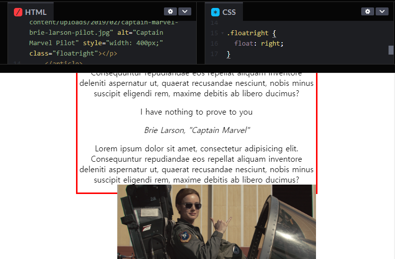
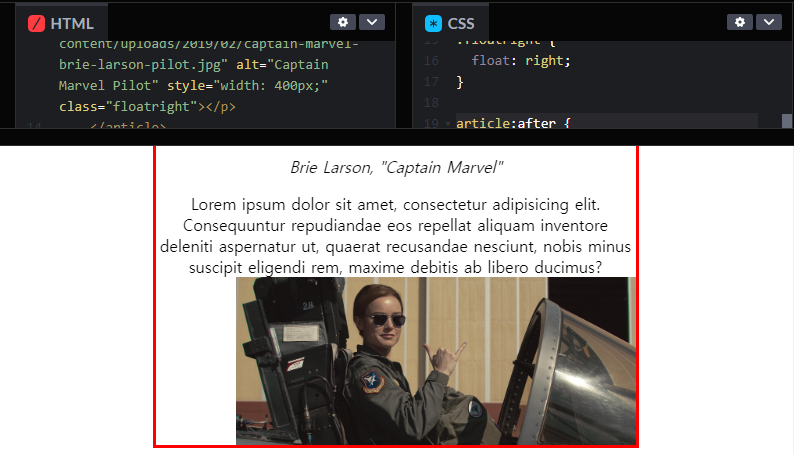

# CSS Layout

## with Block & Inline Block


## with Floats

#### `float`



#### `margin-rigth` & `margin-bottom`



* `TRouBLe` == **Top Right Bottom Left**

  ```css
  margin: 0 rem; 1rem 0;
  ```

<br/>

#### `article` & `auto margin`



* `margin: 0 auto;`

  : calculate how much extra space we have and divide it in two and stick half on each side of the box(in this case, article).

<br/>

#### Image Right & Clear



* If you float, you must clear!

* This should go on a parent

  ```css
  article:after {
      content: "";
      display: table;
      clear: both;
  }
  ```

  => Adding empty content and displaying it as a table

  