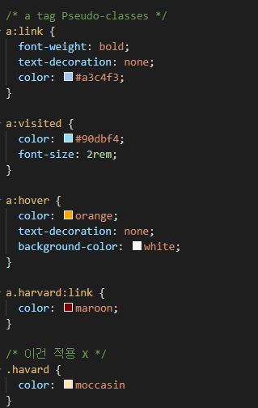

# Introduction to CSS

### html 파일과 연결하기

* `<link rel="stylesheet" href="css파일경로">`


### CSS파일 

1. 폰트 바꾸기!


## styling

`font-family:`

* 폰트 이름이 한 단어 이상이면(한 음절 이상) 작은 따옴표로 묶어준다

`font-size`

* **rem** : relative m
  * em : a size that's established by my browser for the font size by default
  * usually 1em == 16px

`text-align`

* `: center;` 가운데 정렬

`background-color`

* 배경색


`border`

* `solid` : 실선
* `dotted` : 점선


## Cascade (종속)

**First never wins. Last wins in CSS**


## Link Pseudo-Classes



* **Lord Vader Former Handle Anakin**
  * Link / Visited / Focus / Hover / Active


## Grouped Selectors

```css
h2, h3 {
    color: yellow;
}
```


## IDs

* Can be used only once in a webpage
* JS에서는 많이 쓰이지만 CSS에서는 자주 쓰이지 않음

```css
#idname {
    color: purple;
}
```


## Tags

### div vs section

* Div is more general
* Section has a meaning.

### article

