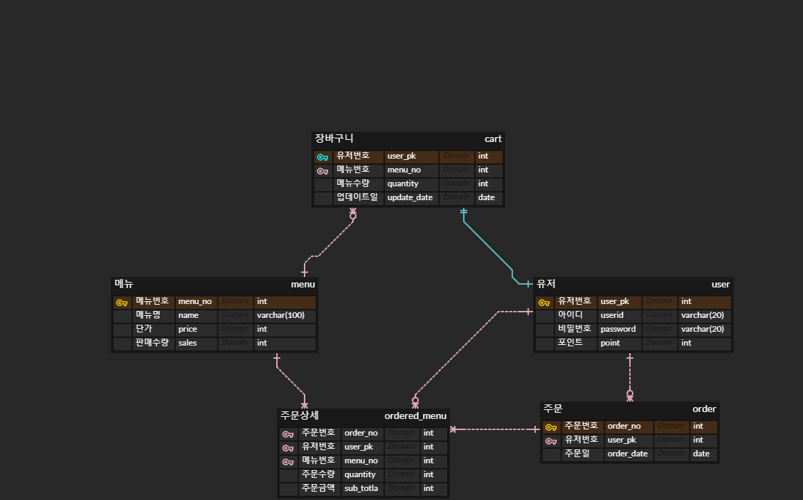

# Build APIs for Coffee Ordering System

> Originally Java-Spring assignment
>
> 1. Python-Django (in progress)
> 2. Java-Spring

<br/>

#### Steps

0. Requirements

1. ERD

---

1. Basic setting

2. Create DB - migration

3. Build APIs

<br/>

### 0. Requirements

> 요구사항 파악

* 목표: 커피숍 주문 시스템 구현
* 요구사항
  * 커피 메뉴 목록 조회 API
    * 커피 정보(메뉴id, 이름, 가격)을 조회하는 API
  * 포인트 충전 API
    * 결제는 포인트로만 가능
    * 포인트를 충전하는 api
  * 커피 주문 및 결제 API
    * 사용자 식별값, 메뉴 id 입력을 받아 주문하고 결제 진행
    * 결제는 포인트로만 가능
    * 충전한 포인트에서 주문 금액 차감
  * 인기 메뉴 목록 조회 API
    * 최근 7일간 인기 있는 메뉴 3개를 조회하는 api
    * 메뉴별 주문 횟수가 정확해야 함
* 자바 요구 사항
  * Spring boot 프로젝트
  * DB: H2 사용
  * 에러응답/ 에러코드는 자유롭게 정의
  * JUnit5 사용하여 테스트코드 작성

<br/>

### 1. ERD

> 요구사항 기반 ERD 작성



* 유저 테이블
* 메뉴 테이블
* 주문 테이블
* 주문 상세 테이블
  * 유저와 메뉴 사이 중개 테이블


## Python-Django

> Feb 27, 2023 -

### 1. Basic Setting

* virtual environment

  ```bash
  $ python -m venv venv
  $ source venv/Scripts/activate
  ```

* Install

  ```bash
  $ pip install django==3.2.15 djangorestframework
  $ pip freeze > requirements.txt
  ```

* Create App

  ```bash
  $ django-admin startproject [project name] .
  ```

  * `.` 을 붙여야 현재 디렉토리에 프로젝트가 생성 됨

* settings.py 수정하기
  * SECRET_KEY를 노출한 채로 그대로 git에 업로드하면 안된다
  * secrets.json 파일에 키를 저장하고, settings.py에서 해당 파일의 값을 불러와서 실행하도록 한다
  * .gitignore에 secrets.json을 추가하여 SECRET_KEY가 업로드 되지 않도록 한다.
  * [참고사이트](https://velog.io/@bom8231/Django-secret-key-%EB%B6%84%EB%A6%AC%ED%95%98%EA%B8%B0)


### 2. Basic Setting

> 

<br/>

## Java-Spring


