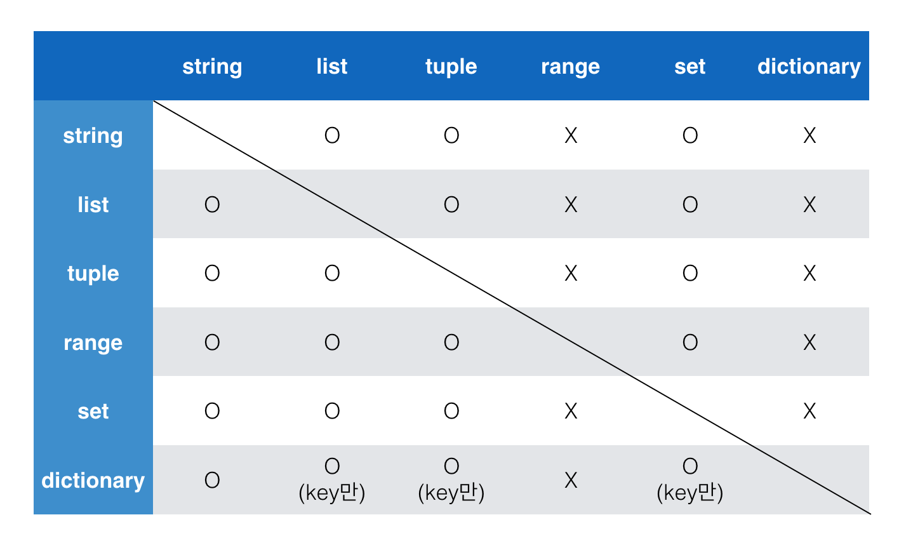
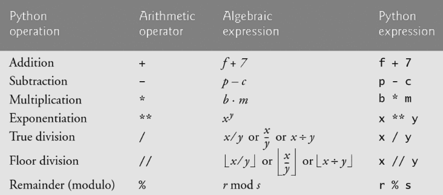

```python
# 1을 값으로 갖는 튜플 a를 생성하시오. >> `,`
a = (1,)
b = [1]
c = {1}
```


# Container

#### IMMUTABLE

* String, Tuple, Range

#### MUTABLE

* List, Set, Dictionary


## Container

* Any object that holds an arbitrary number of other objects. Generally, containers provide a way to access the contained objects and to iterate over them. [Stack Overflow](https://stackoverflow.com/questions/11575925/what-exactly-are-containers-in-python-and-what-are-all-the-python-container)
  * List, Tuple


[ResearchGate](https://www.researchgate.net/figure/A-summary-of-Pythons-different-container-aspects_fig3_301637361)

* Ordered vs Unordered
* Ordered != Sorted

<br/>

<br/>

## Sequence Container 시퀀스형 컨테이너

### List 리스트

**MUTABLE, ORDERED, ITERABLE**

* which can be written as **a list of comma-separated values (items) between square brackets**. Lists might contain items of different types, but usually the items all have the same type. [docs.python.org](https://docs.python.org/3/tutorial/introduction.html)

* Starts from 0

* **Mutable** ; 생성 이후 내용 변경 가능

* ALWAYS between `[]`

* Access through **index** ; list[0]

  ```python
  fruit = ['apple', 'peach', 'strawberry']
  fruit[0]
  fruit[-1]
  ```

  apple

  strawberry

  ```python
  bias = ['music', 'film', ['apple', 'peach', 'strawberry']]
  bias[2][1]
  bias[-1][1][0]
  ```

  apple

  p << 'p'each


<br/>

### Tuple 튜플

* A tuple consists of a number of values separated by comma

* Starts from 0

* **Immutable**

* ALWAYS between `()`

* Access through **index** ; tuple[i]

  ```python
  >>> t = 12345, 54321, 'hello!'
  >>> # Tuples are immutable:
  ... t[0] = 88888
  Traceback (most recent call last):
    File "<stdin>", line 1, in <module>
  TypeError: 'tuple' object does not support item assignment
  >>> # but they can contain mutable objects:
  ... v = ([1, 2, 3], [3, 2, 1])
  >>> v
  ([1, 2, 3], [3, 2, 1])
  ```

* Single item : **Must add _comma(,)_**

* Multiple items : No need

#### Tuple assignment 튜플 대입

* the process that **assigns the values on the right-hand side to the left-hand side variables** [topper](https://www.toppr.com/guides/computer-science/programming-with-python/tuples/tuple-assignment/)

  ```python
  a, b = 1, 2
  print(a, b)
  ```

  1 2

<br/>

### Range 레인지

* Sequence of number
  * Basic : range(n)
    * **0 ~ n-1**
  * Range : range(n, m)
    * **n ~ m**
  * Range & Step : range(n, m, s)
    * **n ~ m-1, adding s**

<br/>

### Packing/Unpacking Operator

<br/>

---

<br/>

## Associative Container 비시퀀스형 컨테이너

### Set 셋

**MUTABLE, UNORDERED, ITERABLE**

* **An unordered collection with no duplicate elements**
  * **순서 없이** 해시 가능한 객체(immutable)만 담음
* Able to add/update/delete object ➡ **Mutable**
* Same as set in math
* **Eliminating duplicate** entries ; **중복 비허용**
* `{}` or `set()`
  * but empty set >> `set()`
* Unordered ==> CAN NOT ACCESS to a value

<br/>

### Dictionary 딕셔너리

**MUTABLE, UNORDERED, ITERABLE**

* An unordered collection **indexed by keys**
  * **A SET OF KEY: VALUE PAIRS**
* Unlike sequences, which are indexed by a range of numbers, **dictionaries are indexed by *keys*, which can be any immutable type;** strings and numbers can always be keys.
  * Key : immutable (ex. string, integer, float, boolean, tuple, range)
  * values : any type is fine
* sometimes found in other languages as “associative memories” or “associative arrays”
* `{}` or `dict()`
* Access to values through keys (not oppositely)

<br/>

<br/>

## Typecasting 형변환

### Typecasting 자료형 변환

* Implicit

  * **Python automatically** converts one data type to another data type

* Explicit

  * Users coverts one data type to another one on purpose

    * str*, float => int

      ​	~~int(3.5) XX~~

    * str*, int => float

    * int, float, list, tuple, dict => str

<br/>

<br/>

## Operator 연산자

### Container Typecasting

[img src](https://5-ssssseung.tistory.com/61?category=954661)




### Types of Operator in Python

* Arithmetic Operator 산술 연산자
* Comparison Operator 비교 연산자
* Logical Operator 논리 연산자
* In-place Operator 복합 연산자
* Membership Operator 멤버십 연산자
* Identity Operator 식별 연산자
* Indexing/Slicing 기타


---

### Arithmetic Operator 산술 연산자



* `//` 몫, `%` 나머지

<br/>

### Comparison Operator 비교 연산자

| operators |           meaning           | example | result |
| :-------: | :-------------------------: | :-----: | :----: |
|     <     |          less than          |   5<6   |  True  |
|    <=     |    less than or equal to    |  5<=6   |  True  |
|     >     |        greater than         |   5>6   | False  |
|    >=     |  greater than or equal to   |  5>=6   | False  |
|    ==     |          equal to           |  5==6   | False  |
|    !=     |        not equal to         |  5!=6   |  True  |
|    is     |       객체 아이덴티티       |         |        |
|  is not   | 객체 아이덴티티가 아닌 경우 |         |        |

* Returns True / False

<br/>

### Logical Operator 논리 연산자


#### Short-Circuit Evaluation 단축 평가

* When the return value is clear, do not check the second value.

  ```python
  a = 2 and 4 # and requires all True => need to check 4
  print(a) 
  ```

  ```python
  b = 7 or 8 # or requires one True => stop evaluate at 7
  print(b)
  ```

  ```python
  c = 0 and 1
  # if one value returns False, and returns False if the second one returns True.
  print(c)
  ```

  ```python
  d = 4 or 2 # or doesn't care how many False it has. One True returns True for the others.
  print(d)
  ```

  ```python
  [출력]
  4
  5
  0
  5
  ```

<br/>

### In-Place Operator

*  an operation that changes directly the content of a given linear algebra, vector, matrices(Tensor) without making a copy
* 연산과 대입이 함께 이뤄짐

<br/>

### Identity Operator 식별 연산자

* Identify if they're the same objects using `is` operator.
* Used to compare None.

<br/>

### Membership Operator 멤버십 연산자

* Used to test if a sequence is presented in an object [W3schools](https://www.w3schools.com/python/gloss_python_membership_operators.asp)
  * `in` : Returns True if a sequence with the specified value is present in the object
  * `not in` : Returns True if a sequence with the specified value is not present in the object

<br/>

### Sequence Type Operator 시퀀스형 연산자

* `+` : Combines two sequences
* `*` : Repeats a sequence

<br/>

### Indexing 인덱싱

* Access to a specific index in a sequence
* The index of the first value : **0**
* The index of the last value : **-1**
* IndexError << When you try to access an index which is out of range.

<br/>

### Slicing 슬라이싱

* Slice a sequence in k

* `[n:m]` : **n ~ m-1**

* `[n:m:s]` : **n ~ m-1, step s**

  * String slicing example:

    |       |  a   |  b   |  c   |  d   |  e   |  f   |  g   |  h   |  i   |
    | :---: | :--: | :--: | :--: | :--: | :--: | :--: | :--: | :--: | :--: |
    | index |  0   |  1   |  2   |  3   |  4   |  5   |  6   |  7   |  8   |
    | index |  -9  |  -8  |  -7  |  -6  |  -5  |  -4  |  -3  |  -2  |  -1  |

    ```python
    s[1:4] => 'bcd'
    s[-5:-1] => 'efgh'
    s[2:-2] => 'cdefg'
    s[2:5:2] => 'ce'
    s[-8:-2:3] => 'bdf'
    ```

* `s[::] ` : **from the beginning to the end**

* `s[::-1]` : **from the end to the beginning** (backward)

<br/>

### set Operator

* `|` : 합집합
* `&` : 교집합
* `-` : 여집합
* `^` : 대칭차

<br/>

### 연산자 우선 순위

* ()
* Slicing
* Indexing
* **
* 단항 +,-
* 산술 *,/,%
* 산술 +, -
* 
