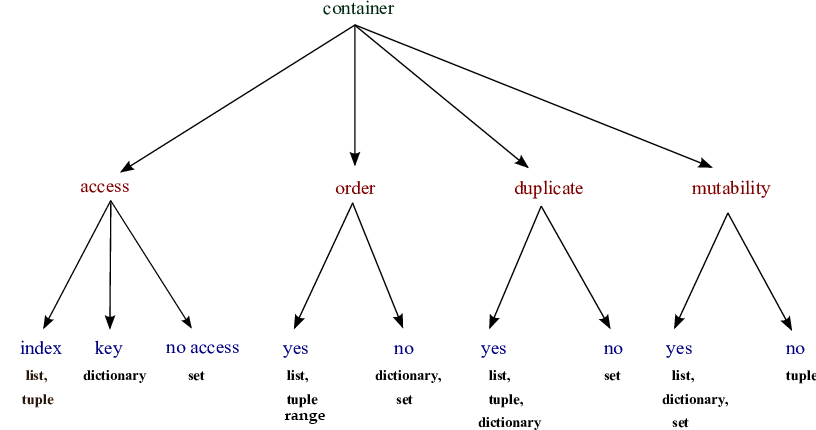

```python
# 1을 값으로 갖는 튜플 a를 생성하시오. >> `,`
a = (1,)
b = [1]
c = {1}
```


# Container

#### IMMUTABLE

* String, Tuple, Range

#### MUTABLE

* List, Set, Dictionary


## Container

* Any object that holds an arbitrary number of other objects. Generally, containers provide a way to access the contained objects and to iterate over them. [Stack Overflow](https://stackoverflow.com/questions/11575925/what-exactly-are-containers-in-python-and-what-are-all-the-python-container)
  * List, Tuple




[ResearchGate](https://www.researchgate.net/figure/A-summary-of-Pythons-different-container-aspects_fig3_301637361)

* Ordered vs Unordered
* Ordered != Sorted

<br/>

<br/>

## Sequence Container 시퀀스형 컨테이너

### List 리스트

* which can be written as **a list of comma-separated values (items) between square brackets**. Lists might contain items of different types, but usually the items all have the same type. [docs.python.org](https://docs.python.org/3/tutorial/introduction.html)
* Starts from 0
* **Mutable** ; 생성 이후 내용 변경 가능
* ALWAYS between `[]`

* Access through **index** ; list[0]

  ```python
  fruit = ['apple', 'peach', 'strawberry']
  fruit[0]
  fruit[-1]
  ```

  apple

  strawberry

  ```python
  bias = ['music', 'film', ['apple', 'peach', 'strawberry']]
  bias[2][1]
  bias[-1][1][0]
  ```

  apple

  p << 'p'each


<br/>

### Tuple 튜플

* A tuple consists of a number of values separated by comma

* Starts from 0

* **Immutable**

* ALWAYS between `()`

* Access through **index** ; tuple[i]

  ```python
  >>> t = 12345, 54321, 'hello!'
  >>> # Tuples are immutable:
  ... t[0] = 88888
  Traceback (most recent call last):
    File "<stdin>", line 1, in <module>
  TypeError: 'tuple' object does not support item assignment
  >>> # but they can contain mutable objects:
  ... v = ([1, 2, 3], [3, 2, 1])
  >>> v
  ([1, 2, 3], [3, 2, 1])
  ```

* Single item : **Must add _comma(,)_**

* Multiple items : No need

#### Tuple assignment 튜플 대입

* the process that **assigns the values on the right-hand side to the left-hand side variables** [topper](https://www.toppr.com/guides/computer-science/programming-with-python/tuples/tuple-assignment/)

  ```python
  a, b = 1, 2
  print(a, b)
  ```

  1 2

<br/>

### Range 레인지

* Sequence of number
  * Basic : range(n)
    * **0 ~ n-1**
  * Range : range(n, m)
    * **n ~ m**
  * Range & Step : range(n, m, s)
    * **n ~ m-1, adding s**

<br/>

### Packing/Unpacking Operator

<br/>

---

<br/>

## Associative Container 비시퀀스형 컨테이너

### Set 셋

* **An unordered collection with no duplicate elements**
  * 순서 없이 해시 가능한 객체(immutable)만 담음
* Able to add/update/delete object ➡ **Mutable**
* Same as set in math
* **Eliminating duplicate** entries ; **중복 비허용**
* `{}` or `set()`
  * but empty set >> `set()`
* Unordered ==> CAN NOT ACCESS to a value
* 

