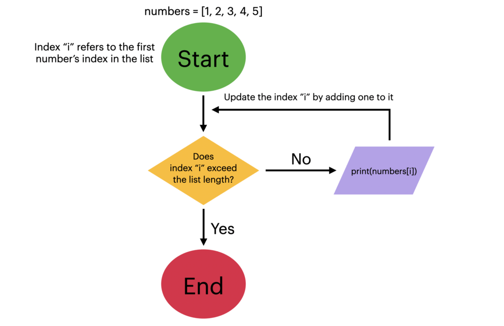
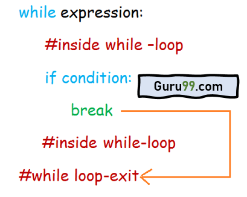
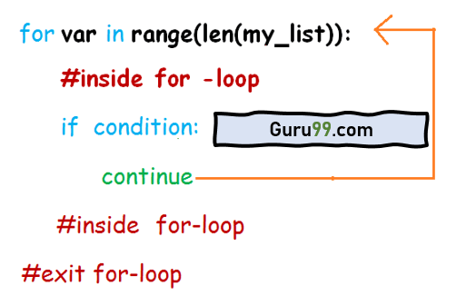

# Control Statement 제어문

* Python Tutorial: **Control Flow Tools**
* 파이썬은 기본적으로 위에서 아래로 순차적으로 명령을 수행
* 특정 상황에 따라 코드를 선택적으로 실행하거나 계속해서 실행하는 제어가 필요 => 제어문 사용

### Conditional Statement 조건문

* Always used with logical statements [img src](https://www.codingem.com/flowchart-loop/)

  

<br/>

## `if` Statments

* `if` ~ `else`

  ```python
  # odd/even
  
  num = int(input('Put number:'))
  if num % 2: # if num % 2 == 1:
      print(f'{num} is odd.')
  else:
      print(f'{num} is even.)
  ```

* `if` ~ `elif` ~ `else`

  * else에는 나머지 모두를 의미하도록  ~~<expression>~~

  ```python
  grade = int(input('Put your grade: '))
  if grade >= 90:
      print('You got A.')
  elif grade >= 80:
      print('You got B.')
  elif grade >= 70:
      print('You got C.')
  else:
      print('You got F.')
  ```

* `if` in `if`

  ```python
  grade = int(input('Put your grade: '))
  if grade >= 90:
      print('You got A.')
      if grade >= 80:
          print('You got B.')
      elif grade >= 70:
          print('You got C.')
      else:
          print('You got F.')
  ```

<br/>

### Conditional Expression 조건 표현식 / Ternary Operator

* **<Value when it's True> if <expression> else <Value when it's False>**

  ```python
  # odd/even
  
  num = int(input('Put number:'))
  print(f'{num} is odd.') if num % 2 else print(f'{num} is even.)
  ```

<br/>

<br/>

---

<br/>

## Loop statement 반복문

* While
* For
* break, continue, for-else


[img src](https://www.geeksforgeeks.org/python-for-loops/)

## `while` Statements

* 표현식이 True인 동안에는 계속해서 순회 => 무한루프를 하지 않도록 **종료조건** 반드시 필요

  => 조건이 거짓이 되면 루프가 멈춘다

  ```python
  while <expression>:
      #statemetns~
  ```

  be used for repeated execution as long as **an expression is true**

  ```python
  while_stmt ::=  "while" assignment_expression ":" suite
                  ["else" ":" suite]
  ```

  This repeatedly tests the expression and, _if it is true, executes the first suite_; if the expression _is false (which may be the first time it is tested) the suite of the `else` clause_, if present, is executed and the loop terminates.

* example

  ```python
  # sum of from 1 to the positive integer which a user puts in
  
  number = int(input())
  n = 1
  total = 0
  while n <= number:
      total += n
      n = n + 1
  print(total)
  
  # sum of from the positive integer which a user puts in to 1
  
  number = int(input())
  result = 0
  while number > 0:
      result += number
      number = number - 1
  print(result)
  ```

<br/>

<br/>

## `for` Statements

* 시퀀스를 포함한 순회가능한 객체 요소를 모두 순회

  => 반복가능한 애들을 꺼내준다!

  ```python
  for <name of variable> in <iterable>:
      #statements
  else:
      #statements
  ```

  = Be used to **iterate over the elements of a sequence** (such as a string, tuple or list) or other iterable object

  ```python
  for_stmt ::=  "for" target_list "in" expression_list ":" suite
                ["else" ":" suite]
  ```

<br/>

#### 문자열 순회

```python
chars = 'love'

# simply iterate (for)
for char in chars:
    print(char)
    
# access by indexes
for idx in range(len(chars)):
    print(chars[idx])
```

<br/>

#### 딕셔너리 순회

* 기본적으로 key를 순회, key를 통해 값을 활용 =  **RETURN KEYS** => Access values by keys

  ```python
  menus = {'신전떡볶이': '매운치즈김밥', '불스떡볶이': '페퍼로니떡볶이'}
  
  for menu in menus:
      print(menu)
      
  >>> 신전떡볶이
  >>> 불스떡볶이
  
  # 딕셔너리 순회
  for menu in menus:
  	print(menu, menus[menu])
      
  >>> 신전떡볶이 매운치즈김밥
  >>> 불스떡볶이 페퍼로니떡볶이
  ```
  
   ```python
   menus = {'신전떡볶이': ['매운치즈김밥', '로제치즈떡볶이'], '불스떡볶이': ['페퍼로니떡볶이', '꿀구마추가']}
   # 신전떡볶이의 메뉴 출력하고, 개수 세기
   cnt = 0
   # 일단 키 값을 찾자
   for menu in menus:
       if menu == '신전떡볶이':
           # 찾은 키값으로 value에 접근한다
           for i in menus[menu]:
               print(i)
               cnt += 1
   print(cnt)
   
   >>> 매운치즈김밥
   >>> 로제치즈떡볶이
   >>> 2
   ```
  
* Methods

  * `.key()`: keys
  * `.values()`: values
  * `.items()`: (key, value)의 튜플

  ```python
  menus = {'신전떡볶이': '매운치즈김밥', '불스떡볶이': '페퍼로니떡볶이'}
  print(menus.keys())
  print(menus.values())
  print(menus.items())
  
  >>> dict_keys(['신전떡볶이', '불스떡볶이'])
  >>> dict_values(['매운치즈김밥', '페퍼로니떡볶이'])
  >>> dict_items([('신전떡볶이', '매운치즈김밥'), ('불스떡볶이', '페퍼로니떡볶이')])
  ```

  ```python
  # keys
  for key in menus.keys():
      print(key, menus[key])
      
  >>> 신전떡볶이 매운치즈김밥
  >>> 불스떡볶이 페퍼로니떡볶이
  ```

  ```python
  # values
  for value in menus.values():
      print(value)
      
  >>> 매운치즈김밥
  >>> 페퍼로니떡볶이
  ```

  ```python
  # items
  for key, value in menus.items():
      # key, value = ('신전떡볶이', '매운치즈김밥')
      print(key, value)
  
  >>> 신전떡볶이 매운치즈김밥
  >>> 불스떡볶이 페퍼로니떡볶이
  ```

<br/>

### enumerate 순회

* enumerate()

  : 인덱스와 객체를 쌍으로 담은 열거형(enumerate) 객체 반환 = Return an enumerate object.

  * (index, value) 형태의 tuple로 구성
  * type(enumerate()) ➡ <class 'enumerate'>
  
  ```python
  menus = {'신전떡볶이': ['매운치즈김밥', '로제치즈떡볶이'], '불스떡볶이': ['페퍼로니떡볶이', '꿀구마추가']}
  print(enumerate(menus))
  >>> <enumerate object at 0x000001FA4FEB7080>
  
  for idx, menu in enumerate(menus):
      print(idx, menu)
  >>> 0 신전떡볶이
  >>> 1 불스떡볶이
  
  list(enumerate(menus, start=1))
  >>> [(1, 신전떡볶이), (2, 불스떡볶이)]
  ```

<br/>

### List Comprehension

* 표현식과 제어문을 통해 특정한 값을 가진 리스트를 간결하게 생성하는 방법

  : A compact way to process all or part of the elements in a sequence and return a list with the results.

  ``` python
  [expression for 변수 in iterable]
  list(expression for 변수 in iterable)
  ```

* example

  ```python
  # the list of square of 1 to 3
  square_list = []
  for number in range(1, 4):
  	square_list += [number ** 2]
  print(square_list)
  
  >> [1, 4, 9]
  ```

  ```python
  # using list comprehension
  square_list = [number ** 2 for number in range(1, 4)]
  print(square_list)
  
  >> [1, 4, 9]
  ```

<br/>

### Dictionary Comprehension

* 표현식과 제어문을 통해 특정한 값을 가진 딕셔너리를 간결하게 생성하는 방법

* example

  ```python
  # the dictionary of square of 1 to 3
  square_dict = {}
  for number in range(1, 4):
      square_dict[number] = number ** 2
  print(square_dict)
  
  >>> {1: 1, 2: 4, 3: 9}
  ```

  ```python
  square_dict = {number: number ** 2 for number in range(1, 4)}
  print(square_dict)
  ```

<br/>

<br/>

## break, continue, for-else  반복문 제어

### break

* **Loop Exit!**

* 특정 조건에 반복문 종료할 때 사용

  

<br/>

### Continue

*  Continue 이후의 코드 블룩을 수행하지 않고 다음 반복을 수행(조건문으로 다시 이동)

  = **Right Go Back** to Condition

  

<br/>

### Pass

* Do **NOTHING**
* 반복문이 아니어도 사용 가능

<br/>

### else

* 반복문을 끝까지 실행하게 되면 else문 실행
