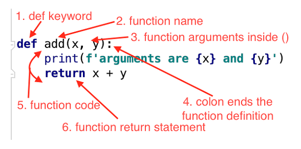
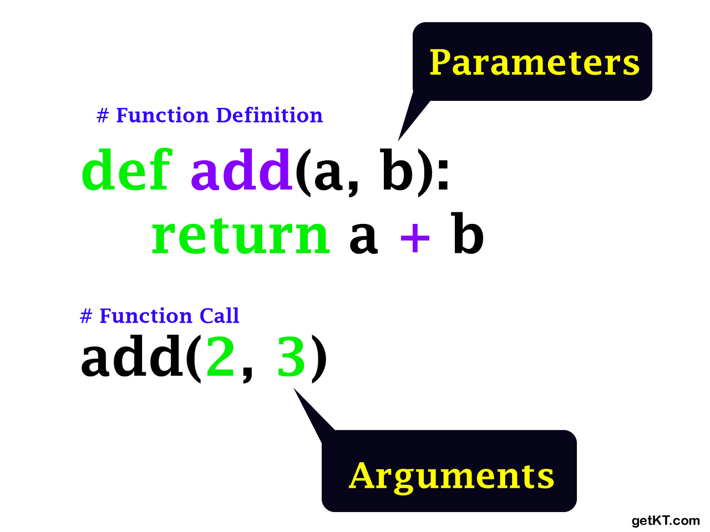
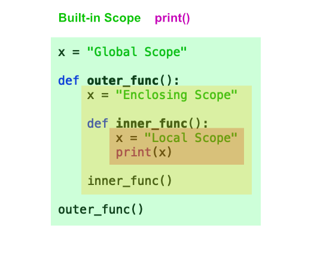

# Function 함수

1. Basic of function
2. Output
3. Input
4. Scope
5. Doc-string
6. Applications

<br/>

## 함수의 기초

### Function

* A block of code which only runs when it is called. [w3schools](https://www.w3schools.com/python/python_functions.asp)

  특정한 기능을 하는 코드의 조각(묶음)

* 특정 명령을 수행하는 코드를 매번 다시 작성X, 필요시에만 호출

#### Custom Function

```python
def function_name(parameter):
    # code block
    return returning value
```

<br/>

### 함수의 구조

* define & call
* input
* doc-string(문서화)
* scope(범위)
* output(결과값)

<br/>

### Define & Call

* Define by keyword `def`

* tab + Function body(실행될 코드 블록)

* Functions can deliver parameter

* At the end, functions `return` returning value

  

<br/>

<br/>

## Output 함수의 결과값

### 값에 따라

* 명시적인 return 값이 없을 때 => None 반환 후 종료
* return 값을 반환하고 함수 종료 => **하나의 객체**를 반환

### return vs print

* return은 함수 안에서만 사용하는 키워드
* print는 출력을 위해 사용하는, **보기 위해 사용하는** 함수

<br/>

### 튜플 반환

* 두 개 이상의 값을 반환하겠다? => 튜플로 묶여서 **하나의 객체**로 반환 됨

<br/>

<br/>

## Input 함수의 입력

### Parameter & Argument

* Parameter : 함수를 실행할 때, 함수 **내부**에서 사용되는 식별자 => 이름을 지어주는 것

* Argument : 함수를 **호출**할 때 넣어주는 **값**

  

<br/>

### Argument

* 함수 호출 시 함수의 parameter를 통해 전달 되는 값
* 소괄호 안에 할당 `func_name(argument)`
  * 필수 arg : 반드시 전달 되어야 함
  * 선택 arg : 값을 전달하지 않아도 됨 => 기본 값이 전달

<br/>

### Positional Arguments

* 기본적으로 함수 호출 시 argument는 위치에 따라 함수 내에 전달 됨

### Keyword Arguments

* (굳이) 특정한 값에 특정한 value를 집어 넣는 방식

  ```python
  def multiply(x, y):
      return x * y
  
  print(add(1, 2)) # => x = 1, y = 2
  print(add(y=2, x=1)) # 키워드
  print(add(x=1, 2)) # SyntaxError <= 키워드를 지정하는 순간 위치 의미 X
  print(add(1, y=2))
  ```

<br/>

### Default Arguments Values (Def)

* 기본값을 지정하여 함수 호출 시 argument 값 설정안해도 괜찮음(선택)

  ```python
  def student(name= 'Jen', gpa): # => SyntaxError: non-default argument follows default argument
      return name, gpa
  
  def student(gpa, name='Jen'):
      return name, gpa
  
  print(student(4.0))
  >>> ('Jen', 4.0)
  ```

<br/>

### Positional Arguments Packing/Unpacking `*`

* multiple positional arguments  ==>> parameter

* Use to define the function which **doesn't know how many arguments** to receive

  ```python
  def add(*args, a):
      return args, a
  
  print(add(1, 2, 3, 4))
  # TypeError: add() missing 1 required keyword-only argument: 'a'
  print(add(1, 2, 3, 4, a=5))
  ```

  * Then, *args needs to be at the end?

    ```python
    def another_add(a, *args):
    	return a, args
    
    print(another_add(1,2,3,4,5))
    >>> (1, (2, 3, 4, 5))
    ```

<br/>

### Keyword Arguments Packing/Unpacking `**`

* 함수가 임의의 개수 Argument를 keyword Argument로 호출될 수 있도록 지정

  ```python
  def add(**kwargs, a): # SyntaxError: invalid syntax
      return kwargs, a
  
  # add(a=1, b=2, c=3) 이라고 해도 **kwargs가 값을 다 가져간다!!!!!!
  ```
  
  ```python
  def numbers(a, **kwargs):
  	return a, kwargs
  
  print(numbers(1, b ='2', c ='3'))
  # 순서대로 a 먼저 자기 자리 찾아간 뒤에 묶으니까 가능!
  ```
  
  ```python
  def characters(**kwargs):
  	return kwargs
  
  print(characters(Batman='Wayne', Ironman='Stark', Spiderman='Parker'))
  >>> {'Batman': 'Wayne', 'Ironman': 'Stark', 'Spiderman': 'Parker'}
  
  #Batman, Ironman, Spiderman은 딕셔너리의 키 X
  #식별자(이름)일 뿐! 그래서 ''표시 필요 없음
  ```

<br/>

<br/>

## Scope 함수의 범위

* 함수는 코드 내부에 local scope를 생성하며, 그 외의 공간인 global scope로 구분한다
* 식별자(Variable, 변수의 이름)들은 LEGB 순서로 찾아나가면 됨

 


```python
a = 0
b = 1
def enclosed():
    a = 10
    c = 4
    def local(c):
        print(a, b, c)
        # => a는 바로 위의 10, b는 더 위의 1, c는 아래 local(400)에서 호출한 값 400 => 10 1 400
    local(400)
    print(a, b, c) # => 10 1 4
enclosed()
print(a, b) # 가장 바깥에 있으므로 global => 0 1

>>> 10 1 400
>>> 10 1 4
>>> 0 1
```

* Example

  * 

  ```python
  number = [1, 2, 3, 4]
  
  def new():
      numbers[0] = 100
      # numbers의 0번째 값을 콕 집어서 변경 > 변경된다!
      # 새로 변수를 만든게 아니라 주소에 있는 것을 직접 바꿨기 때문 
  
  new()
  print(numbers)
  ```

  * replace

    ```python
    word = 'hello' # string is IMMUTABLE
    
    def new():
        word.replace('h', '')
        # replace를 써도 string 규칙 안 깨짐
        # 문자열을 바꾼 게 아니라, h를 뺀 ello를 return 해준 것 뿐
        a = word.replace('h', '')
        # return 값을 a에 담아두자
        print(word) # immutable하므로 그대로
        print(a)
    
    new()
    print(word)
    ```

    hello

    ello

    hello


<br/>

### Lifecycle 변수 수명주기


return 안하면 print해도 저장값은 None!!!
