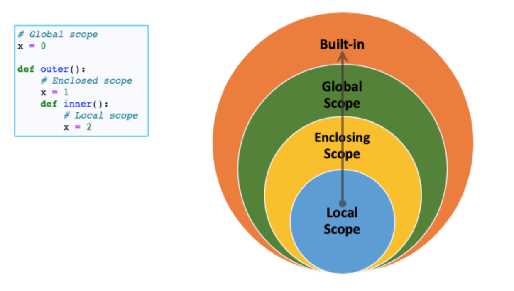

# Function 함수


<br/>

### Keyword Arguments

* 굳이 특정한 값에 특정한 value를 집어 넣는 방식

```python
def add(x, y):
    print(x)
    print(y)
    
add(2, x=5)
# TypeError: add() got multiple values for argrument 'x'

add(y=2, x=5)
5
2
```

<br/>

### Positional Arguments Packing/Unpacking

#### *

* multiple positional arguments  ==>> parameter

* Use to define the function for unknown-

  ```python
  def add(*args, a):
      return args, a
  
  print(add(1, 2, 3, 4))
  # TypeError: add() missing 1 required keyword-only argument: 'a'
  print(add(1, 2, 3, 4, a=5))
  ```

  * Then, *args needs to be at the end?

    ```python
    >>>def another_add(a, *args):
    ... return a, args
    
    >>> print(another_add(1,2,3,4,5))
    ```

<br/>

### Keyword Arguments Packing/Unpacking

#### **

* 함수가 임의의 개수 Argument를 keyword Argument로 호출될 수 있도록 지정

  ```python
  >>> def add(**kwargs, a):
    File "<stdin>", line 1:
      def add(**kwargs, a):
                        ^
              
  SyntaxError: invalid syntax
  # a에게 값을 넣어줄 수 있는 방법이 없으니까!
  # add(a=1, b=2, c=3) 이라고 해도 **kwargs가 값을 다 가져간다
  ```

  ```python
  >>> def add(a, **kwargs):
      return a, kwargs
  
  >>> print(add(a=1, b=2, c=3))
  (1, {'b':2, 'c':3})
  # 순서대로 a 먼저 자기 자리 찾아간 뒤에 묶으니까 가능!
  ```

<br/>

<br/>

## Scope

### Scope 함수의 범위



[velog](https://velog.io/@idnnbi/Python-Variable-Scope)

```python
a = 1

def enclosed():
    a = 20
	
    def local():
        a = 300
        print(a)
	local()
    print(a)
    
enclosed()
print(a)
```

300

20

1

* Example

  * 

  ```python
  number = [1, 2, 3, 4]
  
  def new():
      numbers[0] = 100
      # numbers의 0번째 값을 콕 집어서 변경 > 변경된다!
      # 새로 변수를 만든게 아니라 주소에 있는 것을 직접 바꿨기 때문 
  
  new()
  print(numbers)
  ```

  * replace

    ```python
    word = 'hello' # string is IMMUTABLE
    
    def new():
        word.replace('h', '')
        # replace를 써도 string 규칙 안 깨짐
        # 문자열을 바꾼 게 아니라, h를 뺀 ello를 return 해준 것 뿐
        a = word.replace('h', '')
        # return 값을 a에 담아두자
        print(word) # immutable하므로 그대로
        print(a)
    
    new()
    print(word)
    ```

    hello

    ello

    hello


<br/>

### Lifecycle 변수 수명주기


return 안하면 print해도 저장값은 None!!!
