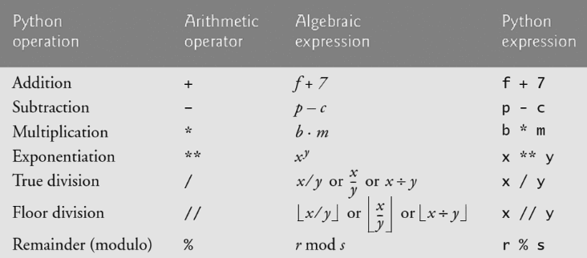

# Operator 연산자

### Types of Operator in Python

* Arithmetic Operator 산술 연산자
* Comparison Operator 비교 연산자
* Logical Operator 논리 연산자
* In-place Operator 복합 연산자
* Membership Operator 멤버십 연산자
* Identity Operator 식별 연산자
* Indexing/Slicing 기타

<br/>

<br/>

## Arithmetic Operator 산술 연산자



* `//` 몫
* `%` 나머지

#### divmod 함수

* 나눗셈과 관련된 함수

  ```python
  >>> print(divmod(9, 2))
  >>> quotient, remainder = divmod(9,2) # 변수에 divmod(9, 2)의 값 할당
  >>> print(f'몫은 {quotient}이고 나머지는 {remainder}이다.')
  (4, 1)
  몫은 4이고 나머지는 1이다.
  ```

<br/>

<br/>

## Comparison Operator 비교 연산자

| operators |           meaning           | example | result |
| :-------: | :-------------------------: | :-----: | :----: |
|     <     |          less than          |   5<6   |  True  |
|    <=     |    less than or equal to    |  5<=6   |  True  |
|     >     |        greater than         |   5>6   | False  |
|    >=     |  greater than or equal to   |  5>=6   | False  |
|    ==     |          equal to           |  5==6   | False  |
|    !=     |        not equal to         |  5!=6   |  True  |
|    is     |       객체 아이덴티티       |         |        |
|  is not   | 객체 아이덴티티가 아닌 경우 |         |        |

* Returns **True / False**

<br/>

<br/>

## Logical Operator 논리 연산자

* 타언어에서 논리연산자로 주로 사용하는 `&`과 `|`는 파이썬 내에서 비트 연산자이다.
* 0(zero) >> False


<br/>

### Short-Circuit Evaluation 단축 평가

* 첫 번째 값이 확실할 때, 두 번째 값은 확인하지 않는다

  = When the return value is clear, do not check the second value.

  ```python
  a = 2 and 4 # and requires all True => need to check 4
  print(a) 
  ```

  ```python
  b = 7 or 8 # or requires one True => stop evaluate at 7
  print(b)
  ```

  ```python
  c = 0 and 1
  # if one value returns False, and returns False if the second one returns True.
  print(c)
  ```

  ```python
  d = 4 or 2 # or doesn't care how many False it has. One True returns True for the others.
  print(d)
  ```

  ```python
  [출력]
  4
  5
  0
  5
  ```

<br/>

## In-Place Operator 복합 연산자

*  an operation that changes directly the content of a given linear algebra, vector, matrices(Tensor) without making a copy
*  연산과 할당이 함께 이뤄짐
*  반복문을 통해 갯수를 카운트 할 때 자주 사용
   *  a += b 
   *  a -= b
   *  ...


<br/>

<br/>

## Identity Operator 식별 연산자

* Identify if they're the same objects using `is` operator.

* Used to compare None.

  ```python
  # 파이썬에서 -5 ~ 256까지의 id는 동일하다
  a = 2
  b = 2
  print(a is b)
  print(id(a), id(b))
  ```

  True
  2746238921040 2746238921040\

  ```python
  # 파이썬에서 257 이후의 id는 다르다.
  a = 260
  b = 260
  print(a is b)
  print(id(a), id(b)) 
  ```

  False

  2746342782000 2746342784176

<br/><br/>

## Membership Operator 멤버십 연산자

* Used to test if a sequence is presented in an object [W3schools](https://www.w3schools.com/python/gloss_python_membership_operators.asp)
  * `in` : Returns True if a sequence with the specified value is present in the object
  * `not in` : Returns True if a sequence with the specified value is not present in the object

<br/><br/>

## Sequence Type Operator 시퀀스형 연산자

* `+` : Combines two sequences 시퀀스 연결

  ```python
  >>> [1, 2] + ['apple'] # 리스트끼리 더하기
  [1, 2, 'apple']
  
  >>> (1, 2) + ('apple',) # 튜플끼리 더하기
  (1, 2, 'apple')
  
  # range + range XXXX
  
  >>> 'no.' + '4' # string끼리 더하기
  'no.4'
  
  >>> 'no.' + 4 # string + integer
  TypeError
  ```

* `*` : Repeats a sequence 시퀀스 반복

  ```python
  # 리스트 [1]을 반복
  >>> [1] * 4
  [1, 1, 1, 1]
  
  # 튜플 (2, 4)를 반복
  >>> (2, 4) * 2
  (2, 4, 2, 4)
  
  # range 불가능
  TypeError
  
  # 문자열 'hello' 반복
  >>> 'hello' * 2
  'hellohello'
  ```

<br/>

<br/>

## Indexing/Slicing 인덱싱/슬라이싱

* `[]`을 통해 값에 접근하고, `[:]`을 이용해 슬라이싱 ~!


### Indexing 인덱싱

* Access to a specific index in a sequence

  *  IndexError: 해당 인덱스가 없는 경우

* The index of the first value : **0**

* The index of the last value : **-1**

  ```python
  # list [1, 2, 3]
  >>> [1, 2, 3][1]
  2
  
  # tuple (1, 2, 3)
  >>> (1, 2, 3)[2]
  
  3
  # range(4) 
  >>> range(4)[2] # list(range(4)) => (0, 1, 2, 3)
  2
  
  # string 문자열 접근
  >>> 'hello'[0]
  'h'
  ```

  

<br/>

### Slicing 슬라이싱

* Slice a sequence in k

* `[n:m]` : **n ~ m-1**

* `[n:m:s]` : **n ~ m-1, step s**

  * String slicing example:

    |       |  a   |  b   |  c   |  d   |  e   |  f   |  g   |  h   |  i   |
    | :---: | :--: | :--: | :--: | :--: | :--: | :--: | :--: | :--: | :--: |
    | index |  0   |  1   |  2   |  3   |  4   |  5   |  6   |  7   |  8   |
    | index |  -9  |  -8  |  -7  |  -6  |  -5  |  -4  |  -3  |  -2  |  -1  |

    ```python
    s[1:4] => 'bcd'
    s[-5:-1] => 'efgh'
    s[2:-2] => 'cdefg'
    s[2:5:2] => 'ce'
    s[-8:-2:3] => 'bdf'
    ```

* `s[::] ` : **from the beginning to the end**

* `s[::-1]` : **from the end to the beginning** (backward)

<br/>

<br/>

## 연산자 우선 순위

* `()`
* Slicing
* Indexing
* 제곱 `**`
* 단항 `+`, `-` (음수, 양수 부호!)
* 산술 `*`, `/` ,`%`
* 산술 `+`, ` -`
* 비교 `in`, `is`
* `not`
* `and`
* `or`


### set operator

* `|` : 합집합
* `&` : 교집합
* `-` : 여집합
* `^` : 대칭차