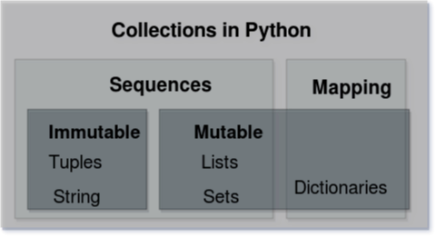
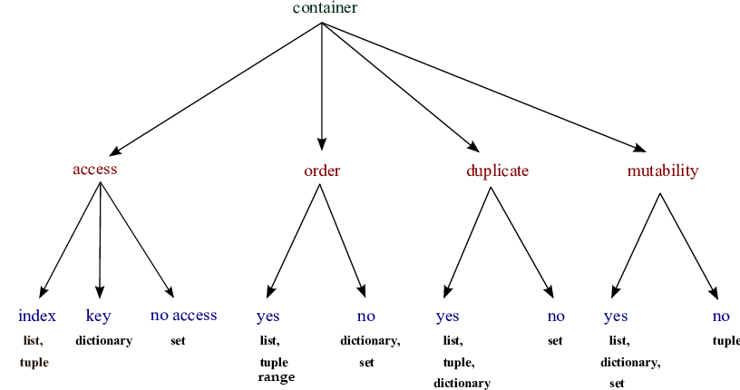

# Container



[img src](https://medium.com/@er.sanyam.arya/abc-of-collections-in-python-f239d787a43e)


## Container

* Any object that holds an arbitrary number of other objects. Generally, containers provide a way to access the contained objects and to iterate over them. [Stack Overflow](https://stackoverflow.com/questions/11575925/what-exactly-are-containers-in-python-and-what-are-all-the-python-container)
  * List, Tuple
* 서로 다른 자료형 저장O




[ResearchGate](https://www.researchgate.net/figure/A-summary-of-Pythons-different-container-aspects_fig3_301637361)

<br/>

<br/>

## Sequence Container 시퀀스형 컨테이너

* Ordered (순서대로 나열된) != Sorted(정렬된)
* 특정 위치의 데이터 가리킬 수 있음
* List, Tuple, Range, String, (Binary)

<br/>

### List 리스트

**MUTABLE(가변형), ORDERED(순서O), ITERABLE(순회 가능)**

* which can be written as **a list of comma-separated values (items) between square brackets**. Lists might contain items of different types, but usually the items all have the same type. [docs.python.org](https://docs.python.org/3/tutorial/introduction.html)
* Indexes start from 0
* **Mutable** ; 생성 이후 내용 변경 가능
* ALWAYS between `[]` `대괄호`

#### CREATE & ACCESS

* `[]` or `list()`

* 값에 대한 접근: `list_name[index]`

  

  * [img src](https://dschloe.github.io/python/basic/basic_syntax_list_1/)

* Access through **index** ; list[0]

  ```python
  
  fruit = ['apple', 'peach', 'strawberry']
  fruit[0]
  fruit[-1]
  
  >>> apple
  >>> strawberry
  ```

  ```python
  bias = ['music', 'film', ['apple', 'peach', 'strawberry']]
  bias[2][1]
  bias[-1][1][0]
  
  >>> apple
  >>> p   # 'p'each
  ```

* 리스트 + 리스트

  * ex_list`.append(i)`
  * ex_list `+= [i]`

<br/>

---

### Tuple 튜플

**IMMUTABLE(수정불가능)**

* A tuple consists of a number of values separated by comma
* (value1, value2)
* 리스트`[]`와 유사, but `()`
* Starts from 0
* ALWAYS between `()` `소괄호`

#### CREATE & ACCESS

* 하나의 항목으로 구성된 튜플은 값 뒤에 반드시 `,`를 붙여야 한다
  Single item : **Must add _comma(,)_**
  
  * 쉼표가 붙지 않으면 튜플 인식 X

  * Multiple items : No need (생략 가능)
  
    ```python
    # 1을 값으로 갖는 튜플 a를 생성하시오. >> `,`
    a = (1,) #(1) => int
    b = [1] #리스트
    c = {1} #셋
    ```
  
* Access through **index** ; tuple[i]

  ```python
  >>> a = 1,
  >>> print(type(a))
  <class 'tuple'>
  ```

#### Tuple Assignment 튜플 대입

* 우변의 값을 좌변의 변수에 한번에 할당하는 과정

  = the process that **assigns the values on the right-hand side to the left-hand side variables** [topper](https://www.toppr.com/guides/computer-science/programming-with-python/tuples/tuple-assignment/)

* 보통 파이썬 내부에서 활용

  ```python
  a, b = 1, 2
  print(a, b)
  ```

  1 2

<br/>

---

### Range 레인지

* 숫자(정수)의 시퀀스를 나타내기 위해 사용

  = Sequence of number

  * 기본형: range(n)
    * **0 ~ n-1**
  * 범위 지정: range(n, m)
    * **n ~ m-1**
  * 범위 및 스텝 지정: range(n, m, s)
    * **n ~ m-1, adding s**

#### CREATE & ACCESS

* `list(range(n, m))` : range를 list로 형변환

  ```python
  # 0부터 -6까지 담긴 range를 만들고 list로 형 변환하기
  >>> print(list(range(0, -5, -1)))
  [0, -1, -2, -3, -4, -5]
  ```

<br/>

---

### Packing/Unpacking Operator `*`

* 모든 시퀀스형은 패킹/언패킹 연산자 `*`를 사용하여 객체의 패킹 또는 언패킹이 가능

#### Packing

* 대입문의 좌변 변수에 위치

  ```python
  >>> a, *b = 1, 2, 3, 4
  >>> print(a)
  >>> print(type(a))
  1
  <class 'int'>
  
  >>> print(b)
  >>> print(type(b))
  [2, 3, 4]
  <class 'list'>
  ```


#### Unpacking

* argument unpacking: when argument name starts with *

* `*` 패킹의 경우 리스트로 대입, `*` 언패킹의 경우 튜플로 대입

  ```python
  def multipy(a, b, c):
      return a * b * c
  
  numbers = [1, 2, 3]
  print(multipy(*numbers))
  print(multipy(numbers)) # => TypeError: argument 여러개 넣어야 하는데 1개만 넣었기 때문
  ```

#### Caution

* `*`이 패킹/언패킹 연산자인지 산술 연산자(곱셈)인지 구분해야 함

  * 패킹/언패킹

    ```python
    # 1. 연산자가 대입식의 좌측에 위치
    x, *y = 1, 2, 3
    print(x, y)
    >>> 1 [2, 3]
    
    # 2. 연산자가 단항연산자(하나의 항을 대상으로 연산)로 사용
    ```

  * 산술 연산자(곱셈)

    ```python
    # 1. 연산자가 이항연산자(두 개 항을 대상으로 연산)로 사용
    ```

<br/>

<br/>

---

---

<br/>

## Associative Container 비시퀀스형 컨테이너

* Set, Dictionary
* 순서가 없다 => 인덱스로 값에 접근할 수 없다!!!!!!!!!

<br/>

### Set 셋

**MUTABLE, UNORDERED, ITERABLE**

* **An unordered collection with no duplicate elements**
  * **순서 없이** 해시 가능한 객체(immutable)만 담음
* Able to add/update/delete object ➡ **Mutable / 가변 자료형**
* Same as set in math
  * 함수와 마찬가지로 차집합`-` 합집합`|` 교집합`&` 연산 가능!

* **Eliminating duplicate** entries ; **중복 비허용!!!**
  * Set을 활용하면 list 내 중복을 손쉽게 제거할 수 있지만, 순서를 보장할 수 없음


#### CREATE & ACCESS

* `{}` or `set()`
  * but empty set >> `set()`
* Unordered ==> CAN NOT ACCESS to a value

#### set operator

* `|` : 합집합
* `&` : 교집합
* `-` : 여집합
* `^` : 대칭차

<br/>

---

### Dictionary 딕셔너리

**MUTABLE, UNORDERED, ITERABLE**

* An unordered collection **indexed by keys** / 순서 X `key-value` 쌍으로 이루어진 객체
  * **A SET OF KEY: VALUE PAIRS**
* Unlike sequences, which are indexed by a range of numbers, **dictionaries are indexed by *keys*, which can be any immutable type;** strings and numbers can always be keys.
  * **key** : only **immutable(변경 불가능)** data
    * string, integer, float, boolean, tuple, range
    * 중복X  => 뒤에 정의한 값으로 바뀜
  * Value : anything

    * ex. list, dictionary is fine.

* sometimes found in other languages as “associative memories” or “associative arrays”

#### CREATE & ACCESS

* `{}` or `dict()`

  ```python
  {key: value}
  dict(key=value) key값 '' 씌우지 않는다
  ```

  ```python
  dict_name[key] = value # 새로운 값 넣을 때!
  ```

  ```python
  def func(**kwargs):
    pass
  
  func('이건': '안되겠죠') ??? 다시 보기 
  ```

* 순서를 보장하지 않는다

* Access to values through keys (not oppositely)

  ```python
  # 전체 key 목록 확인
  dict.keys()
  # 모든 value를 확인
  dict.values()
  # key와 value 목록 확인
  dict.items()
  # 내가 원하는 특정 key의 value 확인
  dict['specific_key'] >> 해당 key 없을 때 KeyError 발생
  dict.get('specific_key') >> 해당 key 없을 때 None 반환
  ```

  ```python
  >>> sm_artists = {'소녀시대': '윤아', '샤이니': '태민', '엑소': '백현'}
  >>> sm_artists.keys()
  >>> sm_artists.values()
  >>> sm_artists.items()
  dict_keys(['소녀시대', '샤이니', '백현'])
  dict_values(['윤아', '태민', '백현'])
  dict_items([('소녀시대', '윤아'), ('샤이니', '태민'), ('엑소', '백현')])
  ```

<br/>

<br/>

## Typecasting 형변환

#### Implicit Typecasting 암시적 형변환

* **Python automatically** converts one data type to another data type

* 사용자가 의도하지 않았지만, 파이썬 내부적으로 자동 변환

  * bool

    ```python
    >>> True + 1
    2
    ```

  * Numeric Type(int, float, complex)

    ```pyton
    int + float ==> float
    int + complex ==> complex
    ```


<br/>

#### Explicit Typecasting 명시적 형변환

* Users coverts one data type to another one on purpose

* 암시적 형변환이 되는 경우도 명시적 형변환 가능

  * `int()` 
  
    * str*, float ➡ int

  * `float()` 
  
    * str*, int ➡ float
  
  * `str()`
  
    * int, float, list, tuple, dict ➡ str
  
    `*` : 형식에 맞는 문자열만 가능
  
  ```python
  # string 5.6 > int ?
  >>> int('5.6')
  ValueError
  
  # float 5.6 > int ?
  >>> int(5.6)
  5
  
  # string 4 > int ?
  >>> int(4)
  4
  
  # string 5.6 > float ?
  >>> float('5.6')
  5.6
  ```

<br/>

#### Container Typecasting 컨테이너형 형변환

[img src](https://5-ssssseung.tistory.com/61?category=954661)

* ㅋ세로에 있는 컨테이너를 가로로 변환


* example

  ```python
  # List Typecasting // Range X, Dict X
  >>> l = [1, 2, 3, 4]
  >>> print(str(l))
  >>> print(tuple(l))
  >>> print(set(l))
  [1, 2, 3, 4]
  (1, 2, 3, 4)
  {1, 2, 3, 4}
  
  # Tuple Typecasting // Range X, Dict X
  >>> t = (1, 2, 3, 4)
  >>> print(str(t))
  >>> print(list(t))
  >>> print(set(t))
  (1, 2, 3, 4)
  [1, 2, 3, 4]
  {1, 2, 3, 4}
  
  # Range Typecasting // Dict X
  >>> r = range(1, 5)
  >>> print(str(r))
  >>> print(list(r))
  >>> print(set(r))
  >>> print(tuple(r))
  range(1, 5)
  [1, 2, 3, 4]
  {1, 2, 3, 4}
  (1, 2, 3, 4)
  
  # Set Typecasting // Range X, Dict X
  >>> s = {1, 2, 3, 4}
  >>> str(s)
  >>> list(s)
  >>> tuple(s)
  {1, 2, 3, 4} # set 모양 그대로 string이 되어 나옴
  [1, 2, 3, 4]
  (1, 2, 3, 4)
  
  # Dictionary Typecasting // Range X
  >>> d = {'name': 'Jen', 'year': 2022}
  >>> print(str(d)) 
  >>> print(list(d)) 
  >>> print(tuple(d))
  >>> print(set(d))
  {'name': 'Jen', 'year': 2022}
  ['name', 'year']
  ('name', 'year')
  {'year', 'name'}
  ```

<br/>

### REVIEW


[hsngju.log](https://velog.io/@hsngju/Python02Container)
