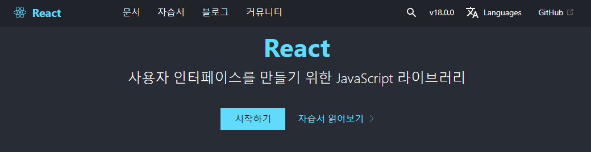

## 리액트 소개

## 리액트는 무엇인가?

* 라이브러리
  * 자주 사용되는 기능들을 정리해 모아 놓은 것
* 사용자 인터페이스(User Interface, UI)
  * 사용자와 컴퓨터 프로그램이 서로 상호작용을 하기 위해 중간에 입출력을 제어해주는 것
* UI 라이브러리
  * 사용자를 위한 화면을 만들기 위한 기능을 모아 놓은 것!
  * 자바스크립트 UI 라이브러리
    * React.js, Vue.js, Angular.js 등
* 프레임워크 vs 라이브러리
  * 프로그램의 흐름에 대한 제어 권한에서 차이
    * 프레임워크는 흐름의 제어 권한이 프레임워크 자신에게 있음
    * 라이브러리는 흐름 제어 X 개발자가 원하는 것만 가져가서 사용 => 제어 권한이 개발자에게

 

## 리액트의 장점과 단점

### 장점

* 빠른 업데이트(화면 로딩)와 렌더링 속도
  * 빠른 업데이트를 위해 Virtual DOM 사용
    * 기존의 방식으로 화면을 업데이트하려면 DOM을 수정해야하는데, 리액트는 DOM을 모두 수정하는 것이 아니라 업데이트해야하는 최소한의 부분만 검색-업데이트하여 렌더링
    * Document Object Model
      * 하나의 웹사이트에 대한 모든 정보를 담고 있는 큰 그릇
* Component-Based (컴포넌트 기반)
  * 모든 페이지가 컴포넌트로 구성
  * 레고 블록 조립하듯 컴포넌트들을 모아서 개발
  * 재사용성(Reusability)이 높음
    * 개발 기간 단축
    * 유지 보수 용이
    * 모듈 간 의존성이 낮음

* Meta의 지원
* 활발한 지식 공유 & 커뮤니티 O
* React Native
  * 모바일 어플리케이션 개발 가능

### 단점

* 방대한 학습량

* 꾸준한 업데이트 => 계속 공부해야함 ^^

* 높은 상태관리 복잡도

  => 외부 상태관리 라이브러리를 도입