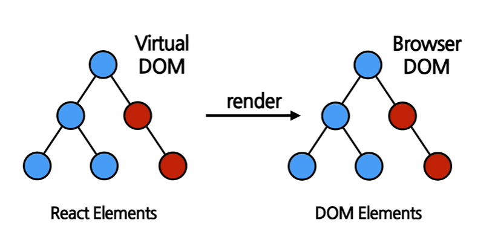

# Rendering Elements

## Elements의 정의와 생김새

### Elements

* 단어 뜻: 어떤 물체를 구성하는 성분, 요소

* React.js : `Elements are the smallest building blocks of React apps`
  
  리액트 앱을 구성하는 가장 작은 블록들

* DOM의 elements
  
  

* Virtual DOM에 존재하는 게 리액트의 엘리먼트
  
  => React Elements는 DOM Elements의 가상 표현
  
  
  
  - DOM Elements는 React Elements에 비해서 더 많은 정보를 담고 있으므로 크고 무거움
    
    => 그래서 Virtual DOM
  
  - Elements는 화면에서 보이는 것을 기술
  * 리액트 Elements는 자바스크립트 객체 형태로 존재 (**불변성!**)
  
  * **[예시 1] type에 html 태그 이름이 문자열로**
    
    
    
    * type에 html 태그 이름이 문자열로 들어가면 element는 해당 태그 이름을 가진 DOM 노드가 되고, props는 속성(attribute)에 해당
    
    * 이게 렌더링이 된다면
      
      
  
  * **[예시2] type에 리액트 컴포넌트 이름**
    
    
    
    * 이처럼 react element는 자바스크립트 객체 형태로 존재
      
      이런 객체를 만드는 것이 `creatElement`
      
      
      
      * 모든 리액트 컴포넌트는 분해해보면 최종적으로 html 태그가 나옴
      
      * props: 간단하게 element의 속성(ex. class, style)
      
      * childern: 해당 element의 자식

#### creatElement 예제


* ConfirmDiaglog 컴포넌트가가 Button을 포함하고 있는 형식
  
  ConfirmDiaglog 컴포넌트의 Element는 다음과 같은 형태이다.
  
  
  
  첫 번째는 html의 p태그이므로 바로 렌더링이 가능하지만, 두 번째는 type이 리액트 컴포넌트이므로 한 번 쪼개야 한다
  
  
  
  **컴포넌트 렌더링을 위해 모든 컴포넌트는 creatElement를 통해 element로 변환된다**

<br/>

## Elements의 특징 및 렌더링하기

### immutable 불변성

* elements **생성 후**에는 children이나 attributes를 바꿀 수 없다
  
  => 그럼 화면 갱신이 안되가?!
  
  
  
  붕어빵이 구워지고 나면 내용물을 바꿀 수 없듯이, element가 만들어지고 나면 children이나 attributes를 바꿀 수 없다. 그러면 어떻게? 
  
  => 새로운 element를 만들어서 바꿔치기 하자!

* virtual DOM 다시 보기
  
  * elements는 불변성을 갖고 있으므로, 새로운 부분을 보여주기 위해서는 새로운 elements를 생성해서 연결해서 보여줘야함
  
  

<br/>

### 렌더링 하기

* 생성 후, 화면에 보여주기 위해서는 `렌더링`이라는 과정을 거쳐야 한다


* React 필수 태그

* 위의 트리 모형에서 맨 위의 있는 노드가 **Root DOM Node**

* `root div`에 실제 리액트 element 렌더링하기 위한 코드
  
  
  
  * 첫 번째 parameter인 리액트 element를 두 번째 parameter인 html element, 즉 DOM element에 렌더링하는 것
    
    * 리액트 element != DOM element
    
    * 즉, 렌더링 과정은 virtual DOM에서 실제 DOM(웹 브라우저)으로 이동하는 것이라고 보면 된다

<br/>

### 렌더링 된 elements 업데이트하기

* 불변성 때문에 업데이트를 위해서는 `다시 생성`해야한다


현재 시간을 나타내는 element를 생성하여 root div에 렌더링하는 함수 tick

javascript의 setInterval을 활용해서 1초마다 함수를 실행해서 새로운 element를 생성!

<br/>

## 실습

(강의랑 코드가 조금 다름)

* `my-app/src/chapter_04/Clock.jsx`
  
  ```jsx
  import React from "react";
  
  function Clock(props) {
      return (
          <div>
              <h1>안녕, 리액트!</h1>
              <h2>현재 시각 : {new Date().toLocaleTimeString()}</h2>
          </div>
      )
  }
  
  export default Clock;
  ```

* `my-app/index.js`
  
  ```javascript
  import React from "react";
  import ReactDOM from "react-dom/client";
  import "./index.css";
  import Clock from "./chapter_04/Clock";
  
  const root = ReactDOM.createRoot(document.getElementById("root"));
  
  setInterval(() => {
   root.render(
   <React.StrictMode>
   <Clock />
   </React.StrictMode>,
   document.getElementById("root")
   );
   });
  ```

* 예시
  
  
