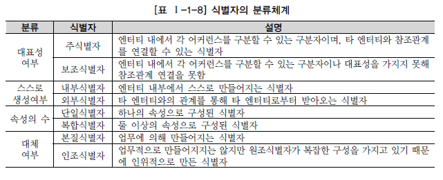

# 1-1. 데이터 모델링의 이해

1. 데이터 모델의 이해
2. 엔터티
3. 속성
4. 관계
5. 식별자

 

## 데이터 모델의 이해

### 모델링

>  복잡한 현실세계를 일정한 표기법에 따라 표현하는 일

* 특징

  * 추상화
  * 단순화
  * 모형화

  👉 `현실세계를 추상화, 단순화, 명확화하기 위해 일정한 표기법에 의해 표현하는 기법`

* 세 가지 관점

  * 데이터 관점(Data, What)
  * 프로세스 관점(Process, How)
  * 상관 관점(Data vs Process)

### 데이터 모델링

> 정보시스템을 구축하기 위한 데이터 관점의 업무 분석 기법
>
> 현실세계의 데이터(what)에 대해 약속된 표기법을 기반으로 표현하는 과정
>
> 데이터베이스 구축하기 위한 분석 및 설계 과정

* 중요성
  * 파급 효과
  * 복잡한 요구 사항의 간결한 표현
  * 데이터 품질
* 유의할 점
  * **중복** 👉 중복이 없어야 한다
  * **비유연성** 👉 데이터 정의와 사용 프로세스를 분리해서 유연성 확보!
  * **비일관성** 👉 상호 연관관계를 명확하게 정의하여 일관성 확보!

* 3단계

  * 개념적(추상) > 논리적 > 물리적 (구체)

* 구성요소 세 가지

  * 업무가 관여하는 어떤 것*things*
  * 어떤 것이 가지는 성격*attributes*
  * 업무가 관여하는 어떤 것 간의 관계*relationships*

  |       개념        | 복수,집합 개념 타입, 클래스 | 개별, 단수 개념 어커런스, 인스턴스 |
  | :---------------: | :------------------------------: | :-------------------------------------: |
  |      어떤 것      |     엔터티 타입 엔터티      |     엔터티 인스턴스, 어커런스      |
  |  어떤 것의 성격   |               관계               |                 패어링                  |
  | 어떤 것 간의 연관 |               속성               |                 속성값                  |

 

## 엔터티⭐️

> 사람, 사물, 물건, 사건, 개념 등의 명사
>
> 업무상 관리가 필요한 관심사
>
> 저장이 되기 위한 어떤 것*thing*

* 특징
  * 반드시 해당 업무에서 필요하고 관리하고자 하는 정보
  * **유일한 식별자**에 의해 식별 가능
  * 영속적으로 존재하는 **인스턴스의 집합(두 개 이상)**
  * **반드시 속성을 포함**
  * 다른 엔터티와 최소 **한 개 이상의 관계 有**

* 분류
  * 유무형
    * 유형, 개념, 사건
  * 발생시점
    * 기본엔터티: 업무에 원래 존재하는 정보, 독립적으로 생성 가능, 타 엔터티의 부모 역할. 자신의 고유 식별자 有
    * 중심엔터티: 기본엔터티로부터 발생, 업무의 중심 역할
    * 행위엔터티: 두 개 이상의 부모엔터티로부터 발생. 자주 내용이 바뀌거나 데이터 양 증가

 

## 속성⭐️

> 업무에서 필요로 하는 인스턴스에서 관리하고자 하는,
> 의미상 더이상 분리되지 않는 최소의 데이터 단위

👉 엔터티를 설명하고 인스턴스의 구성요소가 된다

* 엔터티-인스턴스-속성-속성값의 관계
  * 한 개의 엔터티는 두 개 이상의 인스턴스의 집합
  * 한 개의 엔터티는 두 개 이상의 속성을 가짐
  * **한 개의 속성은 한 개의 속성값을 가짐**

* 분류
  * 속성의 특성에 따른 분류
    * 기본: 업무로부터 추출한 모든 속성. 가장 일반적이고 많은 속성 (ex. 제품이름, 제조년월 등)
    * 설계: 새로 만들거나 변형하여 정의하는 속성 (ex. 약품용기코드)
    * 파생: 다른 속성에 영향을 받아 발생 (ex. 계산값)
  * 엔터티 구성방식에 따른 분류
    * PK속성: 엔터티를 식별할 수 있는 속성
    * FK속성: 다른 엔터티와의 관계에서 포함된 속성
    * 일반속성: 엔터티에 포함되어 있지만 PK/FK에는 비포함 속성

### 도메인⭐️

* 각 속성별로 가질 수 있는 값의 범위
  * 엔터티 내에서 속성에 대한 데이터 타입과 크기, 제약사항을 지정하는 것

 

## 관계

> 엔터티의 인스턴스 사이의 논리적인 연관성으로서 존재 또는 행위로서 서로에게 연관성이 부여된 상태

* 분류
  * 존재에 의한 관계
  * 행위에 의한 관계
* 표기법
  * 관계명
  * 관계차수: 1대1, 1대M, M대 N
  * 관계선택사양: 필수관계, 선택관계

 

## 식별자⭐️

> 하나의 엔터티에 구성된 여러 개의 속성 중에 엔터티를 대표할 수 있는 속성

* 특징
  * 주식별자에 의해 엔터티 내의 모든 인스턴스들이 유일하게 구분
  * 주식별자를 구성하는 속성의 수는 유일성을 만족하는 최소의 수
  * 지정된 주식별자의 값은 자주 변하지 않는 것
  * 주식별자가 지정이 되면 반드시 값이 들어와야 함 `NOT NULL`

* 식별자의 분류

  

* 주 식별자

  * 특징

    * 유일성
    * 최소성
    * 불변성
    * 존재성 : NOT NULL

    👉 모두 만족하면 후보키, 그 중 하나가 기본키(PK)/ 대체키

  * 도출 기준

    * 해당 업무에서 자주 이용되는 속성
    * 명칭, 내역 등과 같이 이름으로 기술되는 것 X
    * 속성의 수가 많아지지 않도록 함

* 식별자 & 비식별자 관계⭐️

  |                     식별자 관계                      |                   비식별자 관계                   |
  | :--------------------------------------------------: | :-----------------------------------------------: |
  |                         강함                         |                       약함                        |
  | SQL 구문이 복잡 (pk 상속으로 인한 속성 수 증가) | 불필요한 JOIN 발생 → 느려짐 (pk가 일반 속성) |
  |                         실선                         |                       점선                        |