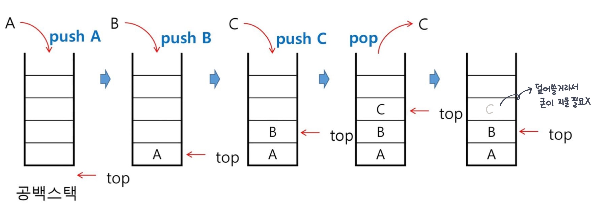

# Stack 1

* 스택
* 재귀호출
* Memoization & DP
* DFS

<br/>

## 스택

* 물건을 쌓아 올리듯 쌓아 올린 형태의 자료구조
* 스택에 저장된 자료는 선형구조를 갖는다
  * 선형구조 : 자료 간의 관계가 1대 1
  * 비선형구조: 자료 간의 관계가 1대 N (ex. 트리)
* 스택에 자료를 삽입하거나 스택에서 자료를 꺼낼 수 있다
* 마지막에 삽입한 자료를 가장 먼저 꺼낸다.
  * 후입선출(LIFO, **Last-In-First_Out**)

### 스택의 구현

* 프로그램에서 구현하기 위해서 필요한 자료 구조와 연산
  * 자료구조 : 자료를 선형으로 저장할 저장소/저장방법
    * 배열을 사용
    * 저장소 자체를 스택이라 부르기도 함
    * 마지막에 삽입된 원소의 위치 == `top`
      * 공식 명칭은 `stack pointer`

#### 연산

* `삽입, push` : 저장소에 자료를 저장
* `삭제, pop` : 저장소에서 자료를 삽입한 순서의 역순으로 꺼냄
* `isEmpty` : 공백인지 아닌지 확인
* `peek` : top에 있는 원소(item)을 반환

#### 삽입/삭제 과정



#### 스택의 `push` `pop`알고리즘

```python
def push(item):
    s.append(item)
```

```python
def pop():
    if len(s)==0:
        # underflow
        return
    else:
        return s.pop(-1)
```

* 하지만, append와 pop은 느리다

  => 크기를 미리 정해놓고, top을 활용한다

  ```python
  def push(item, size):
      global top
      top += 1
      if top == size:
          print('overflow!') # 디버깅용
      else:
          stack[top] = item # 저장
  
  size = 10
  stack = [0] * size
  top = -1
  
  # 함수X 간단하게 해보면
  push(10, size)
  top += 1		# => push(20)
  stack[top] = 20
  ```

  ```python
  def pop():
      global top
      if top == -1:
          print('underflow')
          return 0
      else:
          top -= 1
          return stack[top+1]
  print(pop())
  
  # 함수X
  if top > -1:
      top -= 1
      print(stack[top+1])
  ```

#### 구현 시 고려사항

* 1차원 배열을 사용하면 구현은 용이하지만 크기 변경이 어렵다는 단점

  => 저장소를 동적으로 할당하여 스택을 구현하면 해결 가능(동적 연결리스트 이용)

<br/>

## 재기호출

* 자기 자신을 호출하여 순환 수행되는 것
* 함수에서 실행해야하는 작업의 특성에 따라 일반적인 호출이 아닌 재귀호출방식을 사용하여 함수를 만들면 간단하게 코드를 작성할 수 있고 크기도 줄일 수 있음
* 

## Reference

