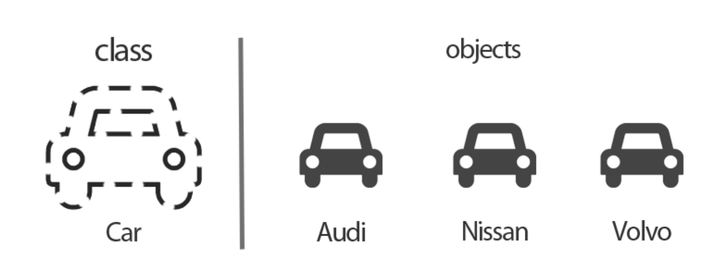

# Vue.js

* Basic Syntax
* Template Syntax

<br/>

## Basic syntax of Vue.js

### Vue instance

* 모든 Vue 앱은 `Vue` 함수로 새 **Vue 인스턴스**를 만드는 것부터 시작한다

  ```javascript
  const app = new Vue({
    // 옵션
  })
  ```

* Vue 인스턴스를 생성할 때에는 Options 객체를 전달해야 한다
  * options를 사용하여 원하는 동작을 구현하는 것

* Vue Instance === Vue Component

* 참고

  

  * `Class` : a specification, blueprint for an object

    * 객체를 정의하고 만들어 내기 위한 **설계도, 틀**
    * 객체를 만들어 내기 위한 변수와 메서드들이 존재함

  * `object` : physical presence of the class in memory(similar to a real-world object)

    * 클래스에 선언된 모양 그대로 생성된 실체. **클래스의 인스턴스**

  * `instance` : a specific representation of an object(an unique copy of the object (same structure, different data))

    * 클래스를 통해서 구현해야할 대상(객체)이 **실체로 구현된, 구체적인 실체**

  * 붕어빵 틀은 클래스, 객체는 붕어빵. 실제로 만들어낸 각각의 붕어빵이 인스턴스!

    팥붕과 슈붕은 둘다 같은 타입의 객체이지만 다른 인스턴스다!

### [Options/DOM]

#### el

* Vue인스턴스에 연결(마운트)할 기존 DOM 요소
* CSS 선택자 문자열 혹은 HTML Element로 작성
* new를 이용해서 인스턴스 생성할 때만 사용

#### data

* Vue 인스턴스의 데이터 객체 (**핵심**)
* Vue 인스턴스의 상태 데이터를 정의
* Vue template에서 interpolation{중괄호!}을 통한 접근 가능
* v-bind(`i`), v-on(`@`)과 같은 directive에서도 사용 가능
* **Vue 객체 내 다른 함수에서 this 키워드 통해 접근 가능**
  * 화살표 함수 XXX

#### methods ()

* 행동!
  * 데이터를 바꾸는 로직 위주 => setter 함수

* 중괄호를 통해 접근 가능
* v-on(`@`)과 같은 directive에서도 사용 가능
* **Vue 객체 내 다른 함수에서 this 키워드 통해 접근 가능**
  * 화살표 함수 XXX
  * 화살표 함수는 부모 context를 바인딩하기 때문에, this가 Vue 인스턴스를 가리키지 않는다

#### computed

* 데이터를 기반으로 하는, 데이터에 의존하는 **계산'된'  속성(값)**

  * 데이터를 활용해서 새로운 '값'을 뽑아낼 때!
  * 데이터를 통한 값을 얻을 때 => getter 함수

* 함수의 형태로 정의하지만 함수가 아닌 **함수의 반환 값이 바인딩**

  => **반드시 반환값이 있어야 한다**

* **종속된 데이터가 변경될 때만 함수를 실행**

### watch

* 특정값이 바뀌면 다른 작업을 한다! (computed는 해당 값을 재계산해서 보여주고 끝)

### filter

* 텍스트 형식화를 적용할 수 있는 필터
* `{{}}` 또는 `v-bind` 쓸 때 사용

<br/>

## Template Syntax

### 보간법{{ Interpolation }}

1. Text

   * 데이터 바인딩의 가장 기본 형태
   * Mustache 구문(이중 중괄호)

   ```html
   <span>메시지: {{ message }}</span>
   ```

2. Raw HTML

   * 사용자 입력 받는 부분에서는 사용하지 말 것
     * XXS 취약점

   ```html
   <span v-html="rawHtml"></span>
   ```

3. Attributes

   * html 속성 값으로 집어 넣기

   ```javascript
   <div v-bind:id="dynamicId"></div>
   ```

4. JS 표현식

   * 조건문은 작동하지 않으므로 삼항 연산자를 사용해야 한다

   ```html
   {{ number + 1}}
   {{ message.split('').reverse().join('') }}
   ```

### 디렉티브 Directive

* `v-` 접두사가 있는 특수 속성

* 디렉티브 속상 값으로는 **단일 JavaScript 표현식**을 사용한다 

  * `v-for`는 예외

* 표현식의 값이 변경될 때, 사이드이펙트를 반응적으로 DOM에 적용하는 역할!

* **전달인자 Arguments**

  * `: (콜론)`으로 전달인자를 사용

    * 예시 1 : 엘리먼트의 href 속성을 표현식 url의 값에 바인드하는 v-bind

      ```html
      <a v-bind:href="url"> ... </a>
      ```

    * 예시 2: DOM 이벤트를 수신하는 v-on

      ```html
      <a v-on:click="doSomething"> ... </a>
      ```

  * 동적 전달인자

* **수식어 Modifiers**

  * `. (점)`으로 표시되는 특수 접미사

  * 디렉티브를 특별한 방법으로 바인딩 해야한다는 것을 나타냄

    * 예시 1: `.prevent`  트리거된 이벤트에서 `event.preventDefault()`를 호출하도록 `v-on` 디렉티브에게 알려줌

      ```html
      <form v-on:submit.prevent="onSubmit"> ... </form>
      ```

#### v-text

*  어쩌고 저쩌고

  ```html
  <div id="app">
  	<p>{{ message }}</p>
    <p v-text="message"></p>
  </div>
  
  <script>
  	const app = new Vue({
      el: '#app',
      data: {
        message: 'Hello!'
      }
    })
  </script>
  ```

  * {{ }} 를 없에고 Hello!만 보여주는 것

    p의 innerText로 Hello!를 넣어서 보여주는 것 모두 브라우저가 한 일

  ```javascript
  <div id="app">
  	<p>{{ message }}</p>
    <p v-text="message"></p>
  	<p v-html="message"></p>
  </div>
  
  <script>
  	const app = new Vue({
      el: '#app',
      data: {
        message: '<strong>강하닷!</strong>'
      }
    })
  </script>
  ```

  <출력값>

  `<strong>강하닷!</strong>`

  `<strong>강하닷!</strong>`

  강하닷!

#### v-show

* `v-show="A"` A가 true일 때 보여준다

* 문서에 있지만(렌더링 해두지만) `display: hidden` 값을 줘서 안 보이게 하는 것 뿐

  => 렌더링 횟수가 단 한번이라면 `v-if`에 비해 상대적으로 렌더링 비용이 높음 (렌더링 했는데도 안 쓰이니까)

  * **눈에 보이는지, 아닌지가 핵심**! => 토글이 잦을 때 사용한다 => 토글 비용 낮음

* **Expensive initial load, cheap toggle**

#### v-if, v-else-if, v-else

* `v-if="B"` B가 true일 때만 **렌더링해서** 보여준다
  * 즉, 전달인자가 false인 경우 **렌더링 XXX** => 렌더링 비용 낮음
  * 자주 변경 되는 요소의 경우 매번 렌더링 해야하므로 토글 비용 증가할 수 있음

* **Cheap initial load, expensive toggle**

#### v-for

* `item in items`
* v-for 사용시 **반드시 key 속성을 각 요소에 작성**
  * 개별 DOM 노드들을 추적하고 기존 엘리먼트를 재사용, 재정렬하려고!
  * array의 요소가 실시간으로 바뀔 때, 유일한 값인 key를 통해서 접근!
* v-if와 함께 사용하는 경우 v-for의 우선순위가 더 높음
  * 가능하다면 동시 사용X
* `v-if="(value, index) in arr"` : array 순회
  * 순회하며 출력할 때에는 index 먼저 쓰면 index먼저 나옴 하지만 v-if 값으로 넣을때는 무조건 인덱스가 뒤로 가야한다!

#### v-bind

* 태그의 기본 속성들과 Vue를 연결 시켜줄 때 사용하는 것
  * ex) ``
* 축약형은 `:`
* 자바스크립트 객체식으로 넘기면 된다
* **클래스 바인딩**도 가능하다!
  * `<div :class="{ active : isRed }">`
    * isRed가 true라면! active도 true가 돼서 들어감
  * `<div :class="[activeRed, myBackGround]">` : 여러개의 클래스를 바인딩

* **스타일 바인딩**
  * `<p :style="{ fontSize: fontSize + 'px' }">`
    * font-size로 보내주면 자바스크립트는 `-`를 연산자로 이해하기 때문에 그렇게 보내면 안된다. 자바스크립트와 마크업 언어 사이의 기싸움?!
    * 두번째 fontSize는 데이터로 연동할 부분, 앞의 font-size로 바뀌어서 스타일에 들어갈 거임

#### v-on

* **엘리먼트에 이벤트 리스너를 연결** => 특정 이벤트가 발생했을 때 주어진 코드가 실행 됨

* 축약형은 `@`

* 이벤트 유형은 전달인자로 표시함

  * button을 누르면 `alertHello` 메서드가 실행

  ```html
  <div id="app">
      <!-- 메서드 핸들러 -->
      <button v-on:click="alertHello">Button</button>    
      <button @click="alertHello">Button</button>    
  
      <!-- 기본 동작 방지 -->
      <form action="" @submit.prevent="alertHelloo">
  		<button>GoGo</button>
      </form>
      
      <!-- 키 별칭을 이용한 키 입력 수식어 -->
      <input type="text" @keyup.space="log">
      <!-- cb 함수에서 특수 문법 () -->
      <input type="text" @keyup.space="log('a')"> <!--실행하게 되면 a를 인자로 넘길게!-->
      
  </div>
  ```

  ```javascript
  <script>
      const app = new Vue({
          el: '#app',
          data: {
              message: 'Hello Vue',
          },
          methods: {
              alertHello: function () {
                  alert('hello')
              }
          }
      })
  ```

* `@input`
  * input에 값이 들어오면 무조건 반영함
    * ex) 안녕 => ㅇ/아/안/안ㄴ/안녀/안녕

#### v-model

* HTML form 요소의 값과 Data를 **양방향으로 바인딩**

* 수식어
  * `.lazy` : input 대신 change 이벤트 이후에 동기화
  * `.number` : 문자열을 숫자로 변경
  * `.trim` : 입력에 대해 trim 진행(왼오 둘다)

* 단방향 예시

  


<br/>

## References

[Class, Object, Instance](https://stackoverflow.com/questions/2885385/what-is-the-difference-between-an-instance-and-an-object)

[클래스, 객체, 인스턴스](https://computer-science-student.tistory.com/319)