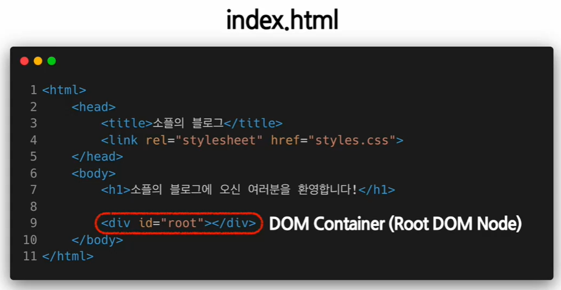
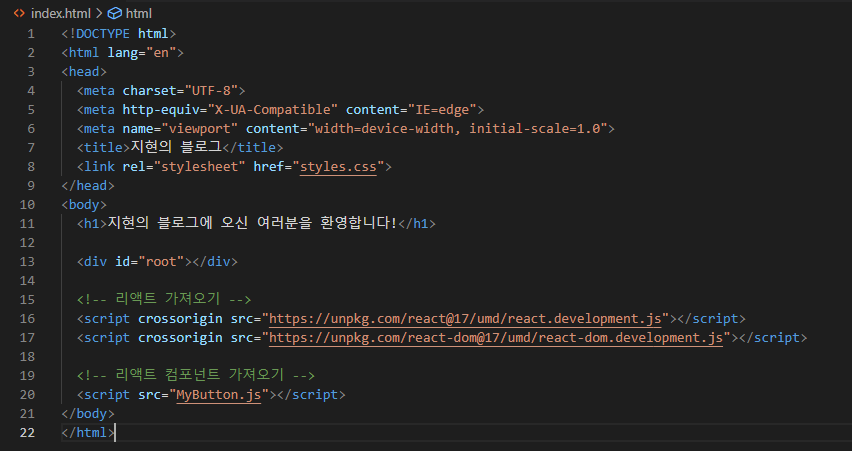
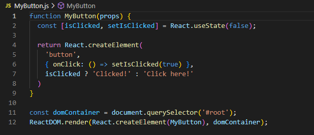
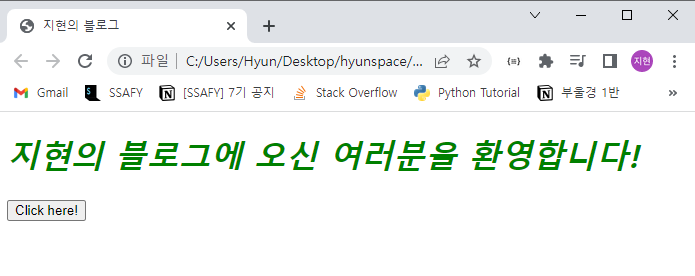
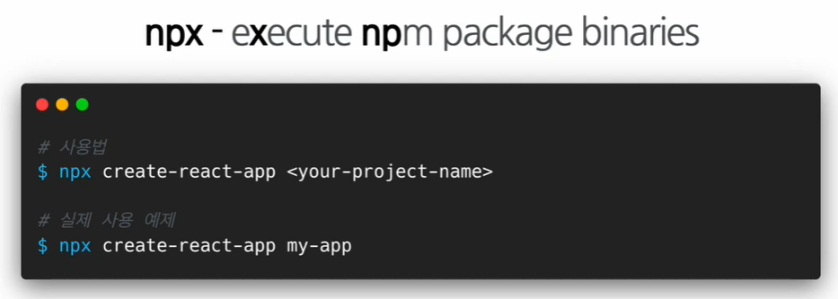
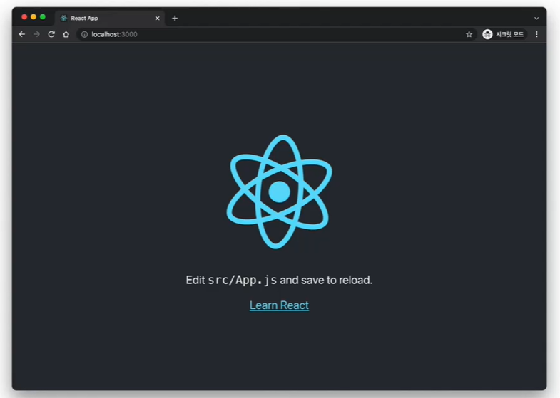

# 리액트 시작하기

## (실습) 직접 리액트 연동하기



`<div id="root"></div>` 가 DOM 이 시작되는 부분이라고 보면 됨



<br/>

### 리액트 컴포넌트 만들기





<br/>

## (실습) create-react-app

### 1. 설치하기



* `npx` : 설치 후 실행까지

  ```bash
  cd my-app
  
  npm start
  ```



